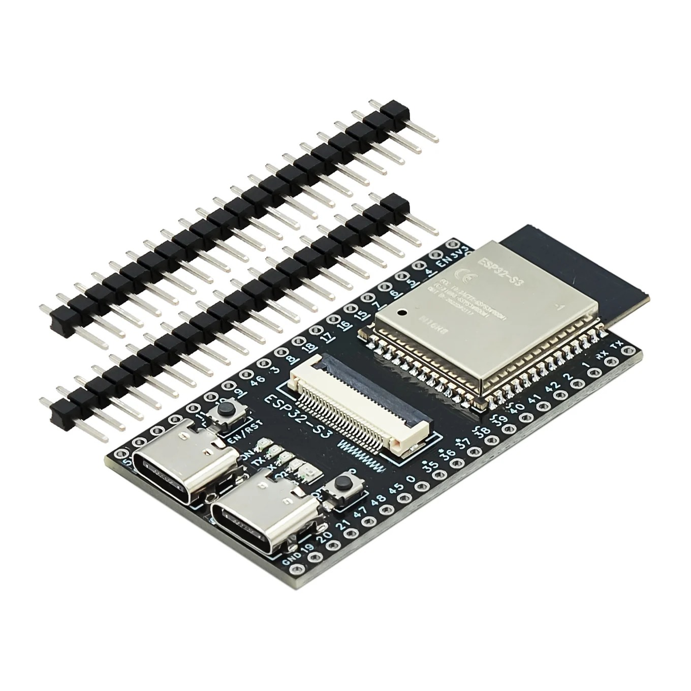
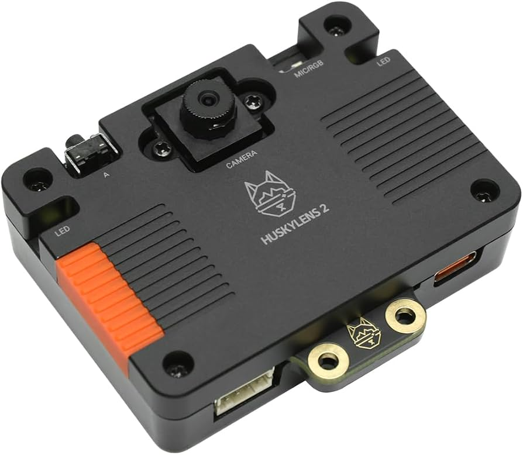
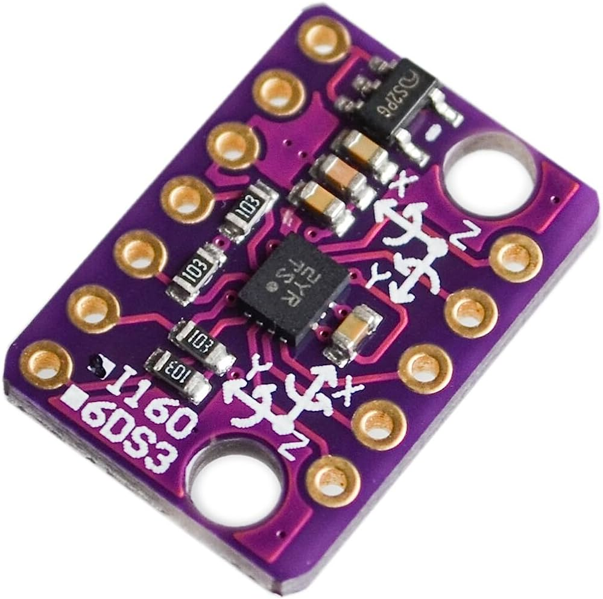
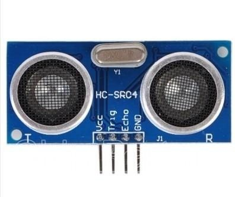
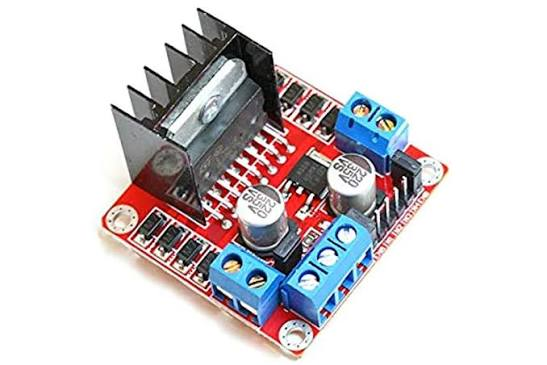

# 🏎️ WRO 2026 Future Engineers – Team Nexus

<div align="center">
  

  [](https://www.instagram.com/iniar_zulia/)
  [](https://github.com/)
</div>

---

## 🏆 **REPRESENTANDO A TEAM NEXUS – RUMBO A WRO 2026**

Bienvenidos al repositorio oficial del **Team Nexus**, compitiendo en la categoría **Future Engineers** de la **World Robot Olympiad™ (WRO)**. En este espacio encontrarás el proceso de diseño, desarrollo y construcción de nuestro vehículo autónomo.

Nuestra filosofía combina la innovación práctica con la resolución de retos complejos. El propósito en esta temporada es diseñar un vehículo verdaderamente autónomo, robusto y altamente eficiente, capaz de superar exitosamente tanto los retos de la **etapa cerrada** como los de la **etapa abierta**, buscando clasificar a la Final Nacional y representar con orgullo a nuestro país.

> 💡 **Estado del Proyecto:** Integración de sistemas electrónicos, calibración de visión artificial y pruebas de control de movimiento en pista.

---

## 📚 **Tabla de Contenidos**
- [📂 Estructura de Documentación](#estructura)
- [👥 El Equipo](#equipo)
- [🛠️ Stack Tecnológico](#stack)
- [🔧 Sistema Electrónico](#hardware)
- [🚀 Instalación y Uso](#instalacion)

---

## <a id="estructura"></a>📂 **Estructura de Documentación**

<div align="center">

| 📁 Carpeta | 🎯 Contenido Técnico | 📖 Link |
|-----------|----------------------|-----------|
| **📂 planes** | **Hardware & Componentes**<br>• Fichas técnicas detalladas<br>• Lista de materiales y esquemáticos | [🔗 Ver Documentación](./planes/README.md) |
| **💻 src** | **Firmware & Algoritmos**<br>• Lógica de navegación<br>• Controladores de sensores y visión | [🔗 Próximamente](#) |
| **⚙️ models** | **Diseño Mecánico**<br>• Modelos CAD 3D y chasis modular | [🔗 Próximamente](#) |

</div>

---

## <a id="equipo"></a>👥 **El Equipo**

Un equipo interdisciplinario que une trayectorias individuales en la WRO y una sólida experiencia conjunta en competencias internacionales de alto nivel como la **FTC Championship en Italia**.

### **Members**

* **José Montiel**
    * **Background:** Estudiante de Ing. Electrónica (Automatización y Control).
    * **Role:** *Software Architecture & Vision Strategy*.
    * **Focus:** Firmware en C++, control de velocidad y procesamiento de visión artificial.

* **David Ocando**
    * **Background:** Estudiante de Ing. Eléctrica (URU) | 2º año en WRO (Robot Sport 2025).
    * **Role:** *Electrical Architecture & Power Management*.
    * **Focus:** Arquitectura electrónica, distribución de energía y alimentación estable.

* **Jairo Cruz**
    * **Background:** Competidor WRO (Robot Sport 2025).
    * **Role:** *Control Strategy & Algorithmic Optimization*.
    * **Focus:** Desarrollo algorítmico y optimización de trayectorias.

* **Wender Sanchez**
    * **Background:** Ing. Mecánico.
    * **Role:** *Coach*.

---

## <a id="stack"></a>🛠️ **Stack Tecnológico**

* **Cerebro:** ESP32-S3 para la ejecución central de algoritmos de navegación y control.
* **Percepción Visual, Distancia e Inercia:** Cámara inteligente HuskyLens para reconocimiento de pista, sensor ultrasónico HC-SR04 para detección de proximidad y sensor IMU BMI160 para orientación.
* **Control de Dirección:** Servomotor controlado directamente mediante GPIO 7 con la librería `ESP32Servo`.
* **Actuación y Tracción:** Puente H L298N operado con GPIOs directos (GPIO 4 para PWM/ENA, GPIO 5 y 6 para dirección) para propulsión.

---

## <a id="hardware"></a>🔧 **Sistema Electrónico (Ficha Técnica de Hardware)**

<h2 align="center">📋 Ficha Técnica de Hardware - Team Nexus</h2>

<table align="center" width="100%">
  <thead>
    <tr>
      <th width="20%">Vista Previa</th>
      <th width="60%">Modelo y Descripción Técnica</th>
      <th width="20%">Documentación</th>
    </tr>
  </thead>
  <tbody>
    <tr>
      <td align="center"></td>
      <td><b>ESP32-S3</b><br/>Unidad de procesamiento principal Dual-Core con soporte para aceleración de IA y control central del vehículo.</td>
      <td align="center"><a href="https://www.espressif.com/sites/default/files/documentation/esp32-s3_datasheet_en.pdf"></a></td>
    </tr>
    <tr>
      <td align="center"></td>
      <td><b>HuskyLens</b><br/>Cámara inteligente de visión artificial para reconocimiento visual y clasificación de obstáculos.</td>
      <td align="center"><a href="https://www.dfrobot.com/product-3118.html"></a></td>
    </tr>
    <tr>
      <td align="center"></td>
      <td><b>BMI160 (IMU)</b><br/>Sensor inercial de 6 ejes (Giroscopio + Acelerómetro) para corrección de rumbo y maniobras de giro.</td>
      <td align="center"><a href="https://www.bosch-sensortec.com/media/boschsensortec/downloads/datasheets/bst-bmi160-ds000.pdf"></a></td>
    </tr>
    <tr>
      <td align="center"></td>
      <td><b>HC-SR04</b><br/>Sensor de distancia por ultrasonido para prevención de colisiones y medición rápida de proximidad a paredes o bloques.</td>
      <td align="center"><a href="https://agelectronica.lat/pdfs/textos/U/ULTRASONIC-HC-SR04.PDF"></a></td>
    </tr>
    <tr>
      <td align="center"></td>
      <td><b>L298N Driver</b><br/>Controlador Puente H de doble canal para regulación de velocidad PWM (GPIO 4) y dirección de tracción (GPIO 5 y 6).</td>
      <td align="center"><a href="https://agelectronica.lat/pdfs/textos/L/L298N-DRIVE-MODULE.PDF"></a></td>
    </tr>
    <tr>
      <td align="center"></td>
      <td><b>Servomotor de Dirección</b><br/>Actuador de alta precisión operado mediante GPIO 7 para el control de ángulo en la dirección Ackermann.</td>
      <td align="center"><a href="https://studylib.net/doc/25404669/mg90s-datasheet"></a></td>
    </tr>
  </tbody>
</table>

---

## <a id="instalacion"></a>🚀 **Instalación y Uso**

```bash
# Clonar el repositorio oficial
git clone [https://github.com/TU_USUARIO/WRO2026-FE-TEAM-NEXUS.git](https://github.com/TU_USUARIO/WRO2026-FE-TEAM-NEXUS.git)

# Acceder a la documentación de hardware
cd planes
