# 🏎️ WRO 2026 Future Engineers – Team Nexus
<div align="center">
  
  
  <br><br>
  [](https://wro-association.org/)
  [](https://www.instagram.com/iniar_zulia/)
  [](https://www.instagram.com/iniar_zulia/)
  <br>
  [](https://www.espressif.com/)
  [](https://isocpp.org/)
  [](https://www.autodesk.com/)
  [](https://bambulab.com/)
  <br>
  [](https://fritzing.org/)
  [](https://www.youtube.com/@NEXUSTEAM-e3d)
  [](https://www.instagram.com/iniar_zulia/)

<a name="inicio"></a>
</div>

Nuestro prototipo **"Smoke"** es un vehículo autónomo diseñado para la categoría **Future Engineers de la World Robot Olympiad™ (WRO) 2026**. 
Este documento técnico ha sido elaborado bajo un formato de **libro blanco de ingeniería (*Engineering Whitepaper*)**: no se limita a describir el resultado final, sino que expone de forma analítica y reproducible el **porqué detrás de cada decisión técnica**, los compromisos de diseño (*trade-offs*), los cálculos físicos y la evolución experimental del proyecto. Cualquier equipo o investigador que consulte esta documentación podrá comprender a profundidad los fundamentos cinemáticos, térmicos, eléctricos y de software que rigen el vehículo, permitiendo reproducir o iterar la plataforma de forma integral.

# 📑 Índice 

- [1. Filosofía de Trabajo y Metodología de Co-Diseño](#1-filosofía-de-trabajo-y-metodología-de-co-diseño)
- [2. Nuestro Equipo (INIAR)](#2-nuestro-equipo-iniar)
  - [David Ocando](#david-ocando)
  - [José Montiel](#josé-montiel)
  - [Jairo Cruz](#jairo-cruz)
  - [Ing. Wender Sánchez (Mentor)](#ing-wender-sanchez)
- [3. Estructura del Repositorio (Repository Directory Map)](#3-estructura-del-repositorio-repository-directory-map)
- [4. Ficha Técnica Oficial de la Plataforma "Smoke"](#4-ficha-técnica-oficial-de-la-plataforma-smoke)
- [5. Galería de Inspección Técnica 360°](#5-galería-de-inspección-técnica-360)
- [6. Desempeño en Pista (Videos Oficiales)](#6-desempeño-en-pista-videos-oficiales)
- [7. Lista Maestra de Materiales y Componentes (BOM)](#7-lista-maestra-de-materiales-y-componentes-bom)
- [8. Movilidad y Diseño Mecánico](#8-movilidad-y-diseño-mecánico)
  - [8.1 Arquitectura Modular del Chasis (Tres Pisos en PETG)](#81-arquitectura-modular-del-chasis-tres-pisos-en-petg)
  - [8.2 Estandarización de Sujeción (Tornillería M3)](#82-estandarización-de-sujeción-tornillería-m3)
  - [8.3 Geometría de Dirección Ackermann Híbrida](#83-geometría-de-dirección-ackermann-híbrida)
  - [8.4 Tren de Tracción RWD, Transmisión Cónica y Diferencial](#84-tren-de-tracción-rwd-transmisión-cónica-y-diferencial)
  - [8.5 Estudio Dinámico: Fuerzas, Torque en Rueda y Aceleración](#85-estudio-dinámico-fuerzas-torque-en-rueda-y-aceleración)
  - [8.6 Neumáticos Escalonados (Staggered Setup)](#86-neumáticos-escalonados-staggered-setup)
- [9. Arquitectura Eléctrica y Distribución de Potencia](#9-arquitectura-eléctrica-y-distribución-de-potencia)
  - [9.1 Banco de Baterías 18650 (Configuración 2S2P)](#91-banco-de-baterías-18650-configuración-2s2p)
  - [9.2 Topología de Tres Ramas Desacopladas](#92-topología-de-tres-ramas-desacopladas)
  - [9.3 Compensación Darlington L298N (Boost a 14V) y Masa Común](#93-compensación-darlington-l298n-boost-a-14v-y-masa-común)
  - [9.4 Protocolo de Encendido Seguro y Control de Usuario](#94-protocolo-de-encendido-seguro-y-control-de-usuario)
  - [9.5 Esquemático General y Mapeo de Pines (Pinout ESP32-S3)](#95-esquemático-general-y-mapeo-de-pines-pinout-esp32-s3)
- [10. Percepción Sensorial y Visión Artificial](#10-percepción-sensorial-y-visión-artificial)
  - [10.1 Visión IA por Hardware (HuskyLens 2)](#101-visión-ia-por-hardware-huskylens-2)
  - [10.2 Telemetría Inercial en Core Dedicado (MPU6050 + FreeRTOS)](#102-telemetría-inercial-en-core-dedicado-mpu6050--freertos)
  - [10.3 Red Ultrasónica HC-SR04 con Muestreo Rotativo](#103-red-ultrasónica-hc-sr04-con-muestreo-rotativo)
- [11. Arquitectura de Software y Lógica de Navegación](#11-arquitectura-de-software-y-lógica-de-navegación)
  - [11.1 Máquina de Estados Finitos (FSM)](#111-máquina-de-estados-finitos-fsm)
  - [11.2 Desglose Modular del Firmware (`OPENCHALLENGE.ino`)](#112-desglose-modular-del-firmware-openchallengeino)
- [12. Diario de Ingeniería, Iteraciones y Solución de Fallas](#12-diario-de-ingeniería-iteraciones-y-solución-de-fallas)


# 1. Filosofía de Trabajo y Metodología de Co-Diseño
En el **Instituto de Inteligencia Artificial y Robótica del estado Zulia (INIAR)**, el desarrollo de **"Smoke"** no se abordó como una suma de tareas aisladas, sino bajo un **modelo holístico de ingeniería concurrente**:
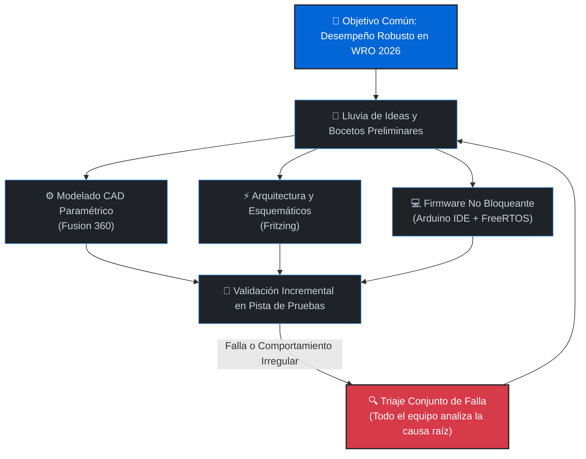
```mermaid
flowchart TD
    OBJ["🎯 Objetivo Común: Desempeño Robusto en WRO 2026"] --> DISCUSS["🧠 Lluvia de Ideas y Bocetos Preliminares"]
    DISCUSS --> CAD["⚙️ Modelado CAD Paramétrico\n(Fusion 360)"]
    DISCUSS --> ELEC["⚡ Arquitectura y Esquemáticos\n(Fritzing)"]
    DISCUSS --> CODE["💻 Firmware No Bloqueante\n(Arduino IDE + FreeRTOS)"]
    
    CAD & ELEC & CODE --> TEST["🏁 Validación Incremental en Pista de Pruebas"]
    
    TEST -->|"Falla o Comportamiento Irregular"| TRIAGE["🔍 Triaje Conjunto de Falla\n(Todo el equipo analiza la causa raíz)"]
    TRIAGE --> DISCUSS
    classDef main fill:#0366d6,stroke:#24292e,stroke-width:2px,color:#fff;
    classDef step fill:#1f2328,stroke:#58a6ff,stroke-width:1px,color:#c9d1d9;
    classDef fail fill:#d73a49,stroke:#24292e,stroke-width:2px,color:#fff;
    class OBJ main;
    class DISCUSS,CAD,ELEC,CODE,TEST step;
    class TRIAGE fail;
```

# 2. Nuestro Equipo (INIAR)
Team Nexus está integrado por estudiantes universitarios del **Instituto de Inteligencia Artificial y Robótica del estado Zulia "Dr. Héctor Rafael Rojas" (INIAR)**, combinando experiencia práctica en torneos nacionales y mundiales:

## 👤 David Ocando <a id="david-ocando"></a>
**Líder de Arquitectura Eléctrica, Gestión de Potencia y Co-Administrador Digital**
<div align="center">
  
</div>

* **Formación Académica:** Estudiante de Ingeniería Eléctrica (Mención Generación y Distribución de Potencia) – **Universidad Rafael Urdaneta (URU)**.
* **Responsabilidades Técnicas en "Smoke":**
  * **Diseño Eléctrico de Potencia:** Cálculo de caídas de tensión, selección de convertidores DC-DC y desacoplamiento en 3 ramas independientes (lógica a 5V, actuadores a 5V y tracción a 14V).
  * **Almacenamiento Energético:** Configuración del banco de celdas 18650 (2S2P / 7000 mAh), monitoreo de curvas de descarga y dimensionamiento de cables de potencia.
  * **Inmunidad Electromagnética:** Unificación del plano de masas (Common Ground), filtrado de ruidos parásitos de conmutación y protocolo de encendido seguro.
  * **Documentación Técnica:** Mantenimiento y estandarización del repositorio en GitHub bajo la rúbrica oficial de la WRO.
### 🏆 Historial de Competición:
* **Copa KAI (2023):** Participación en robótica móvil y combate autónomo.
* **FIRST Tech Challenge (FTC Championship – Piacenza, Italia 2024):** Representación internacional de Venezuela; desarrollo de sistemas de potencia de alta corriente y actuadores de respuesta rápida.
* **WRO Venezuela (Temporada 2025):** Competidor oficial en la categoría **RoboSports**, optimizando la respuesta dinámica y la robustez eléctrica del robot en cancha.
---
## 👤 José Montiel <a id="jose-montiel"></a>
**Ingeniero Líder de Firmware, Visión Artificial y Control Autónomo**
<div align="center">
  
</div>

* **Formación Académica:** Estudiante de Ingeniería Electrónica – **Universidad Dr. Rafael Belloso Chacín (URBE)**.
* **Responsabilidades Técnicas en "Smoke":**
  * **Desarrollo de Firmware Embebido:** Programación en C++ sobre ESP32-S3 bajo arquitectura no bloqueante con temporizadores de hardware.
  * **Sistemas Operativos en Tiempo Real:** Implementación de tareas dedicadas en **FreeRTOS** (Core 0 para la integración angular del MPU6050 a 500 Hz y Core 1 para la navegación).
  * **Control de Rumbo y Estabilidad:** Algoritmo Proporcional-Derivativo (PD) con zona muerta y compensación angular de escape lateral ante muros.
  * **Visión por Computador:** Calibración y enlace serie UART (115,200 baudios) con la cámara **HuskyLens 2** para la clasificación colorimétrica de obstáculos.
  * **Tolerancia a Fallas:** Desarrollo del mecanismo de auto-rescate en caliente del bus I2C mediante 9 ciclos de reloj forzados en SCL.
### 🏆 Historial de Competición:
* **WRO Venezuela Regional (Temporada 2025):** Participación oficial en la categoría **Future Engineers**, acumulando experiencia en cinemática de pista, algoritmos reactivos y visión de carril.
---
## 👤 Jairo Cruz <a id="jairo-cruz"></a>
**Ingeniero de Diseño Mecánico, Dinámica Vehicular y Manufactura Aditiva**
<div align="center">
  
</div>

* **Formación Académica:** Estudiante de Ingeniería Electrónica (Mención Automatización y Control).
* **Responsabilidades Técnicas en "Smoke":**
  * **Diseño Paramétrico 3D:** Modelado en **Autodesk Fusion 360** del chasis modular de tres niveles, bancada de motor y soportes de sensado.
  * **Manufactura Aditiva Avanzada:** Optimización de laminado en **Bambu Lab** con filamento **PETG** estructural (orientación de capas, 100% infill en engranajes y tolerancias dimensionales).
  * **Cinemática y Ensamblaje:** Adaptación híbrida del piñón cónico con entrada D-Shaft al diferencial LEGO EV3, timonería Ackermann y estandarización métrica M3.
### 🏆 Historial de Competición:
* **Copa KAI (2023):** Competidor en diseño de chasis ultraligero y robótica móvil.
* **FIRST Tech Challenge (FTC Championship – Italia 2024):** Integrante de la delegación internacional venezolana; diseño de sistemas de reducción mecánica y ensamblaje de alta precisión.
* **WRO Venezuela (Temporada 2025):** Competidor en la categoría **RoboSports**, especializándose en rigidez torsional y resistencia a impactos mecánicos.
---
## 👤 Ing. Wender Sánchez <a id="wender-sanchez"></a>
**Mentor Líder y Asesor de Ingeniería Mecánica**
<div align="center">
  
</div>

* **Formación y Perfil:** Ingeniero Mecánico egresado de la **Universidad del Zulia (LUZ)**, con dilatada trayectoria profesional en dinámica de vehículos, cinemática de mecanismos y sistemas de transmisión de potencia.
* **Acompañamiento Metodológico:** Supervisión técnica en el cálculo analítico de fuerzas, validación de relaciones de transmisión, selección de materiales termoplásticos y apego a la rúbrica internacional de la WRO.

<a id="estructura-repo"></a>
# 3. Estructura del Repositorio (Repository Directory Map)
Para agilizar la evaluación de los jueces y asegurar la total reproducibilidad internacional del proyecto, todos los recursos de ingeniería están organizados y segregados mediante los siguientes accesos directos:
| Directorio / Carpeta | Contenido Técnico y Archivos | Acceso Directo |
| :--- | :--- | :---: |
| **📁 `models/`** | **Diseño Mecánico CAD:** Archivos de fabricación (`.stl`, `.step`), tolerancias y modelos paramétricos para impresión en Bambu Lab. | [🔗 Explorar Archivos CAD](./models/) |
| **📁 `schemes/`** | **Ingeniería Eléctrica:** Esquemático oficial `DIAGRAMAVF.jpg`, distribución de buses de potencia y planos de conexión. | [🔗 Ver Planos Eléctricos](./schemes/) |
| **📁 `src/`** | **Código Fuente y Firmware:** Archivos `OPENCHALLENGE.ino`, librerías embebidas y algoritmos de control no bloqueante en C++. | [🔗 Revisar Código Fuente](./src/) |
| **📁 `v-photos/`** | **Inspección Técnica 360°:** Registro fotográfico oficial en alta resolución de la plataforma "Smoke" en sus 6 perfiles ortogonales. | [🔗 Ver Galería del Robot](./v-photos/) |
| **📁 `t-photos/`** | **Identidad del Equipo:** Fotografías oficiales de los miembros de Team Nexus y sesiones de trabajo en el laboratorio de INIAR. | [🔗 Ver Galería del Equipo](./t-photos/) |
| **📁 `video/`** | **Desempeño en Pista:** Grabación oficial del desafío abierto y clip técnico en bucle `ESQUIVANDOROJOS.gif`. | [🔗 Ver Grabaciones](./video/) |
| **📁 `Otro/`** | **Recursos y Recursos Gráficos:** Identidad visual, logotipos de patrocinadores y documentación complementaria. | [🔗 Abrir Recursos](./Otro/) |
<p align="right"><a href="#inicio">⬆️ Volver al Inicio</a></p>

<a id="ficha-tecnica"></a>
# 4. Ficha Técnica Oficial de la Plataforma "Smoke"
<div align="center">
  
  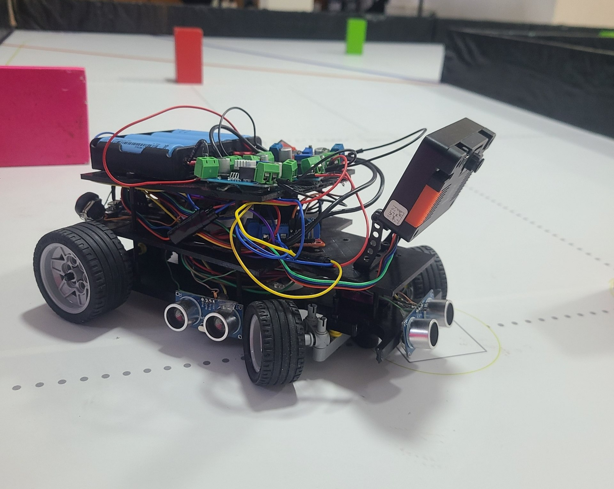
  <br>
  
  <i>Plataforma robótica autónoma "Smoke" en configuración de pista para WRO 2026.</i>
</div>
<br>

El diseño dimensional y dinámico de **"Smoke"** responde a una búsqueda deliberada de compacidad y bajo momento de inercia rotacional ($I_z$), priorizando la agilidad en curvas cerradas sobre estructuras voluminosas:
* **📐 Dimensiones Geométricas Reales:** 
  * Longitud total ($L_{total}$): **225 mm** ($22.5\text{ cm}$)
  * Anchura de vía con neumáticos ($W_{total}$): **170 mm** ($17.0\text{ cm}$)
  * Altura máxima a la cúpula de potencia ($H_{total}$): **110 mm** ($11.0\text{ cm}$)
  * *Conformidad Reglamentaria:* Cumple con amplio margen la restricción dimensional oficial de la WRO ($< 300 \times 200 \times 300\text{ mm}$), dejando un margen de seguridad de $75\text{ mm}$ en longitud y $30\text{ mm}$ en anchura para evitar roces con los muros en giros cerrados.
* **⚖️ Masa y Balística Dinámica:** 
  * Masa total verificada en báscula de laboratorio: **859 gramos** ($0.859\text{ kg}$).
  * Peso total efectivo sobre el tapiz: 
    $$P = m \cdot g = 0.859\text{ kg} \times 9.81\text{ m/s}^2 \approx \mathbf{8.43\text{ Newtons}}$$
  * *Ventaja Dinámica del Peso Contenido:* Con apenas 859 g (frente a prototipos convencionales de la categoría que superan los 1150 g), la inercia lineal ($F = m \cdot a$) y centrífuga ($F_c = m \cdot \frac{v^2}{R}$) se reducen en más de un 25%, permitiendo desaceleraciones más tardías antes de la curva y aceleraciones en recta mucho más explosivas sin sobrecalentar el motor Makeblock.
* **🧠 Unidad Central de Cómputo:** **ESP32-S3 DevKit** (Dual-Core Xtensa LX7 240 MHz, 512 KB SRAM interna) operando bajo **FreeRTOS** para la ejecución concurrente de telemetría inercial y control reactivo.
* **👁️ Percepción Sensorial y Visión IA:** 
  * Procesador de visión inteligente **HuskyLens 2** en enlace serie UART por hardware a 115,200 baudios.
  * Red perimetral de **3 transductores ultrasónicos HC-SR04** ubicados a cota rasante.
  * Unidad de Medición Inercial (**IMU MPU6050**) concéntrica con el centro de masa del vehículo.
* **🦾 Dinámica, Dirección y Tracción:** 
  * Dirección delantera **Ackermann Híbrido** con servomotor digital metálico **TowerPro MG90S**.
  * Propulsión trasera **RWD** impulsada por un motor DC **Makeblock 9V (185 RPM nominales con encoder de cuadratura integrado)**, acoplado mediante transmisión cónica a 90° de PETG a una caja diferencial de 3 satélites LEGO EV3.
* **🔋 Subestación Energética:** Banco de celdas cilíndricas de litio **18650 (3.5V / 3500 mAh)** en configuración **2S2P** (tensión de bus nominal de 7.0V y capacidad masiva de **7000 mAh**), con 3 etapas DC-DC de regulación independiente (XL4015, LM2596 y XL6009).
> [!NOTE]
> **Origen del Nombre "Smoke":**
> Durante las primeras fases de validación experimental en el banco de potencia del laboratorio de INIAR, severos retornos inductivos y picos de sobretensión provocados por la conmutación del motor quemaron consecutivamente tres módulos reguladores *Step-Down*, despidiendo una densa columna de humo blanco. 
> 
> Lejos de desalentarnos, este suceso marcó el rumbo de nuestra ingeniería: nos impulsó a rediseñar de raíz toda la arquitectura eléctrica, aislando la lógica de la potencia mediante 3 ramas independientes y unificando el plano de masas. Bautizar al vehículo como **"Smoke"** rinde tributo a la resiliencia en el taller: cada falla es un aprendizaje indispensable para alcanzar la máxima fiabilidad en pista.
<p align="right"><a href="#inicio">⬆️ Volver al Inicio</a></p>

<a id="fotos-360"></a>

# 5. Galería de Inspección Técnica 360°
Para verificar la simetría estructural, la concentricidad del centro de masa ($CoG$), la rigidez de la manufactura aditiva en PETG y el despeje libre sobre el tapiz (*ground clearance*), se documentan los **6 perfiles de inspección ortogonal reglamentarios**:
| 📸 Perfil de Inspección | 🖼️ Registro Visual | 🔍 Criterio de Verificación Técnica de Ingeniería |
| :--- | :---: | :--- | 
| **Vista Frontal**<br>*(Front View)* |  | • Evalúa la orientación e inclinación angular del procesador de visión **HuskyLens 2** en el Piso 2.<br>• Muestra la posición del sensor ultrasónico central delantero para el frenado ante esquinas a 70 cm.<br>• Inspección del paralelismo de las manguetas de dirección LEGO y el despeje del parachoques. |
| **Vista Trasera**<br>*(Rear View)* |  | • Evidencia el anclaje del motor Makeblock sobre su bancada de PETG reforzada con 8 tornillos M3.<br>• Muestra el ensamble de la transmisión cónica atacando la corona del diferencial LEGO EV3.<br>• Verificación de los retenedores axiales amarillos LEGO que evitan el desplazamiento de las ruedas de tracción de 43 mm. |
| **Vista Superior**<br>*(Top View)* |  | • Evalúa el balance transversal de masas: banco 18650 (2S2P) a la par de los módulos Buck/Boost.<br>• Inspección de la posición concéntrica del sensor inercial **MPU6050** en el centro geométrico del chasis.<br>• Muestra la segregación y peinado del cableado de potencia y señales lógicas hacia el ESP32-S3. |
| **Vista Inferior**<br>*(Bottom View)* |  | • Comprueba la superficie lisa del primer piso en PETG para minimizar la resistencia aerodinámica.<br>• Verificación del *ground clearance* ($\ge 15\text{ mm}$) para evitar cualquier roce en el paso por desniveles del tapiz.<br>• Muestra las cavidades hexagonales empotradas para tuercas de seguridad autoblocantes M3. |
| **Vista Lateral Derecha**<br>*(Right View)* |  | • Evidencia la separación vertical física estricta entre el Piso 1 (tracción), Piso 2 (lógica) y Piso 3 (potencia).<br>• Muestra la orientación perpendicular del sensor ultrasónico lateral derecho para el centrado a 30 cm.<br>• Inspección del escalonamiento de neumáticos: Ø 30 mm directrices y Ø 43 mm motrices. |
| **Vista Lateral Izquierda**<br>*(Left View)* |  | • Permite verificar el acceso a la interfaz de usuario: doble switch maestro y pulsador de arranque GPIO 21.<br>• Disposición del sensor ultrasónico lateral izquierdo.<br>• Evidencia la ventilación pasiva del disipador de aluminio del driver L298N y los reguladores de potencia. |
<p align="right"><a href="#inicio">⬆️ Volver al Inicio</a></p>

<a id="videos-oficiales"></a>
# 6. Desempeño en Pista (Videos Oficiales)
Para validar de forma fehaciente el cumplimiento del reglamento internacional, se presentan los registros audiovisuales de la plataforma "Smoke" operando en pista reglamentaria:
### 6.1 Ronda Abierta (Open Challenge - Recorrido Completo de 3 Vueltas)
Demostración del vehículo completando de manera 100% autónoma las 12 esquinas reglamentarias (3 vueltas continuas), navegando mediante la fusión de la red ultrasónica perimetral y la telemetría inercial del MPU6050:
<div align="center">
  <a href="https://youtu.be/ooOyRUvQE2Y" target="_blank">
    
    <br>
    <b>▶️ Ver en YouTube: Ronda Abierta Oficial – Team Nexus (WRO 2026)</b>
  </a>
</div>
<br>

### 6.2 Ronda de Obstáculos (Obstacle Challenge - Evasión Colorimétrica)
Registro técnico de la clasificación en tiempo real de los bloques de tráfico (rojos y verdes) mediante el procesador de visión inteligente **HuskyLens 2** en enlace serie UART, inyectando de forma inmediata la maniobra de viraje evasivo hacia el servomotor MG90S:

<div align="center">
  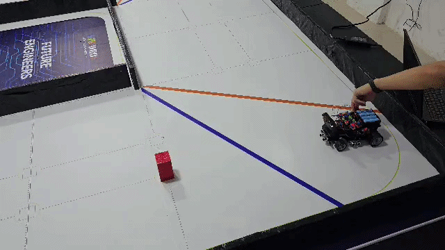
  <br>
  <b>📹 Demostración Técnica: Detección colorimétrica y maniobra autónoma de esquiva ante bloque reglamentario rojo (ID 1)</b>
</div>
<p align="right"><a href="#inicio">⬆️ Volver al Inicio</a></p>

<a id="bom-componentes"> </a>

# 7. Lista Maestra de Materiales y Componentes (BOM)

La selección de hardware para la plataforma **"Smoke"** responde a una metodología rigurosa de **análisis de compromisos (*Trade-off Analysis*) e ingeniería de valor**: cada componente fue evaluado no solo por sus especificaciones teóricas, sino por su balance óptimo entre peso, fiabilidad mecánica, eficiencia energética y coste.
A continuación se desglosa el inventario técnico de la plataforma, detallando la justificación de ingeniería detrás de cada elección frente a alternativas comerciales descartadas:

### 7.1 Subsistema Electrónico, Control y Potencia
| Componente y Modelo | Vista Previa | Especificaciones Clave | Función en "Smoke" | ¿Por qué se eligió? (Justificación Técnica) | Datasheet / Referencia |
| :--- | :---: | :--- | :--- | :--- | :---: | 
| **Microcontrolador Central**<br>ESP32-S3 DevKit | 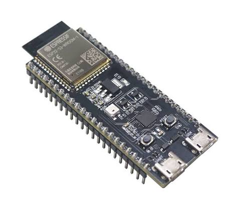 | • Dual-Core Xtensa LX7  240 MHz<br>• 512 KB SRAM + Wi-Fi/BLE<br>• Arquitectura FreeRTOS | Cerebro principal del vehículo; procesa en tiempo real la máquina de estados, telemetría y PWM. | Su arquitectura de doble núcleo permite asignar la integración inercial del MPU6050 al **Core 0** (a 500 Hz) mientras el **Core 1** gestiona la navegación reactiva, eliminando cuellos de botella temporales. | [📄 PDF](https://www.espressif.com/sites/default/files/documentation/esp32-s3_datasheet_en.pdf) |
| **Procesador de Visión IA**<br>DFRobot HuskyLens 2 | 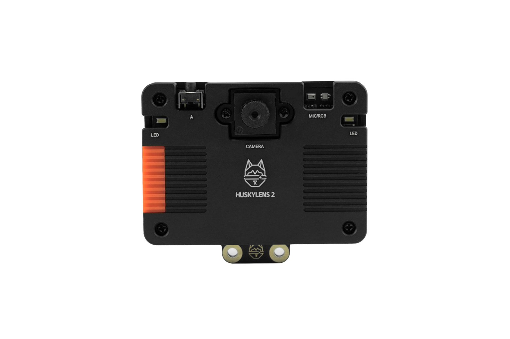 | • Procesador AI KPU integrado<br>• Clasificación colorimétrica<br>• Pantalla IPS de control | Reconocimiento y clasificación en tiempo real de los bloques de tráfico (rojo ID 1 / verde ID 2). | Realiza la inferencia de visión por hardware embebido a 30 FPS, liberando de carga matemática al ESP32-S3 y comunicándose por UART a 115,200 baudios sin saturar el bus I2C. | [📄 Wiki](https://wiki.dfrobot.com/HUSKYLENS_V1.0_SKU_SEN0305_SEN0336) |
| **Celdas de Batería**<br>EVE INR18650-35V | 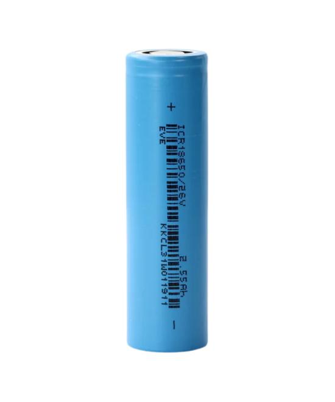 | • Química Li-ion (3.5V nominal)<br>• Configuración **2S2P (7.0V)**<br>• Capacidad masiva: **7000 mAh** | Suministro primario de energía para todo el vehículo y sus tres ramas de conversión. | **Priorización de Autonomía:** El arreglo 2S2P de 7000 mAh garantiza horas ininterrumpidas de pruebas en pista y asegura que la curva de tensión se mantenga plana, evitando pérdidas de velocidad en la vuelta final. | [📄 Info](https://www.evebattery.com/) |
| **Driver de Tracción**<br>Dual H-Bridge L298N | 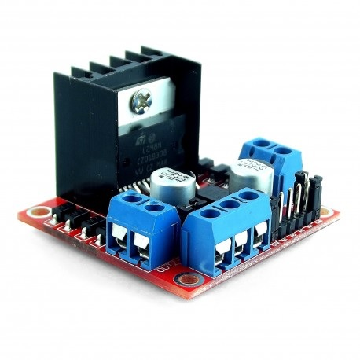 | • Transistores Darlington BJT<br>• 2A pico por canal<br>• Disipador térmico masivo | Control de sentido de giro (avance/reversa) y velocidad PWM del motor Makeblock. | Robusto y tolerante a sobrecorrientes transitorias de arranque; se optimizó retirando su jumper de 5V y alimentando su etapa de potencia a 14V para compensar la caída Darlington. | [📄 PDF](https://www.sparkfun.com/datasheets/Robotics/L298_H_Bridge.pdf) |
| **Regulador Lógica**<br>XL4015E1 Step-Down | 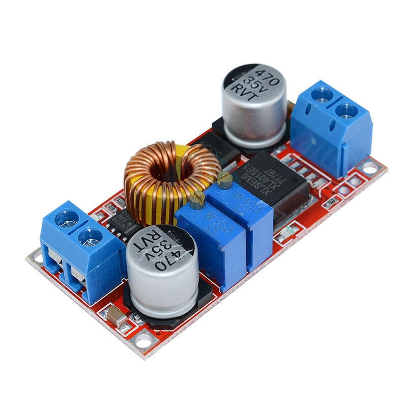 | • Convertidor Buck 5A máx.<br>• Tensión fijada a **5.0V DC**<br>• Eficiencia superior al 90% | Alimenta de forma limpia el ESP32-S3, la red ultrasónica y la sección lógica del L298N. | Su alta capacidad de corriente (5A) y bajo rizado protegen al microcontrolador de caídas de tensión bruscas (*brownouts*) cuando los actuadores demandan potencia. | [📄 PDF](https://www.xlsemi.com/datasheet/XL4015%20datasheet.pdf) |
| **Regulador Actuadores**<br>LM2596 Step-Down | 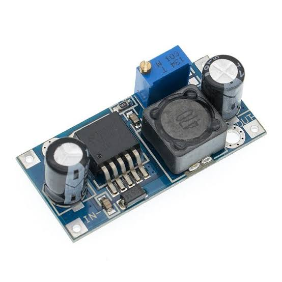 | • Convertidor Buck 3A máx.<br>• Tensión fijada a **5.0V DC**<br>• Filtro LC integrado | Rama exclusiva para el servomotor TowerPro MG90S y la cámara HuskyLens 2. | Aísla completamente los picos de corriente inductiva que genera el servomotor al cambiar de dirección bruscamente, evitando que contaminen la línea del ESP32-S3. | [📄 PDF](https://www.ti.com/lit/ds/symlink/lm2596.pdf) |
| **Regulador Tracción**<br>XL6009 Step-Up | 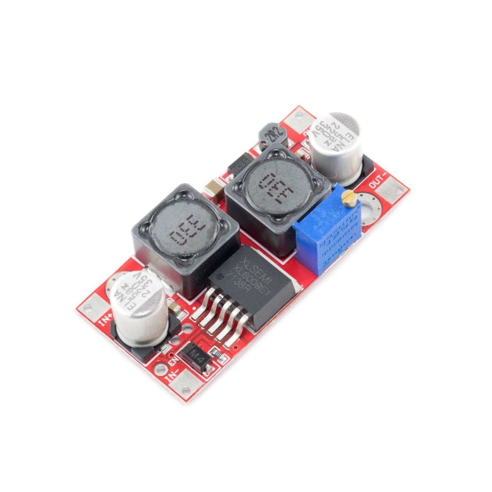 | • Convertidor Boost 4A máx.<br>• Tensión fijada a **14.0V DC**<br>• Conmutación a 400 kHz | Eleva la tensión del banco de baterías para suministrar 12V netos al motor Makeblock. | Compensa la caída interna inherente de $\approx 2.0\text{V}$ del puente H L298N, asegurando que el motor funcione en su cota de máxima potencia y velocidad. | [📄 PDF](https://www.xlsemi.com/datasheet/XL6009%20datasheet.pdf) |
| **Sensor Inercial (IMU)**<br>InvenSense MPU6050 | 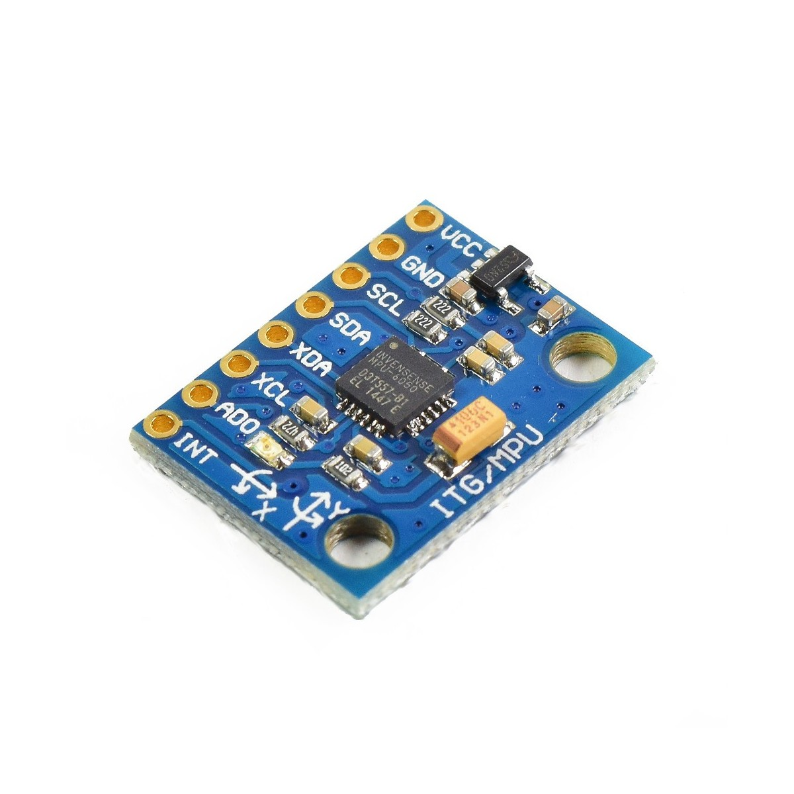 | • Giroscopio de 3 ejes ($\pm 1000^\circ/\text{s}$)<br>• Acelerómetro de 3 ejes<br>• Bus I2C con auto-rescate | Mide la orientación angular (*Yaw*) en el centro de gravedad del vehículo para el control PD. | Permite una navegación inercial hiperestable en rectas y cuenta con la subrutina `rescatarBusI2C()` para desbloquear el bus en caliente ante ruidos parásitos. | [📄 PDF](https://invensense.tdk.com/wp-content/uploads/2015/02/MPU-6000-Datasheet1.pdf) |
| **Sensores Proximidad**<br>HC-SR04 Ultrasónicos (x3) | 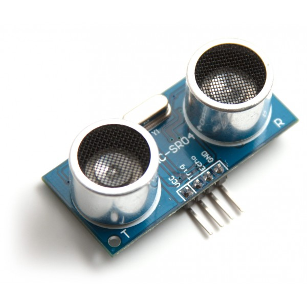 | • Rango: 2 cm a 400 cm<br>• Ángulo de apertura: $15^\circ$<br>• Muestreo cíclico asíncrono | Sensado perimetral: Frontal (detección de esquinas a 70 cm) y Laterales (mantenimiento a 30 cm). | Solución acústica inmune a variaciones de luz ambiental o reflejos en la pista, operada bajo un esquema secuencial que erradica la interferencia cruzada (*crosstalk*). | [📄 PDF](https://www.sparkfun.com/datasheets/Sensors/Proximity/HCSR04.pdf) |

### 7.2 Subsistema Mecánico, Actuadores y Chasis
| Componente y Modelo | Vista Previa | Especificaciones Clave | Función en "Smoke" | ¿Por qué se eligió? (Justificación Técnica) | Referencia CAD / Enlace | 
| :--- | :---: | :--- | :--- | :--- | :---: | 
| **Motor de Tracción**<br>Makeblock DC Motor 9V | 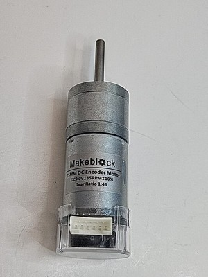 | • 185 RPM nominales @ 9V-12V<br>• Encoder óptico integrado<br>• Eje cilíndrico en "D" | Genera el par motriz longitudinal transferido al diferencial trasero. | **Balance Masa-Torque:** Tras evaluar múltiples opciones, este motor ofreció el torque exacto para desplazar con aceleración ágil los 859 g de "Smoke" sin sacrificar velocidad en rectas ni requerir complejas reductoras externas. | [🌐 Web](https://www.makeblock.com/) |
| **Servomotor Dirección**<br>TowerPro MG90S | 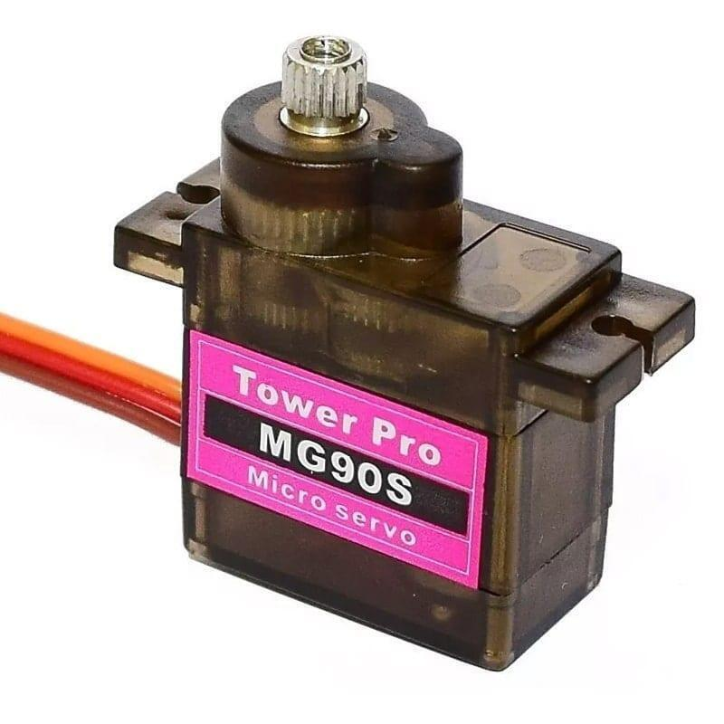 | • **Piñonería 100% metálica**<br>• Torque: 2.2 kg·cm  6V<br>• Velocidad: 0.10 s / 60° | Acciona la timonería Ackermann delantera para el guiado del vehículo. | **Resistencia a Fuerzas de Empuje:** A diferencia de servos con engranes plásticos (como el SG90), la piñonería metálica del MG90S resiste la inercia y fuerza de empuje del motor Makeblock en virajes cerrados sin barrer dientes. | [📄 PDF](https://www.electronicoscaldas.com/datasheet/MG90S_Tower-Pro.pdf) |
| **Diferencial Trasero**<br>Lego Technic EV3 |  | • Caja diferencial de 3 satélites<br>• Piñones cónicos internos<br>• Plástico inyectado de bajo roce | Distribuye la velocidad angular entre las ruedas traseras izquierda y derecha en curvas. | Evita el bloqueo del eje posterior y elimina el arrastre de neumáticos (*tire scrub*), permitiendo que la rueda exterior acelere libremente respecto a la interior en giros de 90°. | [🔗 Lego](https://www.bricklink.com/) |
| **Transmisión Cónica 90°**<br>Piñón Helicoidal Custom | 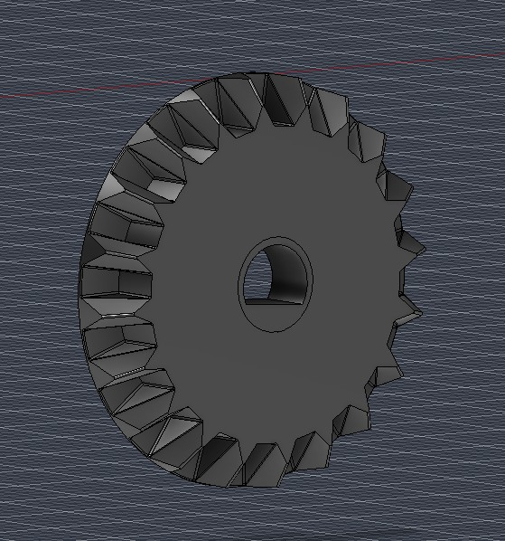 | • Modelado en Fusion 360<br>• Cavidad interior en forma de "D"<br>• PETG 100% relleno sólido | Transfiere el giro longitudinal del motor al eje transversal de la corona LEGO. | Resuelve la incompatibilidad física entre el eje en D del motor Makeblock y el encaje en cruz de LEGO con una pieza compacta de alta resistencia a la cizalladura. | [⚙️ Ver CAD](./models/) |
| **Estructura de Chasis**<br>Diseño Modular 3 Pisos | 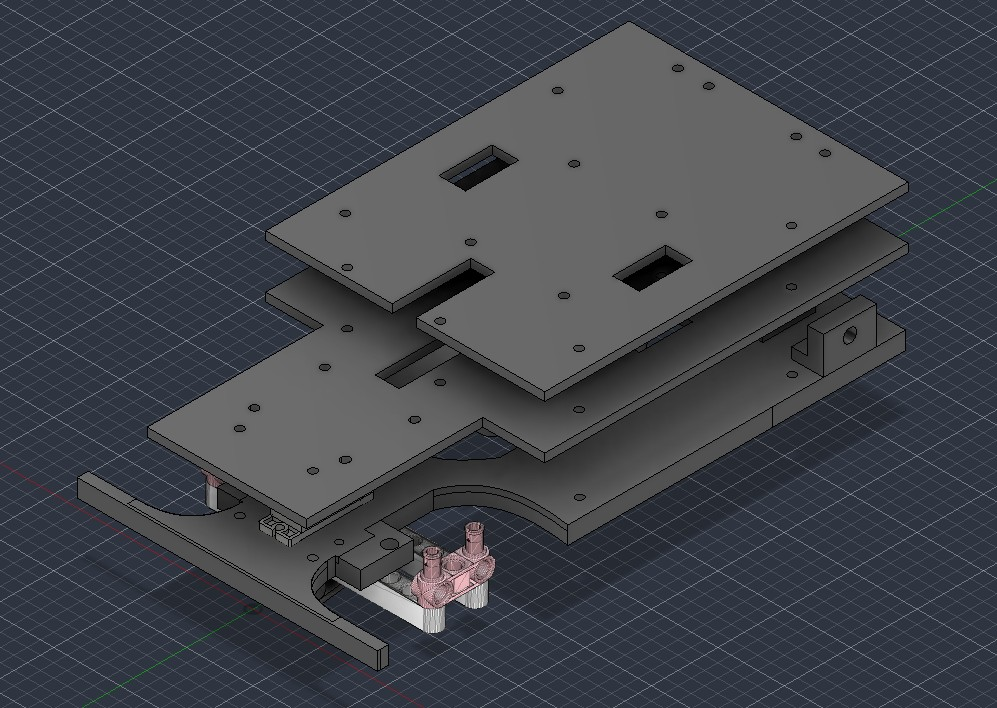 | • Fabricado en Bambu Lab<br>• Filamento **PETG estructural**<br>• Arquitectura vertical | Aloja y segrega los subsistemas mecánicos, lógicos y de potencia. | **Ingeniería de Valor y Tenacidad:** El PETG ofreció la mejor relación coste-eficiencia, aportando mayor resistencia al impacto que el PLA estándar y soportando hasta $80^\circ\text{C}$ sin deformación térmica junto al motor. | [⚙️ Ver STL](./models/) |
| **Tornillería Unificada**<br>Hardware M3 Hexagonal |  | • Tornillos Allen M3 (8-20 mm)<br>• Tuercas de seguridad Nyloc<br>• Separadores rígidos | Unifica la fijación de todo el chasis, bancada de motor y soportes. | Estandariza el mantenimiento en boxes: una sola llave Allen de 2.5 mm opera todo el carro, y las tuercas autoblocantes impiden desajustes por vibración de alta frecuencia. | [⚙️ Ver Info](./models/) |
<p align="right"><a href="#inicio">⬆️ Volver al Inicio</a></p>

<a id="movilidad-mecanica"></a>

# 8. Movilidad y Diseño Mecánico
</div>

El chasis y tren cinemático de **"Smoke"** fueron desarrollados bajo un enfoque híbrido de manufactura: combinando la libertad de diseño paramétrico que ofrece la **impresión 3D en PETG** con la precisión de bajo rozamiento de componentes inyectados de robótica educativa (**LEGO MINDSTORMS EV3**).
Esta arquitectura fue calculada específicamente para soportar las fuerzas de inercia y torsión generadas por una masa dinámica de **859 gramos**, optimizando la posición del centro de gravedad ($CoG$) y minimizando la fricción en pista.


### 8.1 Arquitectura Modular del Chasis (Tres Pisos en PETG)
Para evitar el desorden estructural y blindar la electrónica contra interferencias electromagnéticas (EMI) y calor, el vehículo implementa una **estructura vertical de tres estratos segregados**:


```mermaid
flowchart TD
    subgraph "PISO 3: ALIMENTACIÓN Y GESTIÓN ENERGÉTICA"
        P3["🔋 Banco Celdas EVE 18650 2S2P (7000 mAh @ 7.0V)<br>⚡ Convertidores DC-DC: XL4015 (5V), LM2596 (5V) y XL6009 (14V)<br>🔌 Doble Switch de Seguridad Maestro"]
    end
    subgraph "PISO 2: CONTROL CENTRAL, VISIÓN IA Y TELEMETRÍA"
        P2["🧠 Microcontrolador Central ESP32-S3 DevKit<br>👁️ Procesador de Visión Inteligente HuskyLens 2<br>🧭 Sensor Inercial IMU MPU6050 (Alineado al CoG)<br>🔲 Driver Puente H L298N con Disipador Térmico"]
    end
    subgraph "PISO 1: DINÁMICA DE TRACCIÓN Y CONTACTO AL SUELO"
        P1["⚙️ Motor Makeblock 9V (185 RPM) + Bancada M3 en PETG<br>🔄 Transmisión Cónica 90° + Diferencial LEGO EV3 (3 Satélites)<br>🦾 Dirección Ackermann Híbrida + Servo TowerPro MG90S<br>📡 Red de 3 Sensores Ultrasónicos HC-SR04 (Rasantes)"]
    end
    P3 === P2
    P2 === P1
    classDef n3 fill:#1f2328,stroke:#f85149,stroke-width:2px,color:#fff;
    classDef n2 fill:#1f2328,stroke:#0366d6,stroke-width:2px,color:#fff;
    classDef n1 fill:#1f2328,stroke:#2ea44f,stroke-width:2px,color:#fff;
    class P3 n3;
    class P2 n2;
    class P1 n1;
```
### 8.2 Estandarización de Sujeción (Tornillería M3)
Uno de los criterios esenciales para garantizar la fiabilidad del vehículo ante vibraciones de alta frecuencia provocadas por el motor Makeblock y los impactos en pista fue la **unificación total de fijaciones bajo métrica M3**:
<div align="center">
  
  <br>
  <i>Kit estandarizado de tornillería métrica M3, tuercas de seguridad autoblocantes y columnas pasantes.</i>
</div>

* **Tornillería Métrica M3:** Se estandarizó el uso de tornillos de acero grado 10.9 con cabeza Allen en longitudes calibradas de **8, 12, 16 y 20 mm** para componentes internos, permitiendo que una sola llave Allen de 2.5 mm opere todo el vehículo en boxes.
* **Columnas Pasantes de 35 mm para Rigidez Inter-Pisos:** 
  Para unir rígidamente los tres pisos del chasis sin depender de pequeñas uniones intermedias que pudieran falsearse con el movimiento, se implementaron **tornillos largos pasantes M3 de 35 mm**:
  * Estos tornillos atraviesan separadores cilíndricos en PETG que fijan con precisión la luz vertical entre niveles: un espacio libre de **$15\text{ mm}$ entre el Piso 1 y el Piso 2** (para dar cabida rasante al motor y servo), y un despeje de **$19\text{ mm}$ entre el Piso 2 y el Piso 3** (para albergar el disipador del L298N, la HuskyLens 2 y el cableado de la IMU).
  * Este diseño en columna pasante distribuye las cargas de flexión a lo largo de toda la altura del vehículo ($110\text{ mm}$), evitando el pandeo estructural.
* **Tuercas de Seguridad Autoblocantes (Nyloc):** Cada unión crítica y remate de las columnas de 35 mm incorpora tuercas con inserto elástico de nylon alojadas en cavidades hexagonales empotradas en el PETG, eliminando por completo la posibilidad de aflojamiento por resonancia mecánica.

### 8.3 Geometría de Dirección Ackermann Híbrida

#### Principio Físico y Necesidad Dinámica
Cuando un vehículo traza una curva, la rueda directriz interior recorre un radio de giro más cerrado ($R_i$) que la rueda exterior ($R_o$). Si ambas ruedas giraran al mismo ángulo (geometría paralela convencional), los neumáticos se verían forzados a arrastrarse de lado sobre la pista (*wheel scrub* o arrastre lateral), lo que genera:
1. Una fuerza de fricción parásita que frena el vehículo en cada curva.
2. Pérdida crítica de adherencia en el tren delantero, provocando subviraje (*understeer*).
3. Sobrecarga de corriente y calentamiento prematuro en el servomotor.
Para resolver esto, **"Smoke"** implementa una **geometría de dirección Ackermann**, donde la timonería hace que **la rueda interior gire más pronunciadamente ($\theta_i$) que la exterior ($\theta_o$)**:
<div align="center">
  
| 1. Principio Teórico | 2. Diseño CAD en Fusion 360 | 3. Ensamble Físico en Piso 1 |
| :---: | :---: | :---: |
| 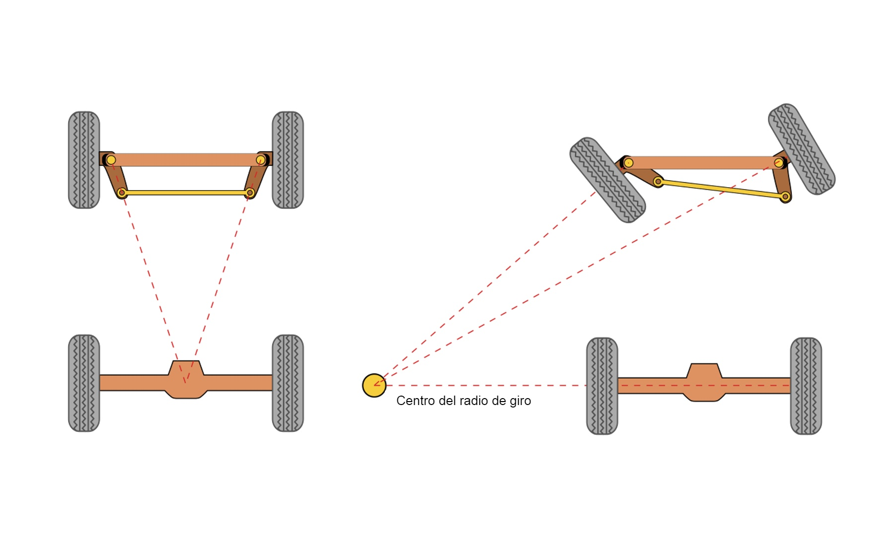 |  |  |
| *Convergencia hacia el eje trasero* | *Brazo custom en PETG + manguetas* | *Integración con servo MG90S* |
</div>

#### Solución de Co-Diseño: Manguetas Inyectadas LEGO + Brazo Custom en PETG
Durante las fases de prototipado inicial, evaluamos imprimir las manguetas y tirantes de dirección completamente en 3D. Sin embargo, las piezas pequeñas impresas en FDM presentaban microporosidad superficial, lo que generaba un rozamiento irregular y juego mecánico acumulado (*backlash*).
> [!NOTE]
> **Decisión de Ingeniería Híbrida:**
> Optamos por una solución de alto rendimiento:
> - **Manguetas y Rótulas Inyectadas (LEGO EV3):** Proporcionan una superficie de giro industrial con fricción prácticamente nula y tolerancias dimensionales microscópicas imposibles de igualar en FDM.
> - **Brazo de Servo (*Servo Horn*) Custom en PETG:** Diseñado a medida en **Autodesk Fusion 360** e impreso con **100% de relleno sólido en PETG**, conectando rígidamente el estriado metálico del servo TowerPro MG90S con los tirantes de LEGO.


#### Validación del Rango de Viraje del Servomotor (±80°)
Para garantizar que la timonería no sufra atascos mecánicos (*binding*) en maniobras de evasión extrema ante obstáculos, se calibró el recorrido del servomotor MG90S:
<div align="center">
  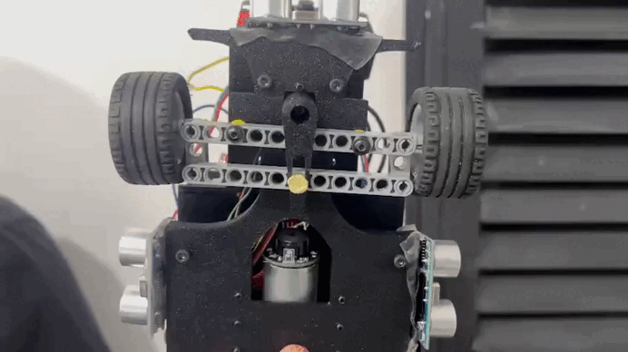
  <br>
  <i>Verificación cinemática: barrido continuo del servo MG90S hasta ±80° demostrando movimiento suave, sin holguras y con respuesta lineal.</i>
</div>

#### Modelo Matemático de la Dirección
La condición de rodadura pura de Ackermann exige que las prolongaciones de los ejes de las ruedas coincidan en el **Centro Instantáneo de Rotación ($CIR$)**:
$$\cot(\theta_o) - \cot(\theta_i) = \frac{W}{L}$$
Donde:
* $W$ = Trocha delantera entre pivotes de mangueta: **142 mm** ($0.142\text{ m}$).
* $L$ = Batalla entre ejes delantero y trasero: **155 mm** ($0.155\text{ m}$).
* $\theta_i$ = Ángulo de la rueda interior a la curva.
* $\theta_o$ = Ángulo de la rueda exterior a la curva.
El radio de giro mínimo medido en el centro del eje posterior se rige por:
$$R = \frac{L}{\tan(\delta)}$$
*(Donde $\delta$ es el ángulo promedio equivalente de la dirección).*

### 8.4 Tren de Tracción RWD, Transmisión Cónica y Diferencial
Para impulsar la masa de **859 gramos**, "Smoke" adopta un esquema de **Tracción Trasera (RWD)** con transmisión en ángulo recto acoplada a un diferencial de satélites cónicos:
<div align="center">
  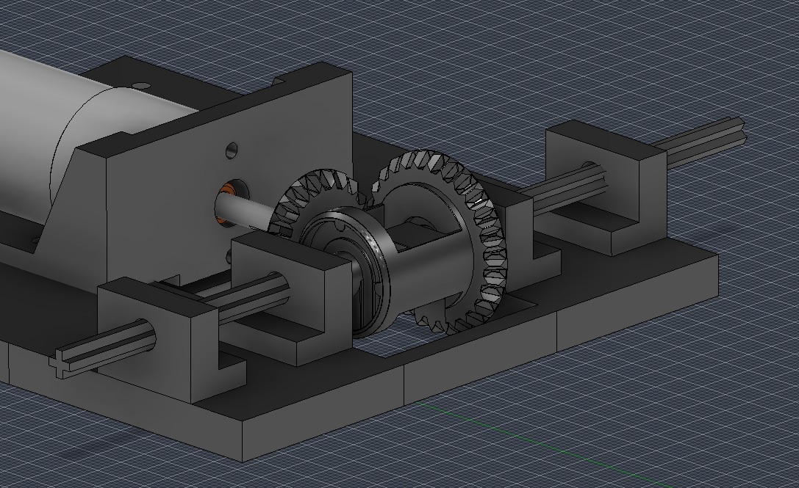
  <br>
  <i>Render de ingeniería en Fusion 360: Acople del eje en D del motor Makeblock al piñón cónico custom en PETG atacando la corona del diferencial LEGO EV3.</i>
</div>


#### 1. Adaptación Mecánica: Eje en D (D-Shaft) a Engranaje Cónico
El motorreductor Makeblock cuenta con un eje cilíndrico con rebaje plano (**eje tipo D**), incompatible con los orificios en cruz estandarizados de LEGO:
* **Solución Técnica:** Modelamos paramétricamente en Fusion 360 un **piñón cónico personalizado** con ranura hembra interna en "D", dimensionado con una compensación de holgura de **$0.15\text{ mm}$** para absorber la contracción térmica del plástico.
* **Manufactura:** Impreso al **100% de densidad de relleno (infill sólido)** en **PETG** en la Bambu Lab, logrando que los dientes soporten el torque instantáneo de arranque sin cizallarse.
<div align="center">
  
  <br>
  <i>Detalle del piñón cónico en PETG con orificio interno en forma de "D".</i>
</div>

#### 2. Soporte Rígido del Motor (Bancada de 8 Puntos en PETG)
Para contrarrestar el momento torsor de reacción que tiende a desalinear el engranaje del motor durante aceleraciones violentas:
* El motor Makeblock se sujeta frontalmente mediante **2 tornillos métricos** directamente a la cara anterior de la bancada.
* La base de la bancada se ancla sólidamente al chasis del Piso 1 mediante **6 tornillos M3** con tuercas autoblocantes, formando una estructura de 8 puntos de fijación que erradica la separación de dientes (*gear separation*).


#### 3. Diferencial de Satélites y Estabilización de Semiejes
El conjunto diferencial de 3 piñones cónicos internos LEGO EV3 distribuye la velocidad angular en curvas:
$$\omega_{diferencial} = \frac{\omega_{izq} + \omega_{der}}{2}$$
* **Doble Bancada por Semieje:** Cada semieje de salida se apoya en dos puntos del PETG (uno contiguo al diferencial y otro junto a la rueda), impidiendo deflexiones axiales bajo carga.
* **Retenedores Amarillos LEGO (*Bushings*):** Los orificios en el chasis se dimensionaron con holgura para rotación libre de fricción, fijando el eje longitudinalmente con retenedores amarillos para impedir desplazamientos transversales de las ruedas.

### 8.5 Estudio Dinámico: Fuerzas, Torque en Rueda y Aceleración
Para fundamentar analíticamente el desempeño dinámico del vehículo en pista y justificar que el motor Makeblock de 185 RPM opera en su zona de máxima eficiencia sin estancamiento térmico (*stall*), desarrollamos el modelo físico basado en las medidas y masa real de **"Smoke"**:
* **Masa Total del Vehículo:** $m = 859\text{ gramos} = \mathbf{0.859\text{ kg}}$
* **Peso Total Normal:** $P = m \cdot g = 0.859\text{ kg} \times 9.81\text{ m/s}^2 \approx \mathbf{8.43\text{ Newtons}}$
* **Distribución de Masa Estática:** $45\%$ en el eje delantero y $55\%$ en el eje trasero (tracción RWD):
  $$N_{trasero} = 0.55 \times 8.43\text{ N} \approx \mathbf{4.64\text{ Newtons}}$$
* **Radio Efectivo de Rueda Trasera ($r_{rueda}$):** Diámetro $\varnothing = 43\text{ mm} \implies r = 0.0215\text{ metros}$.
* **Coeficiente de Fricción Caucho/Pista ($\mu_s$):** Estimado conservadoramente en $\mu_s \approx 0.70$ para neumáticos de goma LEGO EV3 limpios sobre tapiz de vinilo.

#### 1. Cálculo del Torque de Ruptura Estática en Ruedas (Breakout Torque)
El par de torsión mínimo que debe vencerse en el eje de las ruedas traseras para romper la inercia estática e iniciar el movimiento acelerado sin patinaje viene dado por:

$$\tau_{rueda} = N_{trasero} \cdot \mu_s \cdot r_{rueda}$$
$$\tau_{rueda} = 4.64\text{ N} \times 0.70 \times 0.0215\text{ m} \approx \mathbf{0.0698\text{ Nm}} \approx \mathbf{0.712\text{ kg}\cdot\text{cm}}$$

#### 2. Par Motor Makeblock y Eficiencia de Transmisión
El motor Makeblock de 9V a 185 RPM entrega un torque nominal constante de $\tau_{motor} \approx 1.5\text{ kg}\cdot\text{cm}$ ($0.147\text{ Nm}$).
Considerando la relación de transmisión cónica ($i \approx 1.2:1$) y una eficiencia mecánica global de transmisión de $\eta = 88\%$ (0.88) para los engranajes cónicos apoyados sobre bujes lisos:
$$\tau_{disponible} = \tau_{motor} \cdot i \cdot \eta = 1.5\text{ kg}\cdot\text{cm} \times 1.2 \times 0.88 \approx \mathbf{1.58\text{ kg}\cdot\text{cm}}$$
$$\text{Margen de Seguridad de Tracción: } \frac{\tau_{disponible}}{\tau_{rueda}} = \frac{1.58}{0.712} \approx \mathbf{2.22}$$
> [!TIP]
> **Conclusión del Margen de Potencia:**
> El sistema dispone de un **margen de seguridad del 222%** respecto al torque estático de ruptura. Esto garantiza que:
> 1. El motor Makeblock opera con apenas un **$45\%$ de su carga nominal**, consumiendo una corriente promedio baja ($\approx 350 - 500\text{ mA}$).
> 2. No existe riesgo de calentamiento por efecto Joule en las bobinas ni derretimiento térmico de la bancada de PETG.
> 3. El carro acelera de $0\text{ a }100\%$ de velocidad en menos de **$0.25\text{ segundos}$** tras salir de cada curva de 90°.

#### 3. Velocidad Lineal Teórica Máxima en Pista

La velocidad tangencial máxima del vehículo en los tramos rectos a 185 RPM nominales en el eje se rige por:
$$v_{teorica} = \omega \cdot r_{rueda} = \left( 185 \cdot \frac{2\pi}{60} \right) \cdot 0.0215\text{ m} \approx 19.37\text{ rad/s} \times 0.0215\text{ m} \approx \mathbf{0.416\text{ m/s}} \approx \mathbf{1.50\text{ km/h}}$$

Esta velocidad permite recorrer los $\approx 12\text{ metros}$ totales de las 3 vueltas de carrera en un tiempo neto de navegación de aproximadamente **$28\text{ a }32\text{ segundos}$** (incluyendo frenados en curvas), situándose en el rango óptimo de control reactivo sin riesgo de desbordamiento de la pista.

### 8.6 Neumáticos Escalonados (Staggered Wheels Setup)
Para maximizar el agarre dinámico y facilitar el trabajo del servo MG90S, se implementó una configuración diferenciada entre ejes:
<div align="center">
  
| Tren / Posición | Diámetro Circular | Procedencia | Función Dinámica en "Smoke" |
| :---: | :---: | :---: | :--- |
| **Delantero (Dirección)** | **Ø 30 mm** | LEGO EV3 | **Baja inercia rotacional:** Reduce la masa no suspendida del tren delantero en un 40%, permitiendo que el servo MG90S cambie de dirección en milisegundos con mínimo esfuerzo torsor. |
| **Trasero (Tracción)** | **Ø 43 mm** | LEGO EV3 | **Mayor contacto y tracción:** Su mayor diámetro exterior incrementa la velocidad lineal de avance por revolución y su compuesto de caucho blando garantiza agarre estricto en aceleraciones. |
</div>

<p align="right"><a href="#inicio">⬆️ Volver al Inicio</a></p>

### 8.6 Neumáticos Escalonados (Staggered Setup)
La selección de neumáticos en **"Smoke"** no responde a criterios estéticos, sino a una rigurosa optimización de la **dinámica vehicular y la inercia rotacional**:
<div align="center">
  
| 1. Tren Delantero (Dirección) | 2. Tren Trasero (Tracción) | 3. Comparativa de Escalonamiento |
| :---: | :---: | :---: |
| 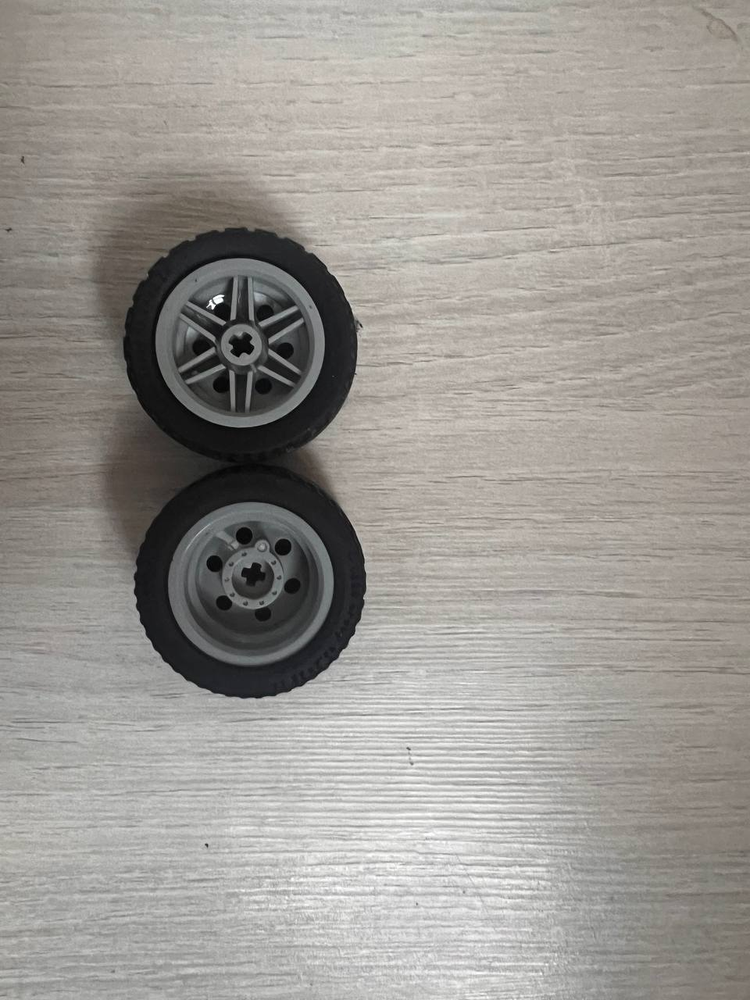 | 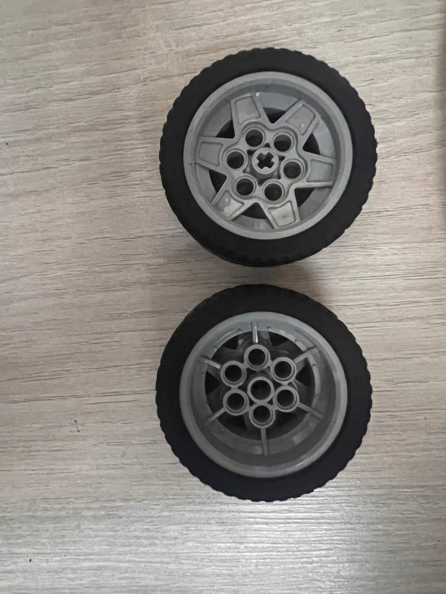 | 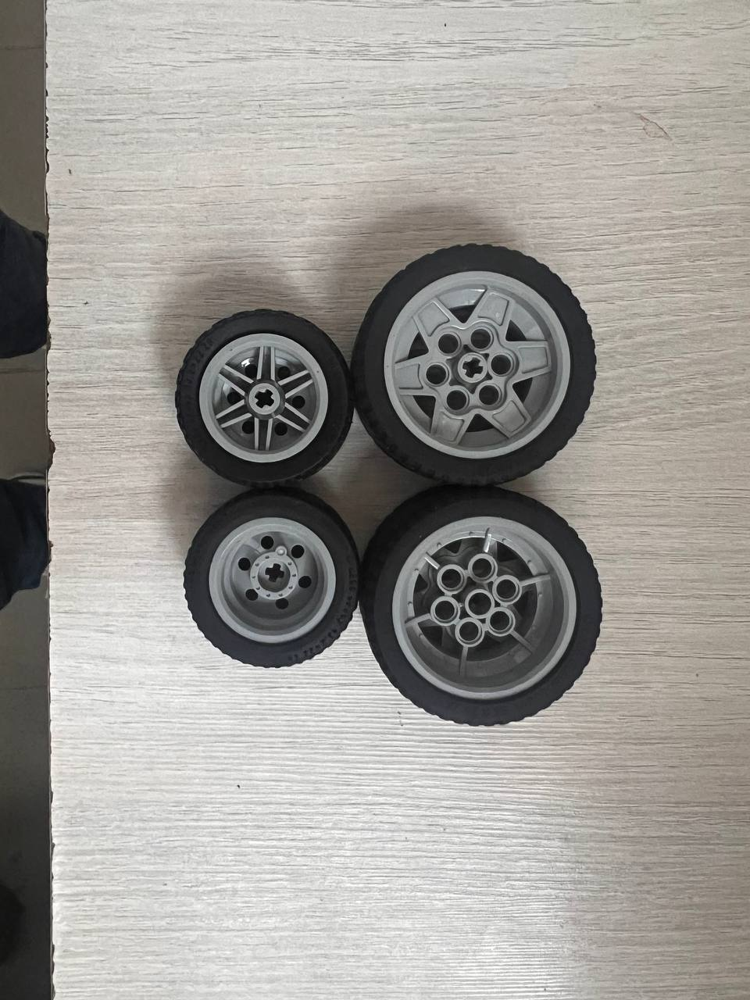 |
| *Ø 30 mm – LEGO EV3* | *Ø 43 mm – LEGO EV3* | *Diferencial de diámetro y banda de rodadura* |
</div>


#### 1. Justificación Dinámica del Tren Delantero (Ø 30 mm): Reducción del Momento de Inercia
El servomotor de dirección MG90S debe vencer dos resistencias para virar: la fricción de giro del caucho contra el tapiz y el momento de inercia rotacional de la propia rueda alrededor del pivote de la mangueta ($I_z$). 
El momento de inercia de un cuerpo rotacional respecto a su eje de masa se rige por:
$$I = \frac{1}{2} m \cdot r^2$$
Al reducir el radio de la rueda de $r_{trasera} = 21.5\text{ mm}$ a $r_{delantera} = 15.0\text{ mm}$, y considerando que la masa de la rueda de 30 mm es aproximadamente un $55\%$ menor ($m_{del} \approx 8.5\text{ g}$ frente a $m_{tras} \approx 19.0\text{ g}$):

$$\frac{I_{delantera}}{I_{trasera}} = \frac{m_{del} \cdot r_{del}^2}{m_{tras} \cdot r_{tras}^2} = \frac{0.0085 \cdot (0.015)^2}{0.0190 \cdot (0.0215)^2} \approx \mathbf{0.218} \quad (\approx 78.2\% \text{ de reducción})$$

> [!TIP]
> **Impacto en el Servo MG90S:**
> El tren delantero presenta una **reducción del 78% en la resistencia inercial rotacional**. Esto permite que el servo alcance su velocidad angular máxima ($0.10\text{ s}/60^\circ$) sin experimentar caídas de par ni sobrecorrientes en maniobras evasivas bruscas de $\pm 21^\circ$.


#### 2. Justificación Dinámica del Tren Trasero (Ø 43 mm): Maximización de Tracción y Velocidad
Para el eje motriz (RWD), se requería maximizar dos variables opuestas: velocidad punta de avance y adherencia en aceleración sin patinaje.
* **Mayor Velocidad Lineal por Revolución ($v$):**
  La velocidad tangencial de avance es directamente proporcional al radio del neumático:
  
  $$v = \omega_{eje} \cdot r_{rueda}$$
  El neumático de $43\text{ mm}$ ($r = 0.0215\text{ m}$) otorga un **$43.3\%$ más de avance por cada giro del motor** que si hubiéramos utilizado ruedas de $30\text{ mm}$, alcanzando $0.416\text{ m/s}$ ($1.50\text{ km/h}$)
  sin forzar las revoluciones del motor Makeblock.
* **Fuerza Máxima de Tracción sin Deslizamiento ($F_{max}$):**
  La fuerza tractiva que las ruedas traseras pueden transferir al suelo antes de que el caucho rompa adherencia estática y comience a patinar se calcula como:
  $$F_{max} = \mu_s \cdot N_{trasero} = 0.70 \times 4.64\text{ N} \approx \mathbf{3.25\text{ Newtons}}$$
  La banda de rodadura de caucho natural vulcanizado de LEGO EV3 (ancho de $14\text{ mm}$) ofrece una mayor área de huella de contacto (*tire contact patch*), asegurando que el torque transmitido por la transmisión cónica ($\approx 0.0698\text{ Nm}$) se convierta íntegramente en aceleración lineal sin derrapes parásitos en la salida de las curvas.
<p align="right"><a href="#inicio">⬆️ Volver al Inicio</a></p>

# 9. Arquitectura Eléctrica y Distribución de Potencia
La concepción del sistema eléctrico de **"Smoke"** parte de una lección técnica aprendida en el laboratorio: para lograr un vehículo de alta fiabilidad, es indispensable desacoplar galvánica y físicamente las cargas dinámicas e inductivas de los actuadores de las líneas de alimentación del microcontrolador y los sensores.

### 9.1 Banco de Baterías 18650 (Configuración 2S2P)

El suministro energético de la plataforma se basa en celdas de iones de litio industriales de alta densidad energética marca **EVE**, modelo **INR18650-35V**
<div align="center">
  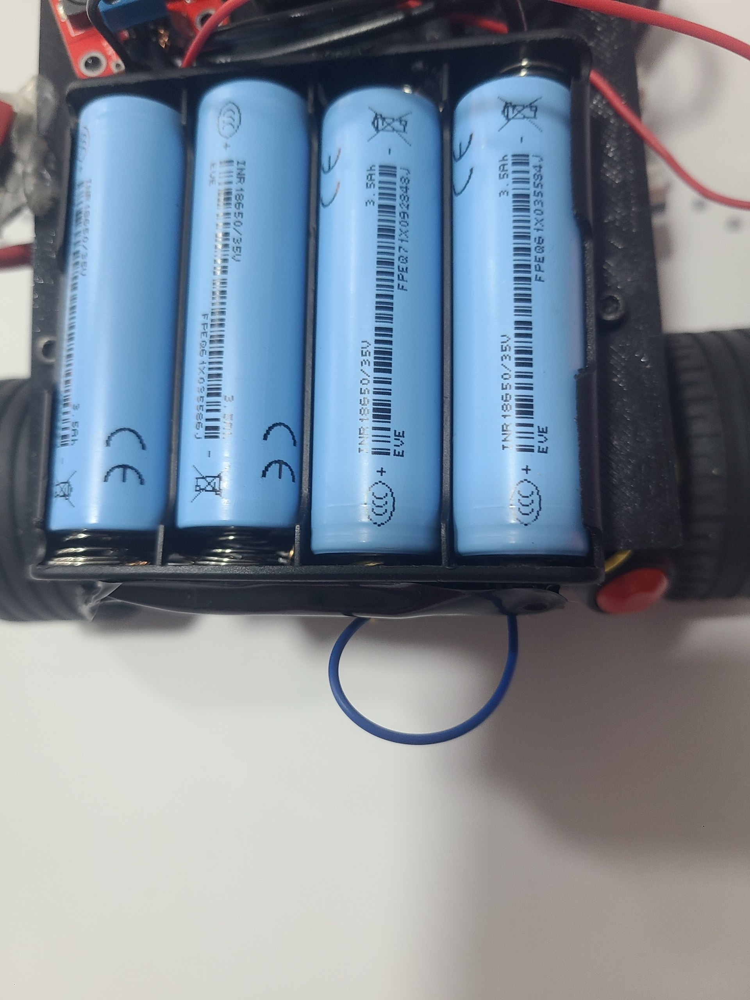
  <br>
  <i>Banco de celdas cilíndricas EVE INR18650-35V en configuración 2S2P montadas en el Piso 3.</i>
</div>

* **Topología Eléctrica (2S2P):** 
  Dos ramas en paralelo compuestas por dos celdas en serie cada una:
  $$V_{bus\_nominal} = 2 \times 3.5\text{V} = \mathbf{7.0\text{V DC}} \quad (V_{max} = 8.4\text{V a plena carga})$$
  $$C_{total} = 2 \times 3500\text{ mAh} = \mathbf{7000\text{ mAh}} \quad (\mathbf{7.0\text{ Ah}})$$
  $$E_{disponible} = 7.0\text{V} \times 7.0\text{ Ah} = \mathbf{49.0\text{ Watt-hora (Wh)}}$$
#### ¿Por qué elegimos esta configuración? (Justificación de Autonomía)
En las competencias WRO, los equipos suelen utilizar pequeñas baterías LiPo de 1000 a 1500 mAh para ahorrar unos pocos gramos. Sin embargo, esto acarrea un grave inconveniente: la curva de descarga decae rápidamente tras 2 o 3 minutos de prueba, alterando la velocidad del motor Makeblock y descalibrando los radios de giro del código.
* **Estabilidad de Tensión Prolongada:** Con **7000 mAh** de capacidad, el consumo medio de "Smoke" ($\approx 800 - 1200\text{ mA}$ con todos los sistemas activos) representa apenas una tasa de descarga de $\approx 0.15\text{C}$.
* **Repetibilidad en Pista:** El vehículo puede rodar de forma continua durante más de **4 horas de entrenamiento intensivo** en el taller de INIAR sin que el voltaje del bus decaiga sensiblemente, garantizando que el comportamiento dinámico sea idéntico entre la primera y la última manga de competencia.

<a id="tres-ramas"></a>

### 9.2 Topología de Tres Ramas Desacopladas
Para erradicar definitivamente los retornos inductivos y picos transitorios que destruyeron los primeros reguladores en el taller, el bus principal de 7.0V se bifurca en **tres etapas de conversión DC-DC especializadas**:
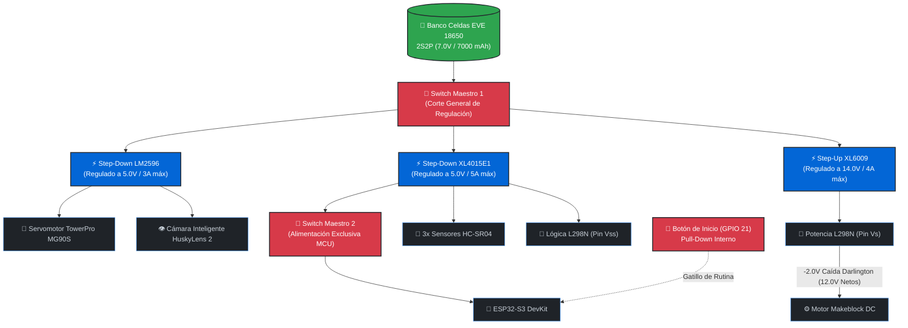
```mermaid
flowchart TD
    BAT[("🔋 Banco Celdas EVE 18650\n2S2P (7.0V / 7000 mAh)")] --> SW1["🔌 Switch Maestro 1\n(Corte General de Regulación)"]
    
    %% Rama A: Potencia Auxiliar
    SW1 --> BUCK_SERVO["⚡ Step-Down LM2596\n(Regulado a 5.0V / 3A máx)"]
    BUCK_SERVO --> SERVO["🦾 Servomotor TowerPro MG90S"]
    BUCK_SERVO --> HUSKY["👁️ Cámara Inteligente HuskyLens 2"]
    %% Rama B: Control y Lógica
    SW1 --> BUCK_LOGIC["⚡ Step-Down XL4015E1\n(Regulado a 5.0V / 5A máx)"]
    BUCK_LOGIC --> SW2["🔌 Switch Maestro 2\n(Alimentación Exclusiva MCU)"]
    SW2 --> MCU["🧠 ESP32-S3 DevKit"]
    BUCK_LOGIC --> US["📡 3x Sensores HC-SR04"]
    BUCK_LOGIC --> L298N_VSS["🔲 Lógica L298N (Pin Vss)"]
    %% Rama C: Potencia de Tracción
    SW1 --> BOOST["⚡ Step-Up XL6009\n(Regulado a 14.0V / 4A máx)"]
    BOOST --> L298N_VS["🔲 Potencia L298N (Pin Vs)"]
    L298N_VS -->|"-2.0V Caída Darlington (12.0V Netos)"| MOTOR["⚙️ Motor Makeblock DC"]
    %% Control de Inicio
    BTN["🔘 Botón de Inicio (GPIO 21)\nPull-Down Interno"] -.->|"Gatillo de Rutina"| MCU
    classDef bat fill:#2ea44f,stroke:#24292e,stroke-width:2px,color:#fff;
    classDef reg fill:#0366d6,stroke:#24292e,stroke-width:2px,color:#fff;
    classDef dev fill:#1f2328,stroke:#58a6ff,stroke-width:1px,color:#c9d1d9;
    classDef sw fill:#d73a49,stroke:#24292e,stroke-width:2px,color:#fff;
    class BAT bat;
    class BUCK_SERVO,BUCK_LOGIC,BOOST reg;
    class SERVO,HUSKY,MCU,US,L298N_VSS,L298N_VS,MOTOR dev;
    class SW1,SW2,BTN sw;  
```
<a id="compensacion-l298n"></a>
### 9.3 Compensación Darlington L298N (Boost a 14V) y Masa Común
#### 1. Justificación de la Elevación a 14V con el Módulo XL6009
El driver clásico **L298N** implementa transistores bipolares de unión (BJT) en configuración Darlington para sus etapas de conmutación en puente H. Por física de semiconductores, estos transistores presentan una caída de tensión saturación colector-emisor interna inevitable:
$$V_{drop} = V_{CE(sat)} \approx 1.8\text{V} - 2.2\text{V}$$
Si el driver se conectara directamente a los 7.0V de la batería, el motor Makeblock apenas recibiría:
$$V_{motor} = 7.0\text{V} - 2.0\text{V} \approx 5.0\text{V}$$
Esto provocaría una pérdida crítica de torque de arranque y reduciría su velocidad angular a menos de 100 RPM.
> [!TIP]
> **Cálculo de la Tensión de Compensación:**
> Para entregar los **12.0V netos de máxima eficiencia al motor Makeblock**:
> 1. Se retiró físicamente el puente (*jumper*) integrado de 5V del módulo L298N, desacoplando su regulador lineal interno 78M05 para evitar recalentamientos térmicos innecesarios.
> 2. Se calibró el módulo elevador **XL6009** a:
>    $$V_{Boost} = V_{nominal} + V_{drop} = 12.0\text{V} + 2.0\text{V} = \mathbf{14.0\text{V DC}}$$
> 3. El pin $V_{ss}$ lógico del chip se alimenta directamente desde los 5V limpios del regulador XL4015, garantizando una conmutación lógica rápida y libre de ruido electromagnético.

#### 2. Beneficios de la Tierra Común Unificada (Common Ground Plane)
Todos los polos negativos (GND) del banco de baterías 18650, los tres convertidores DC-DC, el driver L298N, los sensores ultrasónicos, el servo y el microcontrolador ESP32-S3 están **interconectados eléctricamente en un nodo de masa común**:
* **Referencia Equipotencial Cero:** Erradica bucles de tierra (*ground loops*) y tensiones parásitas flotantes que podrían provocar reinicios espontáneos en el procesador.
* **Integridad de Buses de Comunicación Serial (UART e I2C):** Al compartir un plano de 0V idéntico, las líneas de datos de alta velocidad (`Serial1` a 115,200 baudios de la HuskyLens 2 y las señales PWM del servo a 50 Hz) mantienen sus umbrales de nivel lógico $V_{IL}$ y $V_{IH}$ sin distorsiones ni lecturas corruptas.

<a id="protocolo-encendido"></a>

### 9.4 Protocolo de Encendido Seguro y Control de Usuario
Para prevenir arranques involuntarios o movimientos erráticos del robot en el momento de la manipulación en pista, se diseñó una secuencia de encendido de tres pasos:
1. **Switch Maestro 1 (Alimentación de Convertidores):** Conecta el banco de celdas 18650 a los tres reguladores (XL4015, LM2596 y XL6009), permitiendo que las tensiones de 5V y 14V se estabilicen antes de energizar la lógica.
2. **Switch Maestro 2 (Encendido Exclusivo del MCU):** Habilita la línea de 5V hacia el **ESP32-S3**, asegurando que el microcontrolador bootee en un riel perfectamente filtrado y sin transitorios de encendido.
3. **Pulsador Físico de Inicio (Start Button en GPIO 21):** 
   * Una vez encendido, el vehículo permanece totalmente inmóvil en el punto de salida con los actuadores bloqueados por software.
   * El pin GPIO 21 se encuentra configurado con una **resistencia Pull-Down interna**. Al pulsar el botón, se inyecta un nivel alto de $3.3\text{V}$, disparando la rutina de calibración inercial y arrancando la navegación autónoma.
  
<a id="esquematico-pinout"></a>
### 9.5 Esquemático General y Mapeo de Pines (Pinout ESP32-S3)
El conexionado eléctrico integral de potencia, distribución de buses y líneas de control de **"Smoke"** fue desarrollado en **Fritzing** y se encuentra disponible en alta resolución en [`./Esquemas/DIAGRAMAVF.jpg`](./Esquemas/DIAGRAMAVF.jpg):
<div align="center">
  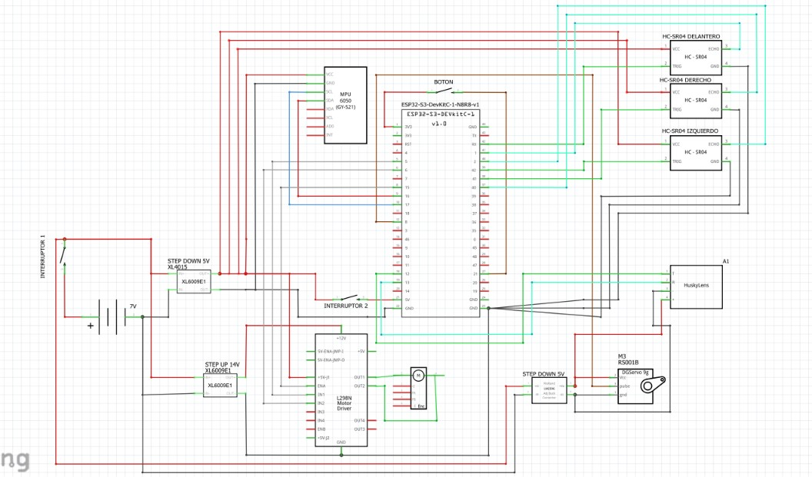
  <br>
  <i>Plano esquemático oficial de conexiones eléctricas de la plataforma autónoma "Smoke".</i>
</div>


#### Mapeo de Pines de Entrada y Salida (ESP32-S3 GPIO Allocation)
| Subsistema | Componente / Periférico | Pin Físico | Modo de Operación / Protocolo de Firmware |
| :--- | :--- | :---: | :--- |
| **🦾 Dirección** | Servomotor TowerPro MG90S | **GPIO 8** | Salida PWM a 50 Hz (Resolución de 12 bits con `ESP32Servo.h`) |
| **⚙️ Tracción** | Driver L298N – ENA (Velocidad) | **GPIO 4** | Modulación PWM a 1000 Hz (`ledcAttach` con ciclo de trabajo de 8 bits) |
| | Driver L298N – IN1 (Sentido) | **GPIO 5** | Salida digital: Estado ALTO (`HIGH`) para giro de avance |
| | Driver L298N – IN2 (Sentido) | **GPIO 6** | Salida digital: Estado BAJO (`LOW`) para avance / ALTO para freno |
| **👁️ Visión IA** | Cámara DFRobot HuskyLens 2 | **GPIO 9** | **UART RX** (Conectado al cable Verde / TX de la cámara) |
| | Cámara DFRobot HuskyLens 2 | **GPIO 10** | **UART TX** (Conectado al cable Azul / RX de la cámara) |
| **🧭 Orientación** | Sensor Inercial IMU MPU6050 | **GPIO 16** | Bus I2C – Línea de Datos bidireccional (**SDA** a 100 kHz) |
| | Sensor Inercial IMU MPU6050 | **GPIO 17** | Bus I2C – Línea de Reloj (**SCL** con auto-rescate en hardware) |
| **📡 Ultrasonido** | HC-SR04 Frontal (Curvas) | **GPIO 42** | Salida de Disparo (**TRIGGER**) – Pulso de $10\ \mu\text{s}$ |
| | HC-SR04 Frontal (Curvas) | **GPIO 41** | Entrada de Retorno (**ECHO**) – Medición por tiempo de vuelo |
| | HC-SR04 Derecho (Centrado) | **GPIO 38** | Salida de Disparo (**TRIGGER**) |
| | HC-SR04 Derecho (Centrado) | **GPIO 37** | Entrada de Retorno (**ECHO**) |
| | HC-SR04 Izquierdo (Centrado) | **GPIO 39** | Salida de Disparo (**TRIGGER**) |
| | HC-SR04 Izquierdo (Centrado) | **GPIO 40** | Entrada de Retorno (**ECHO**) |
| **🔘 Control Usuario** | Pulsador de Arranque en Pista | **GPIO 21** | Entrada digital con resistencia **Pull-Down** interna activada |
<p align="right"><a href="#inicio">⬆️ Volver al Inicio</a></p>

<a id="percepcion-sensorial"></a>
# 10. Percepción Sensorial y Visión Artificial
La arquitectura sensorial de **"Smoke"** opera bajo un esquema de **fusión sensorial distribuida**: combina visión artificial acelerada por hardware embebido para la clasificación semántica de obstáculos, con una red acústica de tiempo de vuelo para el mantenimiento de carril y telemetría inercial de alta frecuencia en tiempo real.
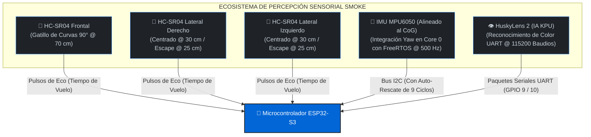
```mermaid
flowchart TD
    subgraph "ECOSISTEMA DE PERCEPCIÓN SENSORIAL SMOKE"
        US_F["📡 HC-SR04 Frontal\n(Gatillo de Curvas 90° @ 70 cm)"]
        US_R["📡 HC-SR04 Lateral Derecho\n(Centrado @ 30 cm / Escape @ 25 cm)"]
        US_L["📡 HC-SR04 Lateral Izquierdo\n(Centrado @ 30 cm / Escape @ 25 cm)"]
        MPU["🧭 IMU MPU6050 (Alineado al CoG)\n(Integración Yaw en Core 0 con FreeRTOS @ 500 Hz)"]
        HUSKY["👁️ HuskyLens 2 (IA KPU)\n(Reconocimiento de Color UART @ 115200 Baudios)"]
    end
    US_F & US_R & US_L -->|"Pulsos de Eco (Tiempo de Vuelo)"| ESP["🧠 Microcontrolador ESP32-S3"]
    MPU -->|"Bus I2C (Con Auto-Rescate de 9 Ciclos)"| ESP
    HUSKY -->|"Paquetes Seriales UART (GPIO 9 / 10)"| ESP
    classDef sens fill:#1f2328,stroke:#58a6ff,stroke-width:1px,color:#c9d1d9;
    classDef mcu fill:#0366d6,stroke:#24292e,stroke-width:2px,color:#fff;
    class US_F,US_R,US_L,MPU,HUSKY sens;
    class ESP mcu;
```
<a id="vision-ia"></a>
### 10.1 Visión IA por Hardware (HuskyLens 2)
Para superar el **Desafío de Obstáculos (Obstacle Challenge)**, el vehículo emplea el procesador de visión inteligente **HuskyLens 2** montado rígidamente en el Piso 2:
* **Inferencia Embebida en Hardware:** La cámara incorpora un procesador neuronal especializado (KPU) que ejecuta algoritmos de visión por computador internamente a **30 FPS**. Esto descarga al ESP32-S3 de tener que procesar matrices de píxeles pesadas, permitiéndole concentrar el 100% de sus ciclos de reloj en el control dinámico de la dirección y tracción.
* **Clasificación Colorimétrica Entrenada:** Se configuró en el algoritmo de **Reconocimiento de Color (*Color Recognition*)**, calibrando las firmas cromáticas bajo la iluminación real del recinto para identificar:
  * **Bloque Rojo (ID 1):** Inyecta una consigna de viraje evasivo hacia el flanco **izquierdo** del carril.
  * **Bloque Verde (ID 2):** Inyecta una consigna de viraje evasivo hacia el flanco **derecho** del carril.
* **Justificación de la Comunicación UART (115,200 Baudios) vs. I2C:**
  En las fases iniciales de prueba, se evaluó conectar la cámara mediante el bus I2C compartiendo líneas con el MPU6050. Sin embargo, ante el tráfico denso de paquetes de imagen, el bus I2C presentaba colisiones y bloqueos de reloj (*clock stretching lockup*).
  * **Solución de Ingeniería:** Se migró la HuskyLens 2 hacia un enlace serie UART por hardware dedicado (`Serial1`) en los pines **GPIO 9 (RX)** y **GPIO 10 (TX)** a **115,200 baudios**. Esta línea punto a punto es inmune a colisiones de bus y transfiere las coordenadas $(X, Y)$ y dimensiones $(W, H)$ de los bloques sin pérdidas.
* **Desacoplamiento en Ronda Abierta:** Durante el Open Challenge, la cámara se mantiene encendida pero su hilo de lectura se deshabilita por software en el firmware, asegurando que la navegación reactiva no consuma procesamiento innecesario.

<a id="telemetria-inercial"></a>
### 10.2 Telemetría Inercial en Core Dedicado (MPU6050 + FreeRTOS)
El mantenimiento de trayectoria rectilínea y la verificación de giros exactos de 90° se fundamentan en el sensor inercial **InvenSense MPU6050**, ubicado matemáticamente en el **centro de gravedad ($CoG$) del vehículo (Piso 2)**:
#### 1. Arquitectura Multitarea en Core 0 con FreeRTOS
Para erradicar la deriva angular (*drift*) provocada por demoras en los bucles del código principal, el firmware instancia una tarea dedicada e independiente en el **Core 0** del ESP32-S3 (`tareaLeerMPU`):
* **Frecuencia de Muestreo de 500 Hz:** La tarea inercial se ejecuta con un período estricto de **$2\text{ ms}$**, operando de forma totalmente asíncrona e inmune a las pausas que generan la emisión de pulsos ultrasónicos o la telemetría serial.
* **Calibración Automática de Deriva Estática:** Al encender el robot y presionar el botón de arranque (GPIO 21), el ESP32 permanece inmóvil durante $100\text{ ms}$ y toma **50 lecturas promediadas** del giroscopio en el eje Z para calcular el offset estático ($gz_{offset}$), restándolo en cada iteración.
* **Integración Numérica Discreta del Ángulo Yaw:**
  La orientación angular respecto al rumbo inicial se actualiza integrando la velocidad angular en el eje Z:
  
 $$\Delta \theta = (gz - gz_{offset}) \cdot \Delta t \quad [\text{grados}]$$
 
$$\text{Yaw}_{actual} = \text{Yaw}_{actual} + \Delta \theta \quad (\text{para } |gz| > 0.3^\circ/\text{s})$$
  
#### 2. Tolerancia a Fallas en Hardware: Subrutina de Auto-Rescate I2C
Uno de los problemas más críticos en robótica móvil ocurre cuando un pico inductivo proveniente del motor cuelga el bus I2C, dejando la línea SDA clavada en estado bajo (*I2C bus lockup*):
* **Detección Automática:** La función `leerMPUSeguro()` verifica el estado de transmisión; si `Wire.endTransmission() != 0`, detecta inmediatamente que el bus colapsó.
* **Mecanismo de Recuperación en Caliente (`rescatarBusI2C`):**
  1. Libera el puerto I2C y conmuta temporalmente los pines a modo GPIO digital.
  2. Genera **9 pulsos de reloj manuales en la línea SCL** para forzar a cualquier periférico esclavo bloqueado a liberar la línea SDA.
  3. Reconfigura y reinicia el bus Wire a **100 kHz** con un ancho de banda de filtrado paso-bajo de 21 Hz en el MPU6050.
* **Impacto Operativo:** Esta rutina recupera la telemetría inercial en menos de $150\ \mu\text{s}$, permitiendo que el robot continúe su carrera en pista sin necesidad de reiniciarse ni perder el setpoint de rumbo.

### 10.3 Red Ultrasónica HC-SR04 con Muestreo Rotativo
La detección perimetral de proximidad se basa en tres transductores ultrasónicos **HC-SR04** ubicados en el primer piso del chasis a una altura rasante de **$25\text{ mm}$**:
<div align="center">
  
| Transductor | Orientación en Chasis | Umbral Crítico | Función de Navegación Reactiva |
| :--- | :---: | :---: | :--- |
| **Frontal** | Eje longitudinal proa | **$\le 70.0\text{ cm}$** | **Gatillo de Curvas:** Detecta la aproximación a la pared terminal para activar el viraje a 90° e incrementar el conteo de esquinas. |
| **Lateral Derecho** | Perpendicular estribor | **$\le 25.0\text{ cm}$** | **Escape Lateral:** Si la distancia baja de 25 cm, inyecta un offset angular de $25^\circ$ hacia la izquierda para alejarse del muro. |
| **Lateral Izquierdo** | Perpendicular babor | **$\le 25.0\text{ cm}$** | **Escape Lateral:** Si la distancia baja de 25 cm, inyecta un offset angular de $25^\circ$ hacia la derecha para alejarse del muro. |
</div>

#### 1. Muestreo Rotativo Asíncrono (Eliminación de Eco Cruzado / Anti-Crosstalk)
Si dos o más sensores ultrasónicos dispararan al mismo tiempo, los rebotes acústicos en las esquinas provocarían que un sensor reciba el eco emitido por otro (*interferencia acústica cruzada o crosstalk*), generando lecturas falsas de proximidad.
Para erradicar esto, el firmware ejecuta un ciclo de muestreo secuencial no bloqueante cada **50 ms** (`TIEMPO_SONAR_MS = 50`):
$$\text{Ciclo Rotativo: } \text{Turno 0 (Frontal)} \longrightarrow \text{Turno 1 (Derecho)} \longrightarrow \text{Turno 2 (Frontal)} \longrightarrow \text{Turno 3 (Izquierdo)}$$
> [!TIP]
> **Ventaja de la Secuencia Asíncrona:**
> Este patrón otorga una **tasa de refresco del doble de frecuencia al sensor frontal** (se lee cada 50 ms intercalado), mientras que los laterales se leen cada 100 ms. Esto garantiza que el vehículo detecte el muro terminal a alta velocidad con tiempo suficiente para iniciar la maniobra de giro antes de colisionar.

#### 2. Ecuación de Tiempo de Vuelo y Rechazo de Outliers
La distancia hacia las paredes se determina calculando el tiempo de vuelo de ida y vuelta del paquete acústico ultrasónico de 40 kHz en el aire ($v_{sonido} \approx 343\text{ m/s}$ a 20°C):
$$d = \frac{t_{pulso} \cdot 0.0343}{2} \quad [\text{cm}]$$
* **Timeout de Hardware a $15,000\ \mu\text{s}$:** La función `pulseIn` cuenta con un tiempo límite calibrado de $15,000\ \mu\text{s}$ (equivalente a una distancia máxima de $\approx 257\text{ cm}$).
* **Filtrado de Ecos Espurios:** Si el eco rebota fuera del cono de recepción o no regresa a tiempo, la función descarta la lectura y retorna automáticamente `999.0 cm`, impidiendo que valores nulos generen virajes erráticos en el servomotor.
<p align="right"><a href="#inicio">⬆️ Volver al Inicio</a></p>


<a id="arquitectura-software"></a>

# 11. Arquitectura de Software y Lógica de Navegación
El software embebido de **"Smoke"** fue desarrollado en **C++ bajo el entorno Arduino IDE**, optimizado específicamente para el microcontrolador de doble núcleo **ESP32-S3**. 
Para garantizar un control en tiempo real estricto, el código opera bajo una **arquitectura asíncrona no bloqueante gobernada por el sistema operativo en tiempo real FreeRTOS y temporizadores de hardware (`millis()`)**, evitando por completo el uso de funciones bloqueantes tipo `delay()` en los bucles de carrera.
El código fuente oficial de la ronda abierta se encuentra alojado en [`./src/OPENCHALLENGE.ino`](./src/OPENCHALLENGE.ino).

<a id="fsm-navegacion"></a>

### 11.1 Máquina de Estados Finitos (FSM)
El flujo de control de carrera se rige mediante una máquina de estados finitos determinista que administra las transiciones entre la calibración estática, el guiado reactivo en rectas y las maniobras de viraje en esquinas:
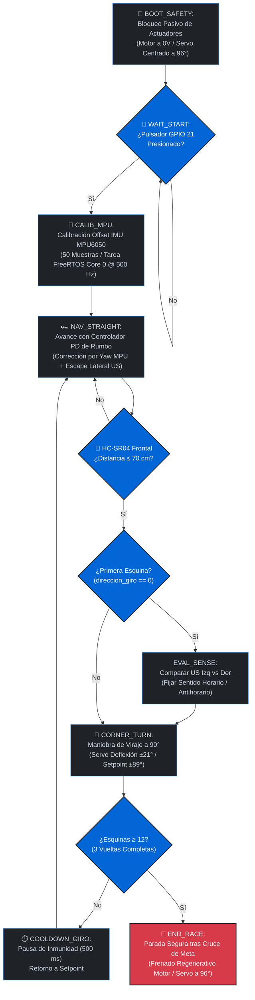
```mermaid
flowchart TD
    BOOT["🔌 BOOT_SAFETY:\nBloqueo Pasivo de Actuadores\n(Motor a 0V / Servo Centrado a 96°)"] --> WAIT_BTN{"🔘 WAIT_START:\n¿Pulsador GPIO 21\nPresionado?"}
    
    WAIT_BTN -- No --> WAIT_BTN
    WAIT_BTN -- Sí --> CALIB["🧭 CALIB_MPU:\nCalibración Offset IMU MPU6050\n(50 Muestras / Tarea FreeRTOS Core 0 @ 500 Hz)"]
    
    CALIB --> DRIVE["🏎️ NAV_STRAIGHT:\nAvance con Controlador PD de Rumbo\n(Corrección por Yaw MPU + Escape Lateral US)"]
    
    DRIVE --> CHECK_CORNER{"📡 HC-SR04 Frontal\n¿Distancia ≤ 70 cm?"}
    
    CHECK_CORNER -- No --> DRIVE
    CHECK_CORNER -- Sí --> DETECT_DIR{"¿Primera Esquina?\n(direccion_giro == 0)"}
    
    DETECT_DIR -- Sí --> EVAL_SPACE["EVAL_SENSE:\nComparar US Izq vs Der\n(Fijar Sentido Horario / Antihorario)"]
    EVAL_SPACE --> TURN["🔄 CORNER_TURN:\nManiobra de Viraje a 90°\n(Servo Deflexión ±21° / Setpoint ±89°)"]
    DETECT_DIR -- No --> TURN
    
    TURN --> CHECK_END{"¿Esquinas ≥ 12?\n(3 Vueltas Completas)"}
    
    CHECK_END -- No --> COOLDOWN["⏱️ COOLDOWN_GIRO:\nPausa de Inmunidad (500 ms)\nRetorno a Setpoint"] --> DRIVE
    CHECK_END -- Sí --> STOP["🛑 END_RACE:\nParada Segura tras Cruce de Meta\n(Frenado Regenerativo Motor / Servo a 96°)"]
    classDef state fill:#1f2328,stroke:#58a6ff,stroke-width:1px,color:#c9d1d9;
    classDef dec fill:#0366d6,stroke:#24292e,stroke-width:2px,color:#fff;
    classDef stop fill:#d73a49,stroke:#24292e,stroke-width:2px,color:#fff;
    class BOOT,CALIB,DRIVE,EVAL_SPACE,TURN,COOLDOWN state;
    class WAIT_BTN,CHECK_CORNER,DETECT_DIR,CHECK_END dec;
    class STOP stop;
```
<a id="desglose-firmware"></a>
<a id="desglose-firmware"></a>
### 11.2 Desglose Modular del Firmware (`OPENCHALLENGE.ino`)
El firmware del vehículo se encuentra estructurado en cuatro módulos funcionales que operan de forma asíncrona mediante temporizadores de hardware:
---
#### 1. Módulo de Seguridad en Arranque y Multitarea FreeRTOS
Para evitar que el robot sufra arranques violentos e incontrolados al energizar el microcontrolador, la función `setup()` ejecuta una secuencia de seguridad pasiva inmediata que bloquea los actuadores antes de inicializar las comunicaciones:
* **Freno de Motores:** Se configuran los canales PWM forzando la velocidad a cero y los pines `PIN_MOTOR_IN1` y `PIN_MOTOR_IN2` en estado bajo (`LOW`).
* **Centrado Mecánico:** El servo MG90S se clava de inmediato en su ángulo neutro (`SERVO_CENTRO = 96°`).
* **Despliegue de Tarea en Core 0:** Se crea la tarea `tareaLeerMPU` asignada al **Core 0** del ESP32-S3 mediante `xTaskCreatePinnedToCore()`, garantizando un bucle inercial a **500 Hz (cada 2 ms)** totalmente inmune a las demoras del resto del programa.
```cpp
// --- Fragmento Setup: Bloqueo de seguridad pasiva ---
pinMode(PIN_MOTOR_IN1, OUTPUT); 
pinMode(PIN_MOTOR_IN2, OUTPUT);
digitalWrite(PIN_MOTOR_IN1, LOW); 
digitalWrite(PIN_MOTOR_IN2, LOW);
// Bloquear velocidad PWM a cero
ledcAttach(PIN_MOTOR_PWM, 1000, 8); 
ledcWrite(PIN_MOTOR_PWM, 0); 
// Centrar inmediatamente el servomotor
ledcAttach(PIN_SERVO, 50, 12); 
escribirServoGrados(SERVO_CENTRO);
// Lanzamiento de tarea en tiempo real en Core 0 para el MPU6050
xTaskCreatePinnedToCore(tareaLeerMPU, "TareaMPU", 4096, NULL, 2, &TareaMPU, 0);
```
#### 2. Módulo de Calibración Dinámica y Detección Automática de Sentido de Carrera
El vehículo elimina cualquier dependencia de configuración manual previa a la carrera, detectando de forma autónoma el sentido del circuito reglamentario:
* **Calibración Estática en Salida:** Al presionar el pulsador de inicio (`PIN_INICIO` en GPIO 21), el ESP32 recolecta 50 muestras estáticas de la velocidad angular en Z para determinar el offset de deriva (`gz_offset`) mientras el chasis permanece en reposo.
* **Decisión Autónoma de Sentido (Horario / Antihorario):** En la primera curva (`direccion_giro == 0`), el sensor ultrasónico frontal detecta el muro a $\le 70\text{ cm}$ y el firmware compara automáticamente las lecturas laterales para fijar el sentido de carrera:
```cpp
// Detección autónoma del sentido de pista en la primera esquina
if (direccion_giro == 0) {
  if (dist_izquierda >= dist_derecha) {
    direccion_giro = 1; // Sentido Antihorario (Pista con giros a la Izquierda)
    Serial.println(">>> PRIMERA ESQUINA: MÁS ESPACIO A LA IZQ. GUARDANDO GIRO A LA IZQUIERDA.");
  } else {
    direccion_giro = -1; // Sentido Horario (Pista con giros a la Derecha)
    Serial.println(">>> PRIMERA ESQUINA: MÁS ESPACIO A LA DER. GUARDANDO GIRO A LA DERECHA.");
  }
}
```
#### 3. Módulo Controlador PD de Rumbo y Subrutina de Escape Lateral
Durante el tránsito por los tramos rectos de la pista, el firmware ejecuta un lazo de control cada **1 ms** (`TIEMPO_LECTURA_MS = 1`):
* **Controlador Proporcional-Derivativo (PD):** Compara el rumbo objetivo (`setpoint_efectivo`) contra el ángulo inercial integrado (`yaw_actual`). Si el error angular supera la **zona muerta de $\pm 2.0^\circ$**, modula la timonería del servomotor MG90S con constantes $K_p = 1.0$ y $K_d = 0.0$.
* **Escape Lateral Reactivo:** Los sensores ultrasónicos laterales vigilan la proximidad a las paredes. Si la distancia en cualquiera de los flancos cae por debajo del umbral de seguridad de **$25.0\text{ cm}$** (`DISTANCIA_MIN_LATERAL`), el firmware inyecta un offset angular instantáneo de $\pm 25^\circ$ (`ANGULO_ESCAPE`), alejando al vehículo del muro sin perder la referencia global de rumbo.
```cpp
// Lazo de control PD inercial
float setpoint_efectivo = setpoint_yaw + offset_lateral;
float error = setpoint_efectivo - yaw_actual;
// Zona muerta para evitar oscilaciones de alta frecuencia en el servo
if (abs(error) < ZONA_MUERTA) { 
  error = 0.0; 
  error_anterior = 0.0; 
}
float derivada = (error - error_anterior) / dt;
error_anterior = error;
float correccion = (Kp * error) + (Kd * derivada);
correccion = constrain(correccion, -MAX_DEFLEXION, MAX_DEFLEXION);
// Subrutina de escape lateral reactivo ante aproximación a muros
if (dist_derecha < DISTANCIA_MIN_LATERAL)   offset_lateral -= ANGULO_ESCAPE;
if (dist_izquierda < DISTANCIA_MIN_LATERAL) offset_lateral += ANGULO_ESCAPE;
```
#### 4. Módulo de Negociación de Curvas de 90°, Conteo de Vueltas y Frenado en Meta
El viraje en las esquinas reglamentarias se ejecuta bajo una rutina sincronizada de precisión:
1. **Disparo de Giro:** Al detectar muro frontal a $\le 70\text{ cm}$ con espacio lateral despejado ($\ge 70\text{ cm}$), el servomotor se posiciona en máxima deflexión angular (`MAX_DEFLEXION = 21°`), se actualiza el setpoint en $\pm 89^\circ$ y se incrementa el contador de esquinas (`esquinas_contadas++`).
2. **Criterio de Salida de Curva:** La maniobra se considera completada cuando el error angular respecto al setpoint es menor a $8.0^\circ$ o si transcurre el tiempo límite de seguridad (`TIMEOUT_GIRO = 2500 ms`), retornando al modo de avance rectilíneo con un período de enfriamiento (*cooldown*) de $500\text{ ms}$.
3. **Parada Automática tras 3 Vueltas (12 Esquinas):** Al registrar 12 esquinas válidas, el robot activa el estado de fin de carrera: mantiene la inercia durante $1500\text{ ms}$ para cruzar holgadamente la línea de meta, corta el PWM del motor Makeblock, conecta los pines IN1 e IN2 a nivel bajo para inducir frenado regenerativo y clava el servo al centro.
```cpp
// Registro de esquinas y activación de fin de carrera tras 12 giros
if (esquinas_contadas >= 12 && !carrera_terminada) {
  carrera_terminada = true;
  tiempo_fin_carrera = tiempo_actual;
  Serial.println(">>> 12 ESQUINAS ALCANZADAS. APAGANDO EN EL TIEMPO SETEADO...");
}
// Secuencia de parada final tras cruzar la línea de meta
if (carrera_terminada && !motor_frenado) {
  if (tiempo_actual - tiempo_fin_carrera >= TIEMPO_PARO_FIN) {
    digitalWrite(PIN_MOTOR_IN1, LOW);
    digitalWrite(PIN_MOTOR_IN2, LOW);
    ledcWrite(PIN_MOTOR_PWM, 0);       // Corte de potencia al motor
    escribirServoGrados(SERVO_CENTRO); // Centrado de timonería a 96°
    motor_frenado = true;
    Serial.println("\n=== 12 ESQUINAS COMPLETADAS - MOTOR APAGADO ===");
  }
}
```

<a id="diario-ingenieria"></a>
# 12. Diario de Ingeniería, Iteraciones y Solución de Fallas
El desarrollo de la plataforma **"Smoke"** siguió estrictamente el **Ciclo de Diseño en Ingeniería (*Engineering Design Process*)**. En lugar de asumir un diseño teórico infalible, el equipo utilizó cada obstáculo experimental surgido en las jornadas de trabajo en el laboratorio de INIAR como una oportunidad de aprendizaje técnico y optimización sistemática:
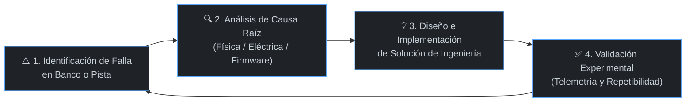
```mermaid
flowchart LR
    P["⚠️ 1. Identificación de Falla\nen Banco o Pista"] --> A["🔍 2. Análisis de Causa Raíz\n(Física / Eléctrica / Firmware)"]
    A --> S["💡 3. Diseño e Implementación\nde Solución de Ingeniería"]
    S --> V["✅ 4. Validación Experimental\n(Telemetría y Repetibilidad)"]
    V --> P
    classDef proc fill:#1f2328,stroke:#58a6ff,stroke-width:1px,color:#c9d1d9;
    class P,A,S,V proc;
```

| Subsistema | Problema Inicial Identificado | Causa Raíz Técnica | Solución de Ingeniería Aplicada | Impacto Técnico en "Smoke" |
| :--- | :--- | :--- | :--- | :--- |
| **⚡ Potencia** | **Destrucción de 3 Step-Downs (Origen del nombre "Smoke")** | Picos de sobretensión transitoria y retornos inductivos generados por el frenado del motor DC quemaron tres módulos en cascada. | Rediseño a **3 ramas independientes** (XL4015 para lógica a 5V, LM2596 para actuadores a 5V y XL6009 para tracción a 14V) + **Masa Común Unificada**. | **100% de fiabilidad eléctrica:** Cero reinicios involuntarios (*brownouts*) y rieles de alimentación libres de rizado parásito. |
| **⚙️ Tracción** | **Pérdida crítica de torque y velocidad en motor Makeblock** | Caída interna inherente ($\Delta V \approx 2.0\text{V}$) en los transistores Darlington BJT del driver L298N, dejando al motor con apenas 5V. | Elevación del bus de tracción a **14.0V con el Step-Up XL6009** y retiro del jumper integrado de 5V para desacoplar su regulador lineal interno. | El motor recibe **12.0V netos constantes**, alcanzando su velocidad nominal de 185 RPM con torque máximo de salida. |
| **🦾 Dirección** | **Servomotor atascado y avería de piñonería interna** | El firmware enviaba consignas angulares que superaban los topes mecánicos del chasis, forzando los engranes plásticos bajo bloqueo continuo (*stall*). | Estandarización con servomotor **TowerPro MG90S de piñonería metálica**, limitación por software (`MAX_DEFLEXION = 21°`) y rutina de prueba $\pm 80^\circ$. | Erradicación total de bloqueos mecánicos (*binding*) y virajes fluidos con respuesta lineal en menos de 0.10 segundos. |
| **🔗 Transmisión** | **Incompatibilidad dimensional de ejes motor y diferencial** | El motor Makeblock posee un eje cilíndrico con rebaje plano (**eje en D**) y el diferencial LEGO EV3 exige acople estandarizado en cruz. | Modelado paramétrico en Fusion 360 e impresión al **100% de relleno en PETG** de un **piñón cónico con cavidad hembra en D**. | Transmisión a 90° sin holguras (*backlash* mínimo), con alta resistencia a la cizalladura en la base de los dientes. |
| **🏎️ Cinemática** | **Fricción irregular y juego mecánico en dirección 100% 3D** | Las manguetas y tirantes impresos en FDM presentaban microporosidad superficial entre capas, induciendo holgura acumulada en las ruedas. | **Arquitectura híbrida:** Manguetas y barras de enlace oficiales moldeadas por inyección LEGO EV3 + brazo de servo custom en PETG. | Dirección hiperprecisa, sin fricción parásita y con rigidez torsional constante que elimina el subviraje (*understeer*). |
| **🧭 Telemetría** | **Congelamiento aleatorio del bus I2C (IMU MPU6050)** | Picos inductivos severos en las proximidades del cableado bloqueaban la línea SDA en nivel bajo (*I2C bus lockup*). | Implementación de la rutina de hardware `rescatarBusI2C()` con **9 pulsos de reloj manuales en SCL** en el Core 0. | El sistema detecta la falla y recupera la telemetría en caliente en menos de $150\ \mu\text{s}$ sin detener la marcha del carro. |
| **💻 Firmware** | **Comportamiento asíncrono e irregular en C++ nativo inicial** | Condiciones de carrera (*race conditions*) y demoras bloqueantes por funciones `delay()` al procesar los tres sensores ultrasónicos simultáneamente. | Reestructuración asíncrona con **FreeRTOS en Core 0 para el MPU6050** y temporizadores no bloqueantes (`millis()`) en Core 1. | Control en tiempo real estricto con lectura inercial fija a **500 Hz** y muestreo rotativo ultrasónico cada 50 ms. |
| **🔋 Almacenamiento**| **Decaimiento progresivo de velocidad en mangas largas** | Baterías comerciales anteriores presentaban una curva de descarga con pendiente pronunciada, alterando los tiempos de giro. | Migración al banco de celdas industriales **EVE INR18650-35V (2S2P / 7000 mAh)** con alta densidad energética. | Curva de tensión sumamente plana a lo largo de las 3 vueltas de carrera; comportamiento idéntico entre la vuelta 1 y la vuelta 12. |

<a id="conclusion-cierre"></a>
## 🏁 Conclusión y Filosofía de Competencia
La plataforma autónoma **"Smoke"** representa meses de trabajo interdisciplinario, rigor analítico y aprendizaje práctico en el taller del **Instituto de Inteligencia Artificial y Robótica del estado Zulia (INIAR)**. 
Cada pieza modelada en Autodesk Fusion 360, cada componente del esquemático desarrollado en Fritzing y cada línea de código en C++ embebido documentada en este repositorio ha sido calculada, probada y validada en pista bajo los más exigentes estándares de la **World Robot Olympiad™ 2026**.
<div align="center">
  <br>
  <b>Desarrollado con dedicación y pasión por la robótica por Team Nexus</b><br>
  <i>David Ocando • José Montiel • Jairo Cruz</i><br>
  Mentor Líder: <i>Ing. Wender Sánchez</i>
  <br><br>
  <b>Instituto de Inteligencia Artificial y Robótica del estado Zulia (INIAR)</b><br>
  <b>Maracaibo, Estado Zulia – Venezuela 🇻🇪</b>
  <br><br>
  <a href="#inicio">⬆️ Volver al Inicio del Documento</a>
</div>
