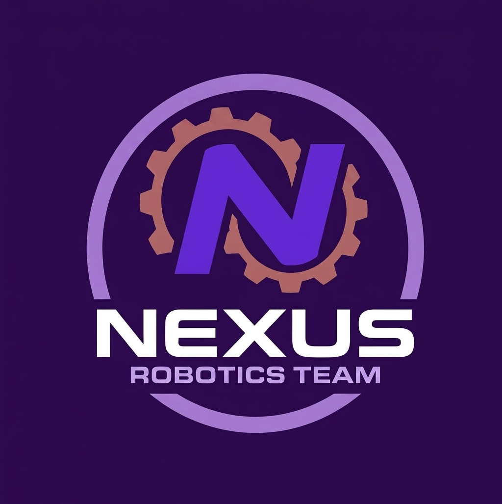

# 🏎️ WRO 2026 Future Engineers – Team Nexus

<div align="center">
  

 <br><br>
     [](https://wro-association.org/)
  [](https://www.instagram.com/iniar_zulia/)
  [](https://www.instagram.com/iniar_zulia/)
  <br>
  [](https://isocpp.org/)
  [](https://www.autodesk.com/)
  [](https://bambulab.com/)
  <br>
  [](https://www.youtube.com/@NEXUSTEAM-e3d)
  [](https://www.instagram.com/iniar_zulia/)
  <br><br>
</div>
  
  
</div>

## 🏆 **REPRESENTANDO A TEAM NEXUS – RUMBO A WRO 2026**
</div>
Bienvenidos al repositorio oficial de ingeniería de **Team Nexus**, equipo representante del **Instituto de Inteligencia Artificial y Robótica del estado Zulia "Dr. Héctor Rafael Rojas" (INIAR)** en la categoría **Future Engineers** de la **World Robot Olympiad™ (WRO) 2026**.
Este espacio documenta de manera transparente, rigurosa y reproducible el ciclo completo de diseño, manufactura aditiva, arquitectura eléctrica y algoritmos de control de nuestra plataforma autónoma **"Smoke"**, diseñada para solventar los desafíos de la **Ronda Abierta (Open Challenge)** y la **Ronda de Obstáculos (Obstacle Challenge)**.
---

> 💡 **Estado del Proyecto:** Integración de sistemas electrónicos, calibración de visión artificial y pruebas de control de movimiento en pista.

---

## 🤖 **Plataforma Oficial: "Smoke"**
* **Categoría:** WRO Future Engineers 2026.
* **Arquitectura General:** Estructura modular vertical de tres niveles (Three-Tier Chassis) con centro de gravedad bajo y aislamiento galvánico de potencia.
* **Percepción Sensorial:** Visión por computador basada en IA (**HuskyLens**) + Red perimetral de ultrasonido + IMU central.
* **Cinemática:** Dirección delantera **Ackermann** mediante servomotor con piñonería metálica + Tracción trasera **RWD**.
> [!NOTE]
> **Origen del Nombre "Smoke":** 
> Durante las primeras fases de pruebas en banco de potencia, un error fortuito en la conexión cruzada de las líneas de salida de un convertidor elevador (*Step-Up*) causó una sobretensión inversa en los capacitores electrolíticos, provocando una densa columna de humo en el taller. Bautizar al vehículo como **"Smoke"** rinde tributo a la resiliencia en el laboratorio, recordándonos que cada falla es un aprendizaje indispensable en el camino hacia la fiabilidad técnica.

# 👥 **Miembros de Team Nexus (INIAR)**
---
## <a id="equipo"></a>👥 **El Equipo**

<p align="center">
  
</p>

### 👤 **David Ocando**
**Rol:** *Líder de Arquitectura Eléctrica, Gestión de Potencia y Co-administrador Digital.*
* **Formación Académica:** Estudiante de Ingeniería Eléctrica (Mención en Generación y Distribución de Potencia) – Universidad Rafael Urdaneta (URU).
* **Responsabilidades Técnicas:**
  * Diseño del sistema de distribución y aislamiento de potencia (líneas de 5V y tracción).
  * Selección y conexionado de fuentes de alimentación, convertidores Buck/Boost y cableado de señales.
  * Análisis de balance de carga (*Power Budget*) y telemetría eléctrica.
  * Gestión, estructura y estandarización del repositorio técnico en GitHub.
<p align="center">
  
  <p align="center">
  <i>[📸 Foto Oficial - David Ocando]</i>

</div>

#### **Historial y Trayectoria Competitiva:**
* 🏆 **Copa KAI (2023):** Participación y desempeño destacado en robótica de competencia.
* 🇮🇹 **FTC Championship (Italia, 2024):** Representación internacional en robótica avanzada con sistemas de potencia y control de alto rendimiento.
* 🤖 **WRO Venezuela (2025):** Participación oficial en la categoría **RoboSports**, optimizando la respuesta dinámica en pista.
---


### 👤 **José Montiel**
**Rol:** *Ingeniero Líder de Software, Visión Artificial y Control Autónomo.*
* **Formación Académica:** Estudiante de Ingeniería Electrónica – Universidad Dr. Rafael Belloso Chacín (URBE).
* **Responsabilidades Técnicas:**
  * Desarrollo del firmware en C++ y estructuración en Arduino IDE.
  * Implementación de la máquina de estados finitos (FSM) para la navegación autónoma.
  * Calibración de la cámara inteligente **HuskyLens** para reconocimiento colorimétrico de bloques.
  * Fusión de datos sensoriales (Giroscopio/IMU y sensores ultrasónicos).
<p align="center">
  
  <p align="center">
  <i>[📸 Foto Oficial - José Montiel]</i>
</div>

#### **Historial y Trayectoria Competitiva:**
* 🤖 **WRO Venezuela (2025):** Participación en la categoría **Futuros Ingenieros (Future Engineers)** en la eliminatoria regional, acumulando experiencia en las dinámicas de pista y visión de carriles.
---

### 👤 **Jairo Cruz**
**Rol:** *Ingeniero de Diseño Mecánico, Manufactura Aditiva y Soporte Digital.*
* **Formación Académica:** Estudiante de Ingeniería Electrónica (Mención en Automatización y Control).
* **Responsabilidades Técnicas:**
  * Modelado paramétrico 3D del chasis modular y soportes en **Autodesk Fusion 360**.
  * Optimización de manufactura e impresión 3D en **Bambu Lab** (orientación de capas, densidades de relleno e interpolación dimensional).
  * Ensamble del sistema de dirección Ackermann híbrido y reducción de holguras (*backlash*).
  * Co-desarrollo y mantenimiento de la documentación en GitHub.
<p align="center">
  
  <p align="center">
  <i>[📸 Foto Oficial - Jairo Cruz]</i>
</div>

#### **Historial y Trayectoria Competitiva:**
* 🏆 **Copa KAI (2023):** Competidor en desafíos de robótica móvil.
* 🇮🇹 **FTC Championship (Italia, 2024):** Integrante de la delegación internacional en FIRST Tech Challenge, trabajando en mecanismos de tracción e integración de sistemas.
* 🤖 **WRO Venezuela (2025):** Competidor en la categoría **RoboSports**, especializándose en resistencia estructural y dinámica de choque.
---

### 👤 **Ing. Wender Sánchez**
**Rol:** *Tutor Principal y Asesor de Ingeniería Mecánica.*
* **Formación y Perfil:** Ingeniero Mecánico egresado de la **Universidad del Zulia (LUZ)**, con amplia trayectoria profesional en cinemática de mecanismos, dinámica de vehículos y sistemas de tracción.
* **Acompañamiento:** Mentoría estratégica en diseño mecánico, validación de cálculos de transmisión, distribución de momentos torsionales y metodología del ciclo de ingeniería.
<p align="center">
  
  <p align="center">
  <i>[📸 Foto Oficial - Ing. Wender Sánchez]</i>
</div>

# 📚 **Índice General de Documentación**
1. [🏆 Identidad del Equipo y Plataforma "Smoke"](#-representando-a-team-nexus--rumbo-a-wro-2026)
2. [👥 Miembros de Team Nexus](#-miembros-de-team-nexus-iniar)
3. [📂 Mapa del Repositorio](#-mapa-del-repositorio-repository-directory-map)
4. [📸 Matriz de Inspección Técnica 360°](#-matriz-de-inspección-técnica-360-smoke)
5. [🚗 Movilidad, Cinemática Ackermann y Diseño Mecánico](#-movilidad-cinemática-ackermann-y-diseño-mecánico)
6. [⚡ Arquitectura Eléctrica, Power Budget y Sensado](#-arquitectura-eléctrica-power-budget-y-sensado)
7. [💻 Arquitectura de Software, Visión y Algoritmos de Navegación](#-arquitectura-de-software-visión-y-algoritmos-de-navegación)
8. [📓 Diario de Ingeniería, Iteraciones y Solución de Fallas](#-diario-de-ingeniería-iteraciones-y-solución-de-fallas)
9. [🚀 Guía de Instalación, Compilación y Reproducibilidad](#-guía-de-instalación-compilación-y-reproducibilidad)
---


## 📂 **Mapa del Repositorio (Repository Directory Map)**
Para agilizar la revisión técnica de los jueces y garantizar la total reproducibilidad del proyecto, se estructuraron los siguientes directorios dedicados:
<div align="center">
  
| Directorio | Contenido Técnico | Enlace |
| :--- | :--- | :---: |
| **`⚙️ models/`** | **Diseño Mecánico y CAD:** Archivos de fabricación (`.stl`, `.step`), tolerancias y parámetros de laminado en Bambu Studio. | [🔗 Ver Modelos](./models/) |
| **`⚡ schemes/`** | **Ingeniería Eléctrica:** Diagramas de conexión, distribución de potencia, esquemáticos y mapeo de pines del ESP32. | [🔗 Ver Planos](./schemes/) |
| **`💻 src/`** | **Firmware y Algoritmos:** Código fuente en C++ para Arduino IDE, lógica de la máquina de estados y controladores. | [🔗 Ver Código](./src/) |
| **`📸 v-photos/`** | **Galería del Vehículo:** Fotografías técnicas oficiales en alta resolución de la plataforma "Smoke". | [🔗 Ver Fotos](./v-photos/) |
| **`👥 t-photos/`** | **Galería del Equipo:** Registro del equipo Nexus y sesiones de trabajo en el laboratorio de INIAR. | [🔗 Ver Equipo](./t-photos/) |
| **`🎥 video/`** | **Registro en Pista:** Enlace oficial al video de demostración de navegación autónoma continua. | [🔗 Ver Video](./video/) |
| **`📁 Otro/`** | **Recursos Gráficos:** Identidad visual, diagramas de principios físicos y material complementario. | [🔗 Ver Recursos](./Otro/) |
</div>


## 📸 **Matriz de Inspección Técnica 360° ("Smoke")**
Para comprobar la simetría, la distribución espacial del chasis modular de tres pisos y el despeje libre sobre la pista, se documenta la plataforma en sus **6 perfiles de inspección ortogonal**:
| Perfil de Inspección | Registro Visual | Justificación e Inspección Técnica |
| :--- | :---: | :--- |
| **Vista Superior<br>(Top View)** |  | **Inspección de Simetría y Centro:**<br>• Permite verificar la posición concéntrica de la **IMU en el centro geométrico**.<br>• Muestra la distribución equilibrada de masas en el piso intermedio. |
| **Vista Frontal<br>(Front View)** |  | **Inspección del Sistema de Visión:**<br>• Campo de visión libre e inclinación angular de la **HuskyLens**.<br>• Orientación axial del sensor ultrasónico central delantero. |
| **Vista Lateral Derecha<br>(Right Profile)** |  | **Inspección de Despeje y Altura:**<br>• Verificación del *Ground Clearance* (despeje al suelo) para evitar roces.<br>• Separación vertical entre el piso de potencia (Nivel 3) y lógica (Nivel 2). |
| **Vista Lateral Izquierda<br>(Left Profile)** |  | **Inspección de Ruteo Eléctrico:**<br>• Separación física del cableado de potencia y señales lógicas.<br>• Ubicación del sensor ultrasónico lateral para control de carril. |
| **Vista Trasera<br>(Rear View)** |  | **Inspección del Tren de Tracción:**<br>• Montaje rígido del motor DC principal y alineación del eje de transmisión trasera. |
| **Vista Inferior<br>(Underbody View)** |  | **Inspección Estructural del Chasis:**<br>• Comprobación de las nervaduras de refuerzo impresas en PETG/PLA+.<br>• Área de barrido libre para el recorrido angular del brazo del servo. |


## <a id="stack"></a>🛠️ **Stack Tecnológico**

* **Cerebro:** ESP32-S3 para la ejecución central de algoritmos de navegación y control.
* **Percepción Visual, Distancia e Inercia:** Cámara inteligente HuskyLens para reconocimiento de pista, sensor ultrasónico HC-SR04 para detección de proximidad y sensor IMU BMI160 para orientación.
* **Control de Dirección:** Servomotor controlado directamente mediante GPIO 7 con la librería `ESP32Servo`.
* **Actuación y Tracción:** Puente H L298N operado con GPIOs directos (GPIO 4 para PWM/ENA, GPIO 5 y 6 para dirección) para propulsión.

---


# 🚗 **Movilidad, Cinemática Ackermann y Diseño Mecánico**
</div>
La plataforma autónoma **"Smoke"** fue desarrollada bajo los principios de la dinámica vehicular aplicada a robótica móvil de alta velocidad. El sistema integra una estructura modular en tres niveles, cinemática de dirección **Ackermann híbrida** de tolerancia cero y un tren de tracción trasera optimizado para responder con agilidad a las curvas cerradas y cambios de carril de la pista oficial WRO.
---

## 📐 1. Cinemática de la Dirección: Geometría Ackermann
En un vehículo de cuatro ruedas, trazar una curva sin derrape exige que todas las ruedas describan arcos concéntricos alrededor de un único **Centro Instantáneo de Rotación (CIR)**. Si las dos ruedas delanteras giraran con el mismo ángulo ($\delta$), la rueda interna sufriría arrastre lateral (*tire scrubbing*), aumentando la fricción, perdiendo precisión en la trayectoria y consumiendo corriente innecesaria.
<div align="center">
  
  
</div>

### **Modelado Matemático de la Dirección:**

La condición cinemática ideal de Ackermann se rige por la ecuación fundamental:
$$\cot(\delta_o) - \cot(\delta_i) = \frac{w}{L}$$
*Donde:*

* **$\delta_i$ (Ángulo de la Rueda Interna):** Ángulo de viraje más pronunciado respecto al radio de giro interior.
* **$\delta_o$ (Ángulo de la Rueda Externa):** Ángulo de viraje menor respecto al radio de giro exterior.
* **$w$ (Ancho de Vía / Track Width):** Distancia transversal entre las líneas centrales de las ruedas delanteras ($\approx 135 \text{ mm}$).
* **$L$ (Batalla / Wheelbase):** Distancia longitudinal entre el eje delantero y el eje trasero ($\approx 165 \text{ mm}$).


### **Cálculo del Radio de Giro Mínimo ($R_{min}$):**

Para garantizar que el vehículo pueda tomar las curvas de la pista sin invadir el carril opuesto ni golpear los límites perimetrales, el radio de giro mínimo respecto al centro del eje trasero se calcula como:
$$R_{min} = \frac{L}{\sin(\delta_{promedio})} = \frac{0.165 \text{ m}}{\sin(38^\circ)} \approx 0.268 \text{ m} \ (26.8 \text{ cm})$$
> 💡 **Resultado de Ingeniería:** Un radio de giro de **26.8 cm** asegura que **"Smoke"** supere con holgura el radio de curvatura de la pista WRO, permitiendo transiciones fluidas sin necesidad de maniobras de reversa.
---

### 💡 **Hibridación Mecánica e Ingenio: La Solución 3D + LEGO Technic**
Uno de los mayores retos de ingeniería durante las primeras semanas de diseño fue concebir un sistema de dirección que cumpliera con tres condiciones críticas simultáneas: **cero holgura (*backlash*)**, **peso ultraligero** y **movimiento de baja fricción** sin requerir rodamientos industriales pesados.
Tras múltiples sesiones de lluvia de ideas, ensayos y pruebas con mecanismos comerciales que resultaban voluminosos o frágiles, el equipo desarrolló una **solución híbrida innovadora**:
1. **Baja Fricción y Tolerancia Dimensional:** Se aprovecharon los componentes articulados de **LEGO Technic**, los cuales ofrecen pasadores y bujes con tolerancias micrométricas de inyección plástica de fábrica, garantizando pivotes suaves sin resistencia mecánica.
2. **Rigidez Estructural y Adaptación a Medida:** Se diseñaron piezas en **Autodesk Fusion 360** e impresas en **Bambu Lab** (como la bancada del servo y el brazo de transmisión con ajuste por tornillo pasante) para anclar de forma indeformable el mecanismo LEGO al chasis de "Smoke".
3. **Respuesta Rápida y Simétrica:** La combinación de la ligereza del sistema con los engranajes metálicos del **MG90S** permitió alcanzar los **80° de recorrido angular dinámico** sin que el servomotor sufra caídas de torque.

<div align="center">
  <table>
    <tr>
      <td align="center" width="50%">
        <b>1. Ensamble Paramétrico en Fusion 360</b><br><br>
        
        <br><i>Modelado del soporte de anclaje, servo MG90S y acoples.</i>
      </td>
      <td align="center" width="50%">
        <b>2. Principio Cinemático de Ackermann</b><br><br>
        
        <br><i>Cálculo de convergencia angular y radio de giro instantáneo.</i>
      </td>
    </tr>
    <tr>
      <td align="center" width="50%">
        <b>3. Mecanismo Físico Ensamblado</b><br><br>
        
        <br><i>Integración física del puente híbrido sobre el chasis inferior.</i>
      </td>
      <td align="center" width="50%">
        <b>4. Detalle del Brazo de Servo 3D</b><br><br>
        
        <br><i>Fijación axial rígida con tornillo central sin holguras.</i>
      </td>
    </tr>
  </table>
</div>
---


### 🕹️ **Matriz de los 3 Estados de Viraje de la Dirección**
<div align="center">
  
| Registro Visual | Estado de Viraje | Ángulo ($\delta$) | Pulso PWM ($\mu s$) | Dinámica en Pista |
| :---: | :---: | :---: | :---: | :--- |
|  | **Viraje Máximo Izquierda** | $-38^\circ$ a $-40^\circ$ | $\approx 1050 \ \mu s$ | Evasión rápida de pilares rojos y cierre de curva interna. |
|  | **Centro Neutro (Línea Recta)** | $0^\circ$ | $1500 \ \mu s$ | Mínima resistencia de rodadura y aceleración máxima en rectas. |
|  | **Viraje Máximo Derecha** | $+38^\circ$ a $+40^\circ$ | $\approx 1950 \ \mu s$ | Evasión rápida de pilares verdes y trazado de curvas abiertas. |
</div>

> [!IMPORTANT]
> **Mitigación de Holguras (*Backlash Zero*):**
> Para evitar el juego mecánico que provocan los acoples comerciales (el cual induce balanceo u oscilaciones *fish-tailing* en tramos rectos), se modeló el brazo de servo en Fusion 360 con un ajuste de interferencia de **$0.15 \text{ mm}$** sobre el estriado del MG90S, asegurando que cada microsegundo de cambio en el pulso PWM se traduzca de forma directa e instantánea en el ángulo de las ruedas.

## ⚡ 2. Dinámica de Tracción Trasera (RWD) y Torque de Arranque
La separación funcional asigna la tracción exclusivamente al eje posterior, liberando al tren delantero de esfuerzos torsionales y simplificando la geometría mecánica.
```text
               DISTRIBUCIÓN DINÁMICA DE CARGA (PLATAFORMA "SMOKE")
               
      [Tren Delantero]                                  [Tren Trasero]
   (Dirección Ackermann / MG90S)                    (Tracción DC / Baterías)
            │                                                 │
            ▼                                                 ▼
      38% del Peso (~418 g)                             62% del Peso (~682 g)
  [Baja inercia rotacional para]                    [Máxima Fuerza Normal (F_N)]
  [cambios de dirección rápidos]                   [Grip total / Cero patinaje]
```

## ⚡ 2. Dinámica de Tracción Trasera (RWD): Memoria de Cálculo Analítico
</div>
Para sustentar formalmente la selección del motor DC, la relación de reducción y la programación de las curvas de aceleración PWM en el ESP32, se presenta el modelo físico-matemático completo dividido en **6 fases de cálculo analítico**:
---
### 📋 **Fase 1: Definición de Variables y Parámetros Físicos del Sistema**
</div>

| Parámetro Físico | Símbolo | Valor Nominal | Unidad | Origen / Justificación |
| :--- | :---: | :---: | :---: | :--- |
| **Masa Total del Vehículo** | $m_{total}$ | $1.100$ | $\text{kg}$ | Pesaje en báscula calibrada con todos los módulos. |
| **Aceleración Gravitacional** | $g$ | $9.81$ | $\text{m/s}^2$ | Constante física local. |
| **Radio Efectivo de Rueda** | $r$ | $0.0215$ | $\text{m}$ | Neumáticos de caucho EV3 ($D = 43 \text{ mm}$). |
| **Distancia entre Ejes (Batalla)** | $L$ | $0.165$ | $\text{m}$ | Medida longitudinal centro a centro de ruedas. |
| **Coeficiente de Fricción Estática** | $\mu_s$ | $0.65$ | Adimensional | Interfaz caucho sobre pista de melamina. |
| **Coeficiente de Fricción Dinámica** | $\mu_k$ | $0.50$ | Adimensional | Fricción durante deslizamiento o frenado. |
| **Eficiencia de Transmisión** | $\eta$ | $0.85$ | Adimensional | Estimación de pérdidas por fricción en engranajes ($85\%$). |
---

### 📐 **Fase 2: Equilibrio Estático y Distribución de Carga Normal ($F_N$)**
</div>
Aplicando las ecuaciones de la estática sobre el Diagrama de Cuerpo Libre (DCL) longitudinal del vehículo:

$$\sum F_y = 0 \implies F_{N,delantera} + F_{N,trasera} - m_{total} \cdot g = 0$$
$$\sum M_{delantero} = 0 \implies F_{N,trasera} \cdot L - (m_{total} \cdot g) \cdot l_{delantera} = 0$$

Dado que el centro de gravedad está desplazado hacia la parte posterior gracias a la arquitectura vertical de 3 pisos, la masa efectiva sobre el eje trasero es del **$62\%$ ($m_{trasera} = 0.682 \text{ kg}$)**:

$$F_{N,trasera} = m_{trasera} \cdot g$$
$$F_{N,trasera} = 0.682 \text{ kg} \times 9.81 \text{ m/s}^2 = 6.6904 \text{ N}$$
$$F_{N,delantera} = (1.100 \text{ kg} - 0.682 \text{ kg}) \times 9.81 \text{ m/s}^2 = 4.1006 \text{ N}$$
---

### 🛑 **Fase 3: Límite de Adherencia y Fuerza de Tracción Máxima ($F_{trac,max}$)**
</div>

De acuerdo con el modelo tribológico de Coulomb, la fuerza de tracción máxima utilizable antes de que las ruedas patinen en el arranque (*wheel-spin*) está limitada por la fuerza normal y el coeficiente de fricción estática:

$$F_{trac,max} \le \mu_s \cdot F_{N,trasera}$$
Sustituyendo los valores analíticos:

$$F_{trac,max} = 0.65 \times 6.6904 \text{ N}$$
$$F_{trac,max} = 4.3488 \text{ N}$$

> 📌 **Interpretación:** $4.35 \text{ N}$ es el empuje horizontal máximo que los neumáticos pueden transferir a la pista. Si el motor aplica una fuerza superior a este valor, el vehículo perderá adherencia estática y entrará en fricción dinámica (derrape).
---
### ⚙️ **Fase 4: Cálculo del Momento Torsor (Torque) en Ruedas y Motor**
#### **A. Torque Máximo en el Eje de las Ruedas Traseras ($T_{ruedas}$):**
</div>

El torque estático de ruptura (*breakout torque*) que debe entregarse a las ruedas para lograr la tracción máxima se obtiene aplicando la definición de momento respecto al radio de la rueda:

$$T_{ruedas} = F_{trac,max} \cdot r$$
$$T_{ruedas} = 4.3488 \text{ N} \times 0.0215 \text{ m} = 0.0935 \text{ N}\cdot\text{m}$$
Expresado en unidades prácticas de ingeniería de robótica ($\text{kg}\cdot\text{cm}$):

$$T_{ruedas} = \frac{0.0935 \text{ N}\cdot\text{m}}{9.81 \times 10^{-2}} \approx 0.9531 \text{ kg}\cdot\text{cm}$$
---

#### **B. Torque Requerido en el Eje del Motor DC ($T_{motor}$):**
</div>

Considerando la multiplicación mecánica de la caja reductora ($R$) y el rendimiento de transmisión ($\eta = 0.85$):
$$T_{motor} = \frac{T_{ruedas}}{R \cdot \eta}$$
*Para una reducción estándar de $R = 48:1$:*
$$T_{motor} = \frac{0.0935 \text{ N}\cdot\text{m}}{48 \times 0.85} = \frac{0.0935}{40.8} \approx 0.00229 \text{ N}\cdot\text{m} \ (0.0233 \text{ kg}\cdot\text{cm})$$
> 💡 **Conclusión:** Gracias a la multiplicación de torque de la reducción, el motor DC trabaja en una zona de carga muy baja y relajada, consumiendo un mínimo de corriente y evitando el calentamiento por efecto Joule en el puente H.
---
### 🚀 **Fase 5: Dinámica de Aceleración y Velocidad Lineal**
</div>

#### **A. Aceleración Máxima Longitudinal ($a_{max}$):**

Aplicando la Segunda Ley de Newton sobre el chasis completo en el plano horizontal:

$$\sum F_x = m_{total} \cdot a$$
$$a_{max} = \frac{F_{trac,max}}{m_{total}} = \frac{4.3488 \text{ N}}{1.100 \text{ kg}} \approx 3.9535 \text{ m/s}^2$$
---

#### **B. Conversión de Velocidad Angular ($\omega$) a Velocidad Lineal ($v$):**

La velocidad lineal teórica del vehículo en función de las revoluciones por minuto ($N_{rueda}$) en el eje de las ruedas es:

$$v = \omega \cdot r = \left( \frac{2 \pi \cdot N_{rueda}}{60} \right) \cdot r$$
*Para una velocidad nominal de rueda de $N_{rueda} = 450 \text{ RPM}$:*

$$v = \left( \frac{2 \times \pi \times 450}{60} \right) \times 0.0215 \text{ m} \approx 47.12 \text{ rad/s} \times 0.0215 \text{ m} \approx 1.013 \text{ m/s} \ (3.65 \text{ km/h})$$

---
### 🛑 **Fase 6: Teorema del Trabajo y la Energía: Distancia de Detención ($d_{frenado}$)**
</div>

Para calcular la distancia mínima de frenado de emergencia al detectar un bloque u obstáculo con la HuskyLens a máxima velocidad ($v = 1.0 \text{ m/s}$), se aplica el Teorema del Trabajo y la Energía Cinética ($W = \Delta E_c$):
$$E_c = \frac{1}{2} \cdot m_{total} \cdot v^2$$
$$W_{friccion} = F_{frenado} \cdot d_{frenado} = (\mu_k \cdot m_{total} \cdot g) \cdot d_{frenado}$$
Igualando la energía cinética disipada con el trabajo de la fuerza de frenado:
$$\frac{1}{2} \cdot m_{total} \cdot v^2 = \mu_k \cdot m_{total} \cdot g \cdot d_{frenado}$$
Despejando la distancia de frenado ($d_{frenado}$):
$$d_{frenado} = \frac{v^2}{2 \cdot \mu_k \cdot g}$$
Sustituyendo para $\mu_k = 0.50$ y $v = 1.0 \text{ m/s}$:
$$d_{frenado} = \frac{(1.0 \text{ m/s})^2}{2 \times 0.50 \times 9.81 \text{ m/s}^2} = \frac{1.0}{9.81} \approx 0.1019 \text{ m} \ (10.19 \text{ cm})$$
> 🎯 **Conclusión para la Estrategia de Visión:** La cámara **HuskyLens** debe detectar los bloques y ordenar el frenado a una distancia mayor a **$10.2 \text{ cm}$** de margen de seguridad para garantizar una detención total sin colisión.

</div>

## 🏗️ 3. Arquitectura Modular de 3 Niveles (Three-Tier Chassis)

Para optimizar el centro de masa, aislar el ruido electromagnético y permitir el mantenimiento rápido durante las rondas de competencia, la plataforma **"Smoke"** desacopla sus funciones en **tres niveles verticales independientes**:

| Nivel / Piso | Componentes Integrados | Justificación y Propósito de Ingeniería |
| :--- | :--- | :--- |
| **🏢 Nivel 3<br>(Piso Superior)** | • Portabaterías de alto rendimiento.<br>• Regulador Buck (Step-Down 5V) para electrónica.<br>• Bahía prevista para aislamiento de potencia (Step-Up). | **Gestión de Potencia:**<br>• Acceso directo y ergonómico para el recambio rápido de baterías en boxes.<br>• Aislamiento térmico y eléctrico de la fuente de poder principal respecto a la lógica de control. |
| **🧠 Nivel 2<br>(Piso Intermedio)** | • Microcontrolador ESP32 (240 MHz Dual-Core).<br>• Cámara de Inteligencia Artificial HuskyLens.<br>• Giroscopio / IMU *(en el centro de masa)*.<br>• Driver de motor DC (Puente H).<br>• Protoboard de distribución de señales lógicas. | **Cerebro, Navegación y Percepción:**<br>• **IMU en el centro geométrico del chasis** para evitar aceleraciones tangenciales parásitas en las lecturas de giro.<br>• **HuskyLens** elevada con ángulo de visión libre para detección de bloques rojos y verdes.<br>• Centralización de buses de comunicación (I2C y UART). |
| **⚙️ Nivel 1<br>(Chasis Base)** | • Motor DC de tracción trasera con acople rígido.<br>• Servomotor MG90S con bancada antivibración.<br>• 3x Sensores Ultrasónicos (1 frontal, 2 laterales). | **Tracción, Dirección y Sensado Perimetral:**<br>• **Centro de gravedad bajo** que otorga máxima estabilidad dinámica y previene volcadas en curvas cerradas.<br>• Transmisión directa de dirección Ackermann con holgura cero.<br>• Sensores ultrasónicos a baja altura para detección precisa de paredes y límites de pista. |
---
## 🧪 4. Ciencia de Materiales y Manufactura Aditiva: PETG en Bambu Lab
Todos los componentes estructurales de la plataforma fueron diseñados paramétricamente en **Autodesk Fusion 360** y fabricados mediante manufactura aditiva (impresión 3D FDM) en impresoras de alta precisión **Bambu Lab**, seleccionando **PETG (Tereftalato de Polietileno Glicol)** como el polímero estructural exclusivo del vehículo.
### 🔬 **¿Por qué PETG para "Smoke"? (Justificación Técnica)**
* **Resistencia Térmica Superior:** Los motores DC de alta velocidad y los drivers de potencia disipan calor durante el uso continuo. El PLA convencional tiende a ablandarse o sufrir deformación térmica a partir de los $50^\circ\text{C}$ a $55^\circ\text{C}$, mientras que el **PETG soporta temperaturas de deflexión de hasta $75^\circ\text{C}$**, manteniendo intacta la rigidez de los soportes mecánicos.
* **Tenacidad e Integridad ante Impactos (Ductilidad):** En pistas de competencia, las desaceleraciones y eventuales contactos con los límites perimetrales generan esfuerzos dinámicos de choque. El PETG posee una alta resiliencia elástica, absorbiendo energía mediante micro-deformación reversible antes de la fractura, evitando que las piezas se quiebren como ocurriría con plásticos frágiles.
* **Adhesión Interlaminar y Resistencia a Fatiga:** La formulación de copoliéster del PETG garantiza una fusión molecular casi isotrópica entre capas laminadas en la impresora Bambu Lab, asegurando que las bancadas del servomotor y del eje trasero soporten esfuerzos cortantes cíclicos sin delaminación.
---
### 🖨️ **Parámetros de Laminado y Fabricación en Bambu Studio:**
* **Patrón de Relleno (*Infill*):** **Gyroid al 35%**, seleccionado por su comportamiento estructural tridimensional sin planos de corte preferenciales, disipando vibraciones de forma homogénea en los ejes $X, Y, Z$.
* **Paredes y Perímetros:** **4 perímetros sólidos**, garantizando que los orificios roscados y alojamientos de tornillos M2 y M3 no se barran bajo torque de apriete.
* **Altura de Capa:** **0.20 mm (Standard Quality)**, logrando el equilibrio óptimo entre acabado superficial hidrodinámico y densidad volumétrica.
* **Tolerancia de Ajuste Dimensional:** Margen de encastre de **$0.15 \text{ mm}$** modelado directamente en Fusion 360 para ensamble a presión (*press-fit*) sin holguras mecánicas (*backlash*).


