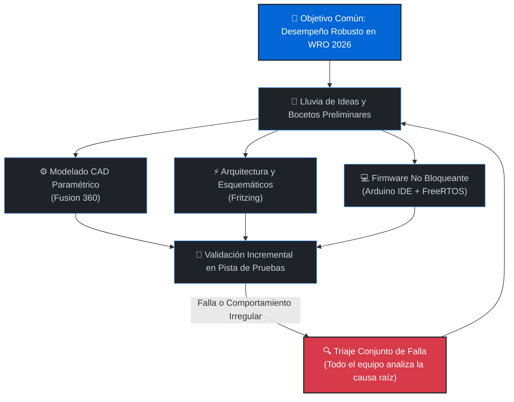

# 🏎️ WRO 2026 Future Engineers – Team Nexus

  
  
    
  
  
  
   
  
  
  
  
   
  
  
  

Nuestro prototipo **"Smoke"** es un vehículo autónomo diseñado para la categoría **Future Engineers de la World Robot Olympiad™ (WRO) 2026**. 
Este documento técnico ha sido elaborado bajo un formato de **libro blanco de ingeniería (*Engineering Whitepaper*)**: no se limita a describir el resultado final, sino que expone de forma analítica y reproducible el **porqué detrás de cada decisión técnica**, los compromisos de diseño (*trade-offs*), los cálculos físicos y la evolución experimental del proyecto. Cualquier equipo o investigador que consulte esta documentación podrá comprender a profundidad los fundamentos cinemáticos, térmicos, eléctricos y de software que rigen el vehículo, permitiendo reproducir o iterar la plataforma de forma integral.

# 📑 Índice 

- [1. Filosofía de Trabajo y Metodología de Co-Diseño](#1-filosofía-de-trabajo-y-metodología-de-co-diseño)
- [2. Nuestro Equipo (INIAR)](#2-nuestro-equipo-iniar)
  - [David Ocando](#david-ocando)
  - [José Montiel](#josé-montiel)
  - [Jairo Cruz](#jairo-cruz)
  - [Ing. Wender Sánchez (Mentor)](#ing-wender-sanchez)
- [3. Estructura del Repositorio (Repository Directory Map)](#3-estructura-del-repositorio-repository-directory-map)
- [4. Ficha Técnica Oficial de la Plataforma "Smoke"](#4-ficha-técnica-oficial-de-la-plataforma-smoke)
- [5. Galería de Inspección Técnica 360°](#5-galería-de-inspección-técnica-360)
- [6. Desempeño en Pista (Videos Oficiales)](#6-desempeño-en-pista-videos-oficiales)
- [7. Lista Maestra de Materiales y Componentes (BOM)](#7-lista-maestra-de-materiales-y-componentes-bom)
- [8. Movilidad y Diseño Mecánico](#8-movilidad-y-diseño-mecánico)
  - [8.1 Arquitectura Modular del Chasis (Tres Pisos en PETG)](#81-arquitectura-modular-del-chasis-tres-pisos-en-petg)
  - [8.2 Estandarización de Sujeción (Tornillería M3)](#82-estandarización-de-sujeción-tornillería-m3)
  - [8.3 Geometría de Dirección Ackermann Híbrida](#83-geometría-de-dirección-ackermann-híbrida)
  - [8.4 Tren de Tracción RWD, Transmisión Cónica y Diferencial](#84-tren-de-tracción-rwd-transmisión-cónica-y-diferencial)
  - [8.5 Estudio Dinámico: Fuerzas, Torque en Rueda y Aceleración](#85-estudio-dinámico-fuerzas-torque-en-rueda-y-aceleración)
  - [8.6 Neumáticos Escalonados (Staggered Setup)](#86-neumáticos-escalonados-staggered-setup)
- [9. Arquitectura Eléctrica y Distribución de Potencia](#9-arquitectura-eléctrica-y-distribución-de-potencia)
  - [9.1 Banco de Baterías 18650 (Configuración 2S2P)](#91-banco-de-baterías-18650-configuración-2s2p)
  - [9.2 Topología de Tres Ramas Desacopladas](#92-topología-de-tres-ramas-desacopladas)
  - [9.3 Compensación Darlington L298N (Boost a 14V) y Masa Común](#93-compensación-darlington-l298n-boost-a-14v-y-masa-común)
  - [9.4 Protocolo de Encendido Seguro y Control de Usuario](#94-protocolo-de-encendido-seguro-y-control-de-usuario)
  - [9.5 Esquemático General y Mapeo de Pines (Pinout ESP32-S3)](#95-esquemático-general-y-mapeo-de-pines-pinout-esp32-s3)
- [10. Percepción Sensorial y Visión Artificial](#10-percepción-sensorial-y-visión-artificial)
  - [10.1 Visión IA por Hardware (HuskyLens 2)](#101-visión-ia-por-hardware-huskylens-2)
  - [10.2 Telemetría Inercial en Core Dedicado (MPU6050 + FreeRTOS)](#102-telemetría-inercial-en-core-dedicado-mpu6050--freertos)
  - [10.3 Red Ultrasónica HC-SR04 con Muestreo Rotativo](#103-red-ultrasónica-hc-sr04-con-muestreo-rotativo)
- [11. Arquitectura de Software y Lógica de Navegación](#11-arquitectura-de-software-y-lógica-de-navegación)
  - [11.1 Máquina de Estados Finitos (FSM)](#111-máquina-de-estados-finitos-fsm)
  - [11.2 Desglose Modular del Firmware (`OPENCHALLENGE.ino`)](#112-desglose-modular-del-firmware-openchallengeino)
- [12. Diario de Ingeniería, Iteraciones y Solución de Fallas](#12-diario-de-ingeniería-iteraciones-y-solución-de-fallas)

# 1. Filosofía de Trabajo y Metodología de Co-Diseño
En el **Instituto de Inteligencia Artificial y Robótica del estado Zulia (INIAR)**, el desarrollo de **"Smoke"** no se abordó como una suma de tareas aisladas, sino bajo un **modelo holístico de ingeniería concurrente**:

# 2. Nuestro Equipo (INIAR)
Team Nexus está integrado por estudiantes universitarios del **Instituto de Inteligencia Artificial y Robótica del estado Zulia "Dr. Héctor Rafael Rojas" (INIAR)**, combinando experiencia práctica en torneos nacionales y mundiales:

## 👤 David Ocando 

**Líder de Arquitectura Eléctrica, Gestión de Potencia y Co-Administrador Digital**

  

* **Formación Académica:** Estudiante de Ingeniería Eléctrica (Mención Generación y Distribución de Potencia) – **Universidad Rafael Urdaneta (URU)**.
* **Responsabilidades Técnicas en "Smoke":**
  * **Diseño Eléctrico de Potencia:** Cálculo de caídas de tensión, selección de convertidores DC-DC y desacoplamiento en 3 ramas independientes (lógica a 5V, actuadores a 5V y tracción a 14V).
  * **Almacenamiento Energético:** Configuración del banco de celdas 18650 (2S2P / 7000 mAh), monitoreo de curvas de descarga y dimensionamiento de cables de potencia.
  * **Inmunidad Electromagnética:** Unificación del plano de masas (Common Ground), filtrado de ruidos parásitos de conmutación y protocolo de encendido seguro.
  * **Documentación Técnica:** Mantenimiento y estandarización del repositorio en GitHub bajo la rúbrica oficial de la WRO.
### 🏆 Historial de Competición:
* **Copa KAI (2023):** Participación en robótica móvil y combate autónomo.
* **FIRST Tech Challenge (FTC Championship – Piacenza, Italia 2024):** Representación internacional de Venezuela; desarrollo de sistemas de potencia de alta corriente y actuadores de respuesta rápida.
* **WRO Venezuela (Temporada 2025):** Competidor oficial en la categoría **RoboSports**, optimizando la respuesta dinámica y la robustez eléctrica del robot en cancha.
---

## 👤 José Montiel 

**Ingeniero Líder de Firmware, Visión Artificial y Control Autónomo**

  

* **Formación Académica:** Estudiante de Ingeniería Electrónica – **Universidad Dr. Rafael Belloso Chacín (URBE)**.
* **Responsabilidades Técnicas en "Smoke":**
  * **Desarrollo de Firmware Embebido:** Programación en C++ sobre ESP32-S3 bajo arquitectura no bloqueante con temporizadores de hardware.
  * **Sistemas Operativos en Tiempo Real:** Implementación de tareas dedicadas en **FreeRTOS** (Core 0 para la integración angular del MPU6050 a 500 Hz y Core 1 para la navegación).
  * **Control de Rumbo y Estabilidad:** Algoritmo Proporcional-Derivativo (PD) con zona muerta y compensación angular de escape lateral ante muros.
  * **Visión por Computador:** Calibración y enlace serie UART (115,200 baudios) con la cámara **HuskyLens 2** para la clasificación colorimétrica de obstáculos.
  * **Tolerancia a Fallas:** Desarrollo del mecanismo de auto-rescate en caliente del bus I2C mediante 9 ciclos de reloj forzados en SCL.
### 🏆 Historial de Competición:
* **WRO Venezuela Regional (Temporada 2025):** Participación oficial en la categoría **Future Engineers**, acumulando experiencia en cinemática de pista, algoritmos reactivos y visión de carril.
---

## 👤 Jairo Cruz 

**Ingeniero de Diseño Mecánico, Dinámica Vehicular y Manufactura Aditiva**

  

* **Formación Académica:** Estudiante de Ingeniería Electrónica (Mención Automatización y Control).
* **Responsabilidades Técnicas en "Smoke":**
  * **Diseño Paramétrico 3D:** Modelado en **Autodesk Fusion 360** del chasis modular de tres niveles, bancada de motor y soportes de sensado.
  * **Manufactura Aditiva Avanzada:** Optimización de laminado en **Bambu Lab** con filamento **PETG** estructural (orientación de capas, 100% infill en engranajes y tolerancias dimensionales).
  * **Cinemática y Ensamblaje:** Adaptación híbrida del piñón cónico con entrada D-Shaft al diferencial LEGO EV3, timonería Ackermann y estandarización métrica M3.
### 🏆 Historial de Competición:
* **Copa KAI (2023):** Competidor en diseño de chasis ultraligero y robótica móvil.
* **FIRST Tech Challenge (FTC Championship – Italia 2024):** Integrante de la delegación internacional venezolana; diseño de sistemas de reducción mecánica y ensamblaje de alta precisión.
* **WRO Venezuela (Temporada 2025):** Competidor en la categoría **RoboSports**, especializándose en rigidez torsional y resistencia a impactos mecánicos.
---
## 👤 Ing. Wender Sánchez 
**Mentor Líder y Asesor de Ingeniería Mecánica**

  

* **Formación y Perfil:** Ingeniero Mecánico egresado de la **Universidad del Zulia (LUZ)**, con dilatada trayectoria profesional en dinámica de vehículos, cinemática de mecanismos y sistemas de transmisión de potencia.
* **Acompañamiento Metodológico:** Supervisión técnica en el cálculo analítico de fuerzas, validación de relaciones de transmisión, selección de materiales termoplásticos y apego a la rúbrica internacional de la WRO.

# 3. Estructura del Repositorio (Repository Directory Map)
Para agilizar la evaluación de los jueces y asegurar la total reproducibilidad internacional del proyecto, todos los recursos de ingeniería están organizados y segregados mediante los siguientes accesos directos:
| Directorio / Carpeta | Contenido Técnico y Archivos | Acceso Directo |
| :--- | :--- | :---: |
| **📁 `models/`** | **Diseño Mecánico CAD:** Archivos de fabricación (`.stl`, `.step`), tolerancias y modelos paramétricos para impresión en Bambu Lab. | [🔗 Explorar Archivos CAD](./models/) |
| **📁 `schemes/`** | **Ingeniería Eléctrica:** Esquemático oficial `DIAGRAMAVF.jpg`, distribución de buses de potencia y planos de conexión. | [🔗 Ver Planos Eléctricos](./schemes/) |
| **📁 `src/`** | **Código Fuente y Firmware:** Archivos `OPENCHALLENGE.ino`, librerías embebidas y algoritmos de control no bloqueante en C++. | [🔗 Revisar Código Fuente](./src/) |
| **📁 `v-photos/`** | **Inspección Técnica 360°:** Registro fotográfico oficial en alta resolución de la plataforma "Smoke" en sus 6 perfiles ortogonales. | [🔗 Ver Galería del Robot](./v-photos/) |
| **📁 `t-photos/`** | **Identidad del Equipo:** Fotografías oficiales de los miembros de Team Nexus y sesiones de trabajo en el laboratorio de INIAR. | [🔗 Ver Galería del Equipo](./t-photos/) |
| **📁 `video/`** | **Desempeño en Pista:** Grabación oficial del desafío abierto y clip técnico en bucle `ESQUIVANDOROJOS.gif`. | [🔗 Ver Grabaciones](./video/) |
| **📁 `Otro/`** | **Recursos y Recursos Gráficos:** Identidad visual, logotipos de patrocinadores y documentación complementaria. | [🔗 Abrir Recursos](./Otro/) |

<a href="#inicio">⬆️ Volver al Inicio</a>

# 4. Ficha Técnica Oficial de la Plataforma "Smoke"

  
  
   
  
  <i>Plataforma robótica autónoma "Smoke" en configuración de pista para WRO 2026.</i>

 

El diseño dimensional y dinámico de **"Smoke"** responde a una búsqueda deliberada de compacidad y bajo momento de inercia rotacional ($I_z$), priorizando la agilidad en curvas cerradas sobre estructuras voluminosas:
* **📐 Dimensiones Geométricas Reales:** 
  * Longitud total ($L_{total}$): **225 mm** ($22.5\text{ cm}$)
  * Anchura de vía con neumáticos ($W_{total}$): **170 mm** ($17.0\text{ cm}$)
  * Altura máxima a la cúpula de potencia ($H_{total}$): **110 mm** ($11.0\text{ cm}$)
  * *Conformidad Reglamentaria:* Cumple con amplio margen la restricción dimensional oficial de la WRO ($< 300 \times 200 \times 300\text{ mm}$), dejando un margen de seguridad de $75\text{ mm}$ en longitud y $30\text{ mm}$ en anchura para evitar roces con los muros en giros cerrados.
* **⚖️ Masa y Balística Dinámica:** 
  * Masa total verificada en báscula de laboratorio: **859 gramos** ($0.859\text{ kg}$).
  * Peso total efectivo sobre el tapiz: 
    $$P = m \cdot g = 0.859\text{ kg} \times 9.81\text{ m/s}^2 \approx \mathbf{8.43\text{ Newtons}}$$
  * *Ventaja Dinámica del Peso Contenido:* Con apenas 859 g (frente a prototipos convencionales de la categoría que superan los 1150 g), la inercia lineal ($F = m \cdot a$) y centrífuga ($F_c = m \cdot \frac{v^2}{R}$) se reducen en más de un 25%, permitiendo desaceleraciones más tardías antes de la curva y aceleraciones en recta mucho más explosivas sin sobrecalentar el motor Makeblock.
* **🧠 Unidad Central de Cómputo:** **ESP32-S3 DevKit** (Dual-Core Xtensa LX7 @ 240 MHz, 512 KB SRAM interna) operando bajo **FreeRTOS** para la ejecución concurrente de telemetría inercial y control reactivo.
* **👁️ Percepción Sensorial y Visión IA:** 
  * Procesador de visión inteligente **HuskyLens 2** en enlace serie UART por hardware a 115,200 baudios.
  * Red perimetral de **3 transductores ultrasónicos HC-SR04** ubicados a cota rasante.
  * Unidad de Medición Inercial (**IMU MPU6050**) concéntrica con el centro de masa del vehículo.
* **🦾 Dinámica, Dirección y Tracción:** 
  * Dirección delantera **Ackermann Híbrido** con servomotor digital metálico **TowerPro MG90S**.
  * Propulsión trasera **RWD** impulsada por un motor DC **Makeblock 9V (185 RPM nominales con encoder de cuadratura integrado)**, acoplado mediante transmisión cónica a 90° de PETG a una caja diferencial de 3 satélites LEGO EV3.
* **🔋 Subestación Energética:** Banco de celdas cilíndricas de litio **18650 (3.5V / 3500 mAh)** en configuración **2S2P** (tensión de bus nominal de 7.0V y capacidad masiva de **7000 mAh**), con 3 etapas DC-DC de regulación independiente (XL4015, LM2596 y XL6009).
> [!NOTE]
> **Origen del Nombre "Smoke":**
> Durante las primeras fases de validación experimental en el banco de potencia del laboratorio de INIAR, severos retornos inductivos y picos de sobretensión provocados por la conmutación del motor quemaron consecutivamente tres módulos reguladores *Step-Down*, despidiendo una densa columna de humo blanco. 
> 
> Lejos de desalentarnos, este suceso marcó el rumbo de nuestra ingeniería: nos impulsó a rediseñar de raíz toda la arquitectura eléctrica, aislando la lógica de la potencia mediante 3 ramas independientes y unificando el plano de masas. Bautizar al vehículo como **"Smoke"** rinde tributo a la resiliencia en el taller: cada falla es un aprendizaje indispensable para alcanzar la máxima fiabilidad en pista.

<a href="#inicio">⬆️ Volver al Inicio</a>

# 5. Galería de Inspección Técnica 360°
Para verificar la simetría estructural, la concentricidad del centro de masa ($CoG$), la rigidez de la manufactura aditiva en PETG y el despeje libre sobre el tapiz (*ground clearance*), se documentan los **6 perfiles de inspección ortogonal reglamentarios**:
| 📸 Perfil de Inspección | 🖼️ Registro Visual | 🔍 Criterio de Verificación Técnica de Ingeniería |
| :--- | :---: | :--- | 
| **Vista Frontal** *(Front View)* |  | • Evalúa la orientación e inclinación angular del procesador de visión **HuskyLens 2** en el Piso 2. • Muestra la posición del sensor ultrasónico central delantero para el frenado ante esquinas a 70 cm. • Inspección del paralelismo de las manguetas de dirección LEGO y el despeje del parachoques. |
| **Vista Trasera** *(Rear View)* |  | • Evidencia el anclaje del motor Makeblock sobre su bancada de PETG reforzada con 8 tornillos M3. • Muestra el ensamble de la transmisión cónica atacando la corona del diferencial LEGO EV3. • Verificación de los retenedores axiales amarillos LEGO que evitan el desplazamiento de las ruedas de tracción de 43 mm. |
| **Vista Superior** *(Top View)* |  | • Evalúa el balance transversal de masas: banco 18650 (2S2P) a la par de los módulos Buck/Boost. • Inspección de la posición concéntrica del sensor inercial **MPU6050** en el centro geométrico del chasis. • Muestra la segregación y peinado del cableado de potencia y señales lógicas hacia el ESP32-S3. |
| **Vista Inferior** *(Bottom View)* |  | • Comprueba la superficie lisa del primer piso en PETG para minimizar la resistencia aerodinámica. • Verificación del *ground clearance* ($\ge 15\text{ mm}$) para evitar cualquier roce en el paso por desniveles del tapiz. • Muestra las cavidades hexagonales empotradas para tuercas de seguridad autoblocantes M3. |
| **Vista Lateral Derecha** *(Right View)* |  | • Evidencia la separación vertical física estricta entre el Piso 1 (tracción), Piso 2 (lógica) y Piso 3 (potencia). • Muestra la orientación perpendicular del sensor ultrasónico lateral derecho para el centrado a 30 cm. • Inspección del escalonamiento de neumáticos: Ø 30 mm directrices y Ø 43 mm motrices. |
| **Vista Lateral Izquierda** *(Left View)* |  | • Permite verificar el acceso a la interfaz de usuario: doble switch maestro y pulsador de arranque GPIO 21. • Disposición del sensor ultrasónico lateral izquierdo. • Evidencia la ventilación pasiva del disipador de aluminio del driver L298N y los reguladores de potencia. |

<a href="#inicio">⬆️ Volver al Inicio</a>

# 6. Desempeño en Pista (Videos Oficiales)
Para validar de forma fehaciente el cumplimiento del reglamento internacional, se presentan los registros audiovisuales de la plataforma "Smoke" operando en pista reglamentaria:
### 6.1 Ronda Abierta (Open Challenge - Recorrido Completo de 3 Vueltas)
Demostración del vehículo completando de manera 100% autónoma las 12 esquinas reglamentarias (3 vueltas continuas), navegando mediante la fusión de la red ultrasónica perimetral y la telemetría inercial del MPU6050:

  <a href="https://youtu.be/ooOyRUvQE2Y" target="_blank">
    
     
    <b>▶️ Ver en YouTube: Ronda Abierta Oficial – Team Nexus (WRO 2026)</b>
  </a>

 

### 6.2 Ronda de Obstáculos (Obstacle Challenge - Evasión Colorimétrica)
Registro técnico de la clasificación en tiempo real de los bloques de tráfico (rojos y verdes) mediante el procesador de visión inteligente **HuskyLens 2** en enlace serie UART, inyectando de forma inmediata la maniobra de viraje evasivo hacia el servomotor MG90S:

  
   
  <b>📹 Demostración Técnica: Detección colorimétrica y maniobra autónoma de esquiva ante bloque reglamentario rojo (ID 1)</b>

<a href="#inicio">⬆️ Volver al Inicio</a>

