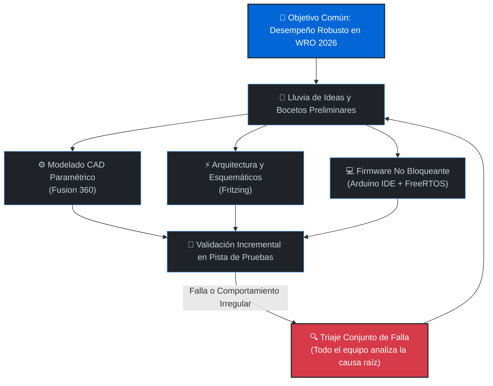
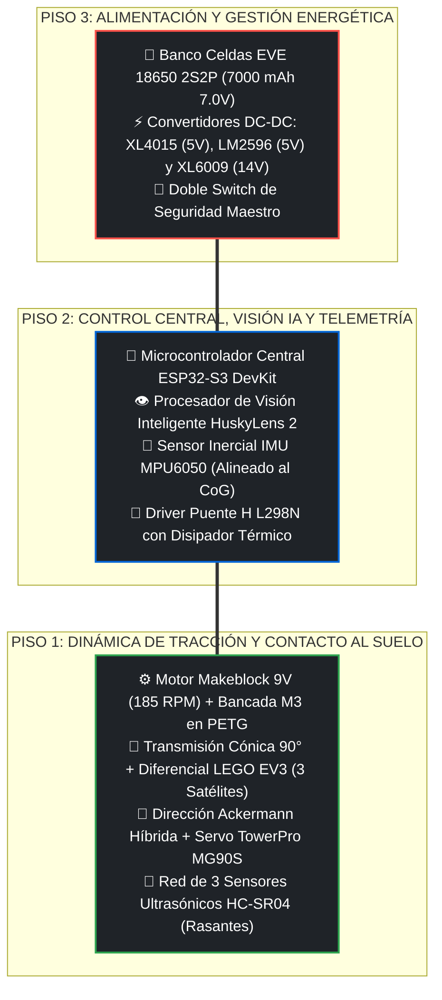
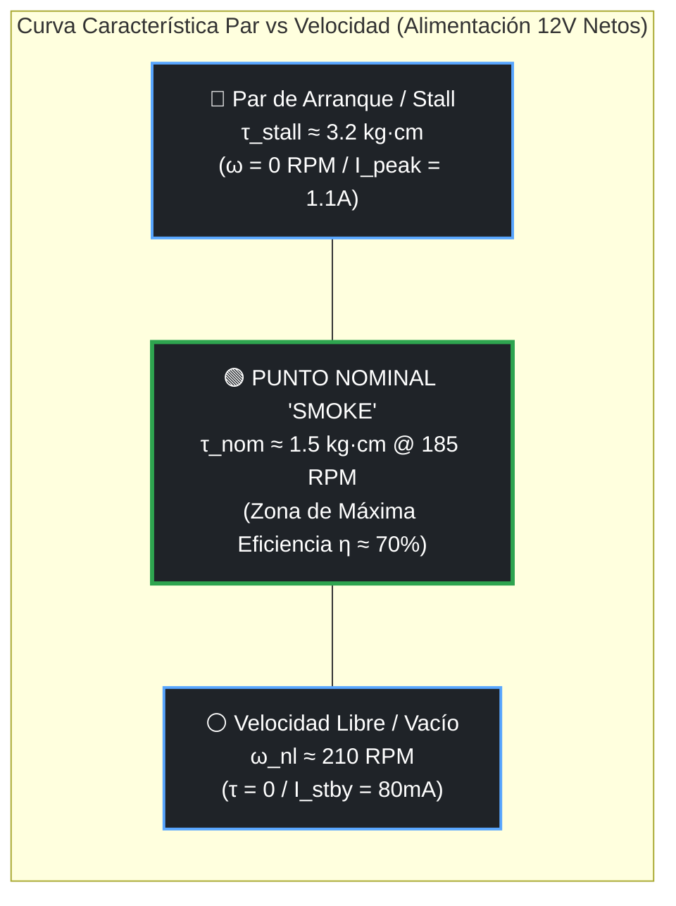
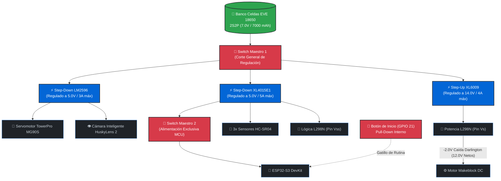
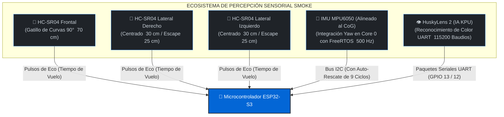
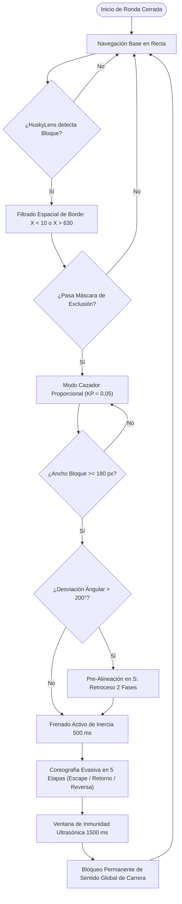
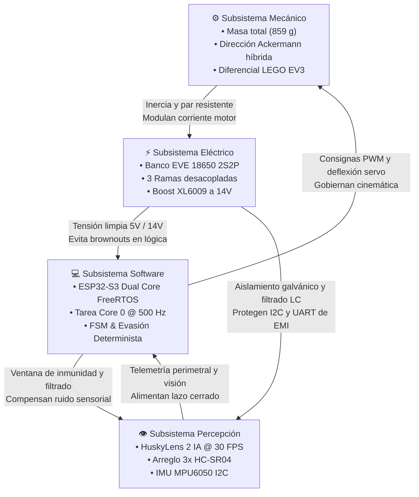
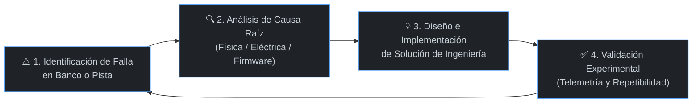

# 🏎️ WRO 2026 Future Engineers – Team Nexus
<div align="center">
  
  
  <br><br>
  [](https://wro-association.org/)
  [](https://www.instagram.com/iniar_zulia/)
  [](https://www.instagram.com/iniar_zulia/)
  <br>
  [](https://www.espressif.com/)
  [](https://isocpp.org/)
  [](https://www.autodesk.com/)
  [](https://bambulab.com/)
  <br>
  [](https://fritzing.org/)
  [](https://www.youtube.com/@NEXUSTEAM-e3d)
  [](https://www.instagram.com/iniar_zulia/)

<a name="inicio"></a>
</div>

Nuestro prototipo **"Smoke"** es un vehículo autónomo diseñado para la categoría **Future Engineers de la World Robot Olympiad™ (WRO) 2026**. 
Este documento técnico ha sido elaborado bajo un formato de **libro blanco de ingeniería (*Engineering Whitepaper*)**: no se limita a describir el resultado final, sino que expone de forma analítica y reproducible el **porqué detrás de cada decisión técnica**, los compromisos de diseño (*trade-offs*), los cálculos físicos y la evolución experimental del proyecto. Cualquier equipo o investigador que consulte esta documentación podrá comprender a profundidad los fundamentos cinemáticos, térmicos, eléctricos y de software que rigen el vehículo, permitiendo reproducir o iterar la plataforma de forma integral.

<a id="indice-general"></a>
## 📑 Índice General: Módulos de Ingeniería del Proyecto

- [Introducción y Datos del Equipo](#introduccion-equipo)
  - [Filosofía de Trabajo y Metodología de Co-Diseño](#filosofia-trabajo)
  - [Nuestro Equipo (INIAR)](#nuestro-equipo)
  - [Estructura del Repositorio y Ficha Técnica Oficial (225 × 170 × 110 mm, 859 g)](#ficha-tecnica)
  - [Galería de Inspección Técnica 360°](#fotos-360)
  - [Videos Oficiales de Demostración (Open & Obstacle Challenge)](#videos-oficiales)

---

### [Módulo 1: Movilidad y Diseño Mecánico](#modulo-1-movilidad)
- 1.1 [Chasis Modular Multicapa en PETG y Distribución de Masa](#chasis-petg)
- 1.2 [Estructura Rígida, Tornillería Pasante M3 y Separación de Niveles](#separacion-niveles)
- 1.3 [Geometría de Dirección Ackermann Híbrida y Validación de Barrido](#geometria-ackermann)
- 1.4 [Tren Motriz Trasero (RWD), Transmisión Cónica y Diferencial LEGO EV3](#tren-motriz)
- 1.5 [Estudio Dinámico: Razonamiento de Par Motor vs. Velocidad](#estudio-dinamico)
- 1.6 [Configuración Escalonada de Ruedas (*Staggered Setup*) e Inercia Rotacional](#ruedas-escalonadas)
- 1.7 [Diseños Alternativos Considerados vs. Diseño Mecánico Elegido](#alternativas-mecanicas)

---

### [Módulo 2: Arquitectura de Energía y Sensores](#modulo-2-energia-sensores)
- 2.1 [Topología de Alimentación Desacoplada en 3 Ramas Independientes](#topologia-alimentacion)
- 2.2 [Presupuesto Energético y Cuadro de Consumo de Corriente (*Power Budget*)](#presupuesto-energetico)
- 2.3 [Banco de Baterías EVE 18650 2S2P (7.0V - 7.4V, 7000 mAh) y Autonomía Teórica](#baterias-18650)
- 2.4 [Regulación de Voltaje: Elevador XL6009 a 14V y Supresión de Caída L298N](#regulacion-voltaje)
- 2.5 [Selección, Justificación y Ubicación Geométrica de Sensores](#justificacion-sensores)
  - 2.5.1 [Cámara Neuronal HuskyLens 2 (IA / Visión por Color)](#sensor-huskylens)
  - 2.5.2 [Unidad de Medición Inercial MPU6050 (Giroscopio / Acelerómetro)](#sensor-mpu6050)
  - 2.5.3 [Arreglo Perimetral de Ultrasonidos HC-SR04](#sensor-ultrasonicos)
- 2.6 [Métodos de Calibración de Sensores y Procedimiento de Arranque](#calibracion-sensores)
- 2.7 [Esquema Eléctrico Oficial, Pinout y Análisis de Puntos Únicos de Fallo (SPOF)](#esquema-pinout)

---

### [Módulo 3: Arquitectura de Software y Control Autónomo](#modulo-3-software)
- 3.1 [Arquitectura General y Máquina de Estados Finitos (FSM)](#fsm-general)
- 3.2 [Estrategia de Seguimiento de Carril: Open Challenge (`NUMERO4.ino`)](#software-open-challenge)
  - 3.2.1 [Inicialización, Concurrencia y Configuración de Periféricos](#software-setup)
  - 3.2.2 [Percepción Ultrasónica y Detección Dinámica de Esquinas](#software-ultrasonico)
  - 3.2.3 [Control PD de Heading con Giróscopo y Maniobra de Escape](#software-pd)
  - 3.2.4 [Negociación Determinista de Curvas y Conteo de 12 Esquinas](#software-curvas)
- 3.3 [Estrategia de Obediencia a Obstáculos: Obstacle Challenge (`CAZA_NUMERO1.ino`)](#estrategia-obstaculos)
  - 3.3.1 [Concurrencia Multihilo en FreeRTOS y Odometría Inercial Discreta (Core 0 @ 500 Hz)](#obstaculos-modulo1-inercial)
  - 3.3.2 [Percepción por Visión IA, Filtrado Espacial de Borde y Modo Cazador Proporcional](#obstaculos-modulo2-cazador)
  - 3.3.3 [Pre-Alineación en S ante Desviación Angular y Coreografía Evasiva en 5 Fases](#obstaculos-modulo3-coreografia)
  - 3.3.4 [Bloqueo Global de Sentido de Pista (`direccion_global_pista`) y Fusión Sensorial](#obstaculos-modulo4-bloqueo-fsm)
- 3.4 [Manejo de Casos Extremos, Métricas de Rendimiento y Randomizadores Web](#metricas-rendimiento)

---

### [Módulo 4: Pensamiento Sistémico y Gestión Integral de Riesgos](#modulo-4-pensamiento-sistemico)
- 4.1 [Interacción Dinámica entre Subsistemas y Filosofía Holística](#interaccion-subsistemas)
- 4.2 [Restricciones Explícitas del Sistema y Compromisos de Diseño (*Trade-offs*)](#restricciones-compromisos)
- 4.3 [Matriz Comparativa: «Por qué elegimos X en lugar de Y»](#matriz-porque-x-en-lugar-de-y)
- 4.4 [Limitaciones del Robot y Compensaciones (Efecto de Iluminación en Visión de Valencia)](#limitaciones-compensaciones)
- 4.5 [Matriz de Identificación, Gestión y Mitigación de Riesgos](#mitigacion-riesgos)
- 4.6 [Ciclos de Iteración y Diario de Ingeniería (Resolución de Fallas Críticas)](#diario-ingenieria)

---

### [Módulo 5: Reproducibilidad, Guía de Construcción y Control de Calidad](#modulo-5-reproducibilidad)
- 5.1 [Lista Maestra de Materiales (BOM) y Mini-Datasheets de Componentes](#bom)
- 5.2 [Guía de Construcción Paso a Paso del Robot (*Step-by-Step Build Guide*)](#guia-construccion)
- 5.3 [Entorno de Software, Versiones de Librerías y Procedimiento de Flasheo](#entorno-software)
- 5.4 [Flujo de Trabajo de Pruebas en Pista y Protocolo de Calibración](#protocolo-pruebas)
- 5.5 [Estructura del Repositorio, Control de Versiones y Notas de Lanzamiento](#control-versiones)


# 🏁 Introducción y Datos del Equipo <a id="introduccion-equipo"></a>

## Filosofía de Trabajo y Metodología de Co-Diseño <a id="filosofia-trabajo"></a>
En el **Instituto de Inteligencia Artificial y Robótica del estado Zulia (INIAR)**, el desarrollo de **"Smoke"** no se abordó como una suma de tareas aisladas, sino bajo un **modelo holístico de ingeniería concurrente**:


## Nuestro Equipo (INIAR) <a id="nuestro-equipo"></a>
Team Nexus está integrado por estudiantes universitarios del **Instituto de Inteligencia Artificial y Robótica del estado Zulia "Dr. Héctor Rafael Rojas" (INIAR)**, combinando experiencia práctica en torneos nacionales y mundiales:

### 👤 David Ocando <a id="david-ocando"></a>
**Líder de Arquitectura Eléctrica, Gestión de Potencia y Co-Administrador Digital**
<div align="center">
  
</div>

* **Formación Académica:** Estudiante de Ingeniería Eléctrica (Mención Generación y Distribución de Potencia) – **Universidad Rafael Urdaneta (URU)**.
* **Responsabilidades Técnicas en "Smoke":**
  * **Diseño Eléctrico de Potencia:** Cálculo de caídas de tensión, selección de convertidores DC-DC y desacoplamiento en 3 ramas independientes (lógica a 5V, actuadores a 5V y tracción a 14V).
  * **Almacenamiento Energético:** Configuración del banco de celdas 18650 (2S2P / 7000 mAh), monitoreo de curvas de descarga y dimensionamiento de cables de potencia.
  * **Inmunidad Electromagnética:** Unificación del plano de masas (Common Ground), filtrado de ruidos parásitos de conmutación y protocolo de encendido seguro.
  * **Documentación Técnica:** Mantenimiento y estandarización del repositorio en GitHub bajo la rúbrica oficial de la WRO.
#### 🏆 Historial de Competición:
* **Copa KAI (2023):** Participación en robótica móvil y combate autónomo.
* **FIRST Tech Challenge (FTC Championship – Piacenza, Italia 2024):** Representación internacional de Venezuela; desarrollo de sistemas de potencia de alta corriente y actuadores de respuesta rápida.
* **WRO Venezuela (Temporada 2025):** Competidor oficial en la categoría **RoboSports**, optimizando la respuesta dinámica y la robustez eléctrica del robot en cancha.
---
### 👤 José Montiel <a id="jose-montiel"></a>
**Ingeniero Líder de Firmware, Visión Artificial y Control Autónomo**
<div align="center">
  
</div>

* **Formación Académica:** Estudiante de Ingeniería Electrónica – **Universidad Dr. Rafael Belloso Chacín (URBE)**.
* **Responsabilidades Técnicas en "Smoke":**
  * **Desarrollo de Firmware Embebido:** Programación en C++ sobre ESP32-S3 bajo arquitectura no bloqueante con temporizadores de hardware.
  * **Sistemas Operativos en Tiempo Real:** Implementación de tareas dedicadas en **FreeRTOS** (Core 0 para la integración angular del MPU6050 a 500 Hz y Core 1 para la navegación).
  * **Control de Rumbo y Estabilidad:** Algoritmo Proporcional-Derivativo (PD) con zona muerta y compensación angular de escape lateral ante muros.
  * **Visión por Computador:** Calibración y enlace serie UART (115,200 baudios) con la cámara **HuskyLens 2** para la clasificación colorimétrica de obstáculos.
  * **Tolerancia a Fallas:** Desarrollo del mecanismo de auto-rescate en caliente del bus I2C mediante 9 ciclos de reloj forzados en SCL.
#### 🏆 Historial de Competición:
* **WRO Venezuela Regional (Temporada 2025):** Participación oficial en la categoría **Future Engineers**, acumulando experiencia en cinemática de pista, algoritmos reactivos y visión de carril.
---
### 👤 Jairo Cruz <a id="jairo-cruz"></a>
**Ingeniero de Diseño Mecánico, Dinámica Vehicular y Manufactura Aditiva**
<div align="center">
  
</div>

* **Formación Académica:** Estudiante de Ingeniería Electrónica (Mención Automatización y Control).
* **Responsabilidades Técnicas en "Smoke":**
  * **Diseño Paramétrico 3D:** Modelado en **Autodesk Fusion 360** del chasis modular de tres niveles, bancada de motor y soportes de sensado.
  * **Manufactura Aditiva Avanzada:** Optimización de laminado en **Bambu Lab** con filamento **PETG** estructural (orientación de capas, 100% infill en engranajes y tolerancias dimensionales).
  * **Cinemática y Ensamblaje:** Adaptación híbrida del piñón cónico con entrada D-Shaft al diferencial LEGO EV3, timonería Ackermann y estandarización métrica M3.
#### 🏆 Historial de Competición:
* **Copa KAI (2023):** Competidor en diseño de chasis ultraligero y robótica móvil.
* **FIRST Tech Challenge (FTC Championship – Italia 2024):** Integrante de la delegación internacional venezolana; diseño de sistemas de reducción mecánica y ensamblaje de alta precisión.
* **WRO Venezuela (Temporada 2025):** Competidor en la categoría **RoboSports**, especializándose en rigidez torsional y resistencia a impactos mecánicos.
---
### 👤 Ing. Wender Sánchez <a id="ing-wender-sanchez"></a>
**Mentor Líder y Asesor de Ingeniería Mecánica**
<div align="center">
  
</div>

* **Formación y Perfil:** Ingeniero Mecánico egresado de la **Universidad del Zulia (LUZ)**, con dilatada trayectoria profesional en dinámica de vehículos, cinemática de mecanismos y sistemas de transmisión de potencia.
* **Acompañamiento Metodológico:** Supervisión técnica en el cálculo analítico de fuerzas, validación de relaciones de transmisión, selección de materiales termoplásticos y apego a la rúbrica internacional de la WRO.

<a id="ficha-tecnica"></a>
## Ficha Técnica Oficial de la Plataforma "Smoke" (225 × 170 × 110 mm, 859 g)
<div align="center">
  
  
  <br>
  
  <i>Plataforma robótica autónoma "Smoke" en configuración de pista para WRO 2026.</i>
</div>
<br>

El diseño dimensional y dinámico de **"Smoke"** responde a una búsqueda deliberada de compacidad y bajo momento de inercia rotacional ($I_z$), priorizando la agilidad en curvas cerradas sobre estructuras voluminosas:
* **📐 Dimensiones Geométricas Reales:** 
  * Longitud total ($L_{total}$): **225 mm** ($22.5\text{ cm}$)
  * Anchura de vía con neumáticos ($W_{total}$): **170 mm** ($17.0\text{ cm}$)
  * Altura máxima a la cúpula de potencia ($H_{total}$): **110 mm** ($11.0\text{ cm}$)
  * *Conformidad Reglamentaria:* Cumple con amplio margen la restricción dimensional oficial de la WRO ($< 300 \times 200 \times 300\text{ mm}$), dejando un margen de seguridad de $75\text{ mm}$ en longitud y $30\text{ mm}$ en anchura para evitar roces con los muros en giros cerrados.
* **⚖️ Masa y Balística Dinámica:** 
  * Masa total verificada en báscula de laboratorio: **859 gramos** ($0.859\text{ kg}$).
  * Peso total efectivo sobre el tapiz: 
    $$P = m \cdot g = 0.859\text{ kg} \times 9.81\text{ m/s}^2 \approx \mathbf{8.43\text{ Newtons}}$$
  * *Ventaja Dinámica del Peso Contenido:* Con apenas 859 g (frente a prototipos convencionales de la categoría que superan los 1150 g), la inercia lineal ($F = m \cdot a$) y centrífuga ($F_c = m \cdot \frac{v^2}{R}$) se reducen en más de un 25%, permitiendo desaceleraciones más tardías antes de la curva y aceleraciones en recta mucho más explosivas sin sobrecalentar el motor Makeblock.
* **🧠 Unidad Central de Cómputo:** **ESP32-S3 DevKit** (Dual-Core Xtensa LX7 240 MHz, 512 KB SRAM interna) operando bajo **FreeRTOS** para la ejecución concurrente de telemetría inercial y control reactivo.
* **👁️ Percepción Sensorial y Visión IA:** 
  * Procesador de visión inteligente **HuskyLens 2** en enlace serie UART por hardware a 115,200 baudios.
  * Red perimetral de **3 transductores ultrasónicos HC-SR04** ubicados a cota rasante.
  * Unidad de Medición Inercial (**IMU MPU6050**) concéntrica con el centro de masa del vehículo.
* **🦾 Dinámica, Dirección y Tracción:** 
  * Dirección delantera **Ackermann Híbrido** con servomotor digital metálico **TowerPro MG90S**.
  * Propulsión trasera **RWD** impulsada por un motor DC **Makeblock 9V (185 RPM nominales con encoder de cuadratura integrado)**, acoplado mediante transmisión cónica a 90° de PETG a una caja diferencial de 3 satélites LEGO EV3.
* **🔋 Subestación Energética:** Banco de celdas cilíndricas de litio **18650 (3.5V / 3500 mAh)** en configuración **2S2P** (tensión de bus nominal de 7.0V y capacidad masiva de **7000 mAh**), con 3 etapas DC-DC de regulación independiente (XL4015, LM2596 y XL6009).
> [!NOTE]
> **Origen del Nombre "Smoke":**
> Durante las primeras fases de validación experimental en el banco de potencia del laboratorio de INIAR, severos retornos inductivos y picos de sobretensión provocados por la conmutación del motor quemaron consecutivamente tres módulos reguladores *Step-Down*, despidiendo una densa columna de humo blanco. 
> 
> Lejos de desalentarnos, este suceso marcó el rumbo de nuestra ingeniería: nos impulsó a rediseñar de raíz toda la arquitectura eléctrica, aislando la lógica de la potencia mediante 3 ramas independientes y unificando el plano de masas. Bautizar al vehículo como **"Smoke"** rinde tributo a la resiliencia en el taller: cada falla es un aprendizaje indispensable para alcanzar la máxima fiabilidad en pista.
<p align="right"><a href="#indice-general">⬆️ Volver al Índice</a></p>

<a id="fotos-360"></a>
## Galería de Inspección Técnica 360°
Para verificar la simetría estructural, la concentricidad del centro de masa ($CoG$), la rigidez de la manufactura aditiva en PETG y el despeje libre sobre el tapiz (*ground clearance*), se documentan los **6 perfiles de inspección ortogonal reglamentarios**:
| 📸 Perfil de Inspección | 🖼️ Registro Visual | 🔍 Criterio de Verificación Técnica de Ingeniería |
| :--- | :---: | :--- | 
| **Vista Frontal**<br>*(Front View)* |  | • Evalúa la orientación e inclinación angular del procesador de visión **HuskyLens 2** en el Piso 2.<br>• Muestra la posición del sensor ultrasónico central delantero para el frenado ante esquinas a 70 cm.<br>• Inspección del paralelismo de las manguetas de dirección LEGO y el despeje del parachoques. |
| **Vista Trasera**<br>*(Rear View)* |  | • Evidencia el anclaje del motor Makeblock sobre su bancada de PETG reforzada con 8 tornillos M3.<br>• Muestra el ensamble de la transmisión cónica atacando la corona del diferencial LEGO EV3.<br>• Verificación de los retenedores axiales amarillos LEGO que evitan el desplazamiento de las ruedas de tracción de 43 mm. |
| **Vista Superior**<br>*(Top View)* |  | • Evalúa el balance transversal de masas: banco 18650 (2S2P) a la par de los módulos Buck/Boost.<br>• Inspección de la posición concéntrica del sensor inercial **MPU6050** en el centro geométrico del chasis.<br>• Muestra la segregación y peinado del cableado de potencia y señales lógicas hacia el ESP32-S3. |
| **Vista Inferior**<br>*(Bottom View)* |  | • Comprueba la superficie lisa del primer piso en PETG para minimizar la resistencia aerodinámica.<br>• Verificación del *ground clearance* ($\ge 15\text{ mm}$) para evitar cualquier roce en el paso por desniveles del tapiz.<br>• Muestra las cavidades hexagonales empotradas para tuercas de seguridad autoblocantes M3. |
| **Vista Lateral Derecha**<br>*(Right View)* |  | • Evidencia la separación vertical física estricta entre el Piso 1 (tracción), Piso 2 (lógica) y Piso 3 (potencia).<br>• Muestra la orientación perpendicular del sensor ultrasónico lateral derecho para el centrado a 30 cm.<br>• Inspección del escalonamiento de neumáticos: Ø 30 mm directrices y Ø 43 mm motrices. |
| **Vista Lateral Izquierda**<br>*(Left View)* |  | • Permite verificar el acceso a la interfaz de usuario: doble switch maestro y pulsador de arranque GPIO 21.<br>• Disposición del sensor ultrasónico lateral izquierdo.<br>• Evidencia la ventilación pasiva del disipador de aluminio del driver L298N y los reguladores de potencia. |
<p align="right"><a href="#indice-general">⬆️ Volver al Índice</a></p>

<a id="videos-oficiales"></a>
## Videos Oficiales de Demostración (Open & Obstacle Challenge)
Para validar de forma fehaciente el cumplimiento del reglamento internacional de la WRO, se presentan los registros audiovisuales de la plataforma "Smoke" operando en pista reglamentaria:

### Ronda Abierta (Open Challenge - Recorrido Completo de 3 Vueltas)
Demostración del vehículo completando de manera 100% autónoma las 12 esquinas reglamentarias (3 vueltas continuas), navegando mediante la fusión de la red ultrasónica perimetral y la telemetría inercial del MPU6050:
<div align="center">
  <a href="https://youtu.be/ooOyRUvQE2Y" target="_blank">
    
    <br>
    <b>▶️ Ver en YouTube: Ronda Abierta Oficial – Team Nexus (WRO 2026)</b>
  </a>
</div>
<br>

### Ronda de Obstáculos (Obstacle Challenge - Evasión y Desempeño)
Demostración técnica de la clasificación en tiempo real de los bloques de tráfico (rojos y verdes) mediante el procesador de visión inteligente **HuskyLens 2** en enlace serie UART, inyectando de forma inmediata la maniobra de viraje evasivo hacia el servomotor MG90S con realineación angular:

<div align="center">
  
  <br>
  <b>📹 Demostración Técnica: Detección colorimétrica y maniobra autónoma de esquiva ante bloque reglamentario rojo (ID 1)</b>
  <br><br>
  <a href="https://youtu.be/E-C2RvofRqQ" target="_blank">
    
    <br>
    <b>▶️ Ver en YouTube: Ronda de Obstáculos Oficial – Team Nexus (WRO 2026)</b>
  </a>
</div>
<p align="right"><a href="#indice-general">⬆️ Volver al Índice</a></p>


# 🏎️ Módulo 1: Movilidad y Diseño Mecánico <a id="modulo-1-movilidad"></a><a id="pilar-1-movilidad"></a>

El chasis y tren cinemático de **"Smoke"** fueron desarrollados bajo un enfoque híbrido de manufactura: combinando la libertad de diseño paramétrico que ofrece la **impresión 3D en PETG** con la precisión de bajo rozamiento de componentes inyectados de robótica educativa (**LEGO MINDSTORMS EV3**).
Esta arquitectura fue calculada específicamente para soportar las fuerzas de inercia y torsión generadas por una masa dinámica de **859 gramos**, optimizando la posición del centro de gravedad ($CoG$) y minimizando la fricción en pista.

## 1.1 Chasis Modular Multicapa en PETG y Distribución de Masa <a id="chasis-petg"></a>
Para evitar el desorden estructural y blindar la electrónica contra interferencias electromagnéticas (EMI) y calor, el vehículo implementa una **estructura vertical de tres estratos segregados**:



## 1.2 Estructura Rígida, Tornillería Pasante M3 y Separación de Niveles <a id="separacion-niveles"></a>
Uno de los criterios esenciales para garantizar la fiabilidad del vehículo ante vibraciones de alta frecuencia provocadas por el motor Makeblock y los impactos en pista fue la **unificación total de fijaciones bajo métrica M3**:
<div align="center">
  
  <br>
  <i>Kit estandarizado de tornillería métrica M3, tuercas de seguridad autoblocantes y columnas pasantes.</i>
</div>

* **Tornillería Métrica M3:** Se estandarizó el uso de tornillos de acero grado 10.9 con cabeza Allen en longitudes calibradas de **8, 12, 16 y 20 mm** para componentes internos, permitiendo que una sola llave Allen de 2.5 mm opere todo el vehículo en boxes.
* **Columnas Pasantes de 35 mm para Rigidez Inter-Pisos:** 
  Para unir rígidamente los tres pisos del chasis sin depender de pequeñas uniones intermedias que pudieran falsearse con el movimiento, se implementaron **tornillos largos pasantes M3 de 35 mm**:
  * Estos tornillos atraviesan separadores cilíndricos en PETG que fijan con precisión la luz vertical entre niveles: un espacio libre de **$15\text{ mm}$ entre el Piso 1 y el Piso 2** (para dar cabida rasante al motor y servo), y un despeje de **$19\text{ mm}$ entre el Piso 2 y el Piso 3** (para albergar el disipador del L298N, la HuskyLens 2 y el cableado de la IMU).
  * Este diseño en columna pasante distribuye las cargas de flexión a lo largo de toda la altura del vehículo ($110\text{ mm}$), evitando el pandeo estructural.
* **Tuercas de Seguridad Autoblocantes (Nyloc):** Cada unión crítica y remate de las columnas de 35 mm incorpora tuercas con inserto elástico de nylon alojadas en cavidades hexagonales empotradas en el PETG, eliminando por completo la posibilidad de aflojamiento por resonancia mecánica.

## 1.3 Geometría de Dirección Ackermann Híbrida y Validación de Barrido <a id="geometria-ackermann"></a>

### 1.3.1 Principio Físico y Necesidad Dinámica
Cuando un vehículo traza una curva, la rueda directriz interior recorre un radio de giro más cerrado ($R_i$) que la rueda exterior ($R_o$). Si ambas ruedas giraran al mismo ángulo (geometría paralela convencional), los neumáticos se verían forzados a arrastrarse de lado sobre la pista (*wheel scrub* o arrastre lateral), lo que genera:
1. Una fuerza de fricción parásita que frena el vehículo en cada curva.
2. Pérdida crítica de adherencia en el tren delantero, provocando subviraje (*understeer*).
3. Sobrecarga de corriente y calentamiento prematuro en el servomotor.
Para resolver esto, **"Smoke"** implementa una **geometría de dirección Ackermann**, donde la timonería hace que **la rueda interior gire más pronunciadamente ($\theta_i$) que la exterior ($\theta_o$)**:

| 1. Principio Teórico | 2. Diseño CAD en Fusion 360 | 3. Ensamble Físico en Piso 1 |
| :---: | :---: | :---: |
|  |  |  |
| *Convergencia hacia el eje trasero* | *Brazo custom en PETG + manguetas* | *Integración con servo MG90S* |

### 1.3.2 Solución de Co-Diseño: Manguetas Inyectadas LEGO + Brazo de Servo (*Servo Horn*) Custom en PETG
Durante las fases de prototipado inicial, evaluamos imprimir las manguetas y tirantes de dirección completamente en 3D. Sin embargo, las piezas pequeñas impresas en FDM presentaban microporosidad superficial, lo que generaba un rozamiento irregular y juego mecánico acumulado (*backlash*).

> [!NOTE]
> **Decisión de Ingeniería Híbrida:**
> Optamos por una solución de alto rendimiento:
> - **Manguetas y Rótulas Inyectadas (LEGO EV3):** Proporcionan una superficie de giro industrial con fricción prácticamente nula y tolerancias dimensionales microscópicas imposibles de igualar en FDM.
> - **Brazo de Servo (*Servo Horn*) Custom en PETG:** Diseñado a medida en **Autodesk Fusion 360** e impreso con **100% de relleno sólido en PETG**, conectando rígidamente el estriado metálico del servo TowerPro MG90S con los tirantes de LEGO.

#### Rediseño Estructural de la Veleta del Servomotor (`Modelos/Servor Arm.stl`)
El servomotor comercial TowerPro MG90S incluye por defecto una colección de veletas (*servo horns*) estándar fabricadas en nylon blanco moldeado por inyección fina. No obstante, en las pruebas dinámicas preliminares con el vehículo a plena masa (**859 gramos**), la veleta comercial demostró ser un punto crítico de vulnerabilidad cinemática:

| Criterio de Comparación | Veleta Comercial Estándar (Nylon MG90S) | Veleta Personalizada Nexus en Fusion 360 (`Servor Arm.stl`) |
| :--- | :--- | :--- |
| **Material y Densidad** | Nylon comercial flexible (~1.5 mm de espesor). | **PETG Estructural al 100% de relleno sólido (*infill 100%*)**. |
| **Espesor y Nervaduras** | Paredes delgadas propensas a pandeo elástico bajo torsión. | **Espesor reforzado a 3.5 mm** con nervaduras axiales de rigidización geométrica. |
| **Acople con la Timonería** | Orificio circular pasante delgado ($\varnothing 1.0\text{ mm}$); tornillo con holgura. | **Alojamiento paramétrico de precisión milimétrica para rótula/pin LEGO EV3**. |
| **Juego Mecánico (*Backlash*)** | Histéresis angular progresiva ($> 4^\circ$) tras 50 ciclos de giro en pista. | **Cero juego mecánico (*Zero-backlash*, $< 0.5^\circ$)**, manteniendo el centro calibrado en $96^\circ$. |
| **Transmisión de Par** | Deformación elástica que absorbe parte del torque del servo. | Transmisión rígida e instantánea del par del servo a las manguetas de dirección. |

> 🛡️ **Mitigación de Riesgo de Ingeniería:**
> **Para mitigar el riesgo de histéresis cinemática, holgura acumulada (*backlash*) y flexión elástica bajo esfuerzos dinámicos de viraje rápido**, el equipo rediseñó en **Autodesk Fusion 360** la veleta del servomotor ([`Modelos/Servor Arm.stl`](./Modelos/Servor%20Arm.stl)), modelándola con paredes de 3.5 mm de grosor, nervaduras de refuerzo y cavidad de anclaje de tolerancia cero para la rótula LEGO EV3. Esto garantiza que cada microsegundo de señal PWM se traduzca de forma lineal y determinista en ángulo de rueda sin deriva.

<div align="center">
  
  <br>
  <i>Render de ensamble en Autodesk Fusion 360: Integración del servomotor MG90S con la veleta personalizada en PETG ('Modelos/Servor Arm.stl', visible en la zona inferior acoplando el pin de dirección) y los elementos de articulación LEGO EV3.</i>
</div>

> [!NOTE]
> **Disponibilidad del Archivo CAD 3D de Manufactura:**
> El modelo tridimensional listo para impresión 3D se encuentra alojado en el repositorio bajo la ruta [`Modelos/Servor Arm.stl`](./Modelos/Servor%20Arm.stl). *(Nota técnica: Los archivos STL son mallas poligonales de fabricación aditiva y no son renderizados nativamente como imagen en GitHub Markdown; por este motivo, se incluye la vista renderizada exportada desde Fusion 360).*

### 1.3.3 Validación del Rango de Viraje del Servomotor (±80°)
Para garantizar que la timonería no sufra atascos mecánicos (*binding*) en maniobras de evasión extrema ante obstáculos, se calibró el recorrido del servomotor MG90S:
<div align="center">
  
  <br>
  <i>Verificación cinemática: barrido continuo del servo MG90S hasta ±80° demostrando movimiento suave, sin holguras y con respuesta lineal.</i>
</div>

### 1.3.4 Modelo Matemático de la Dirección Ackermann
La condición de rodadura pura de Ackermann exige que las prolongaciones de los ejes de las ruedas coincidan en el **Centro Instantáneo de Rotación ($CIR$)**:
$$\cot(\theta_o) - \cot(\theta_i) = \frac{W}{L}$$
Donde:
* $W$ = Trocha delantera entre pivotes de mangueta: **142 mm** ($0.142\text{ m}$).
* $L$ = Batalla entre ejes delantero y trasero: **155 mm** ($0.155\text{ m}$).
* $\theta_i$ = Ángulo de la rueda interior a la curva.
* $\theta_o$ = Ángulo de la rueda exterior a la curva.
El radio de giro mínimo medido en el centro del eje posterior se rige por:
$$R = \frac{L}{\tan(\delta)}$$
*(Donde $\delta$ es el ángulo promedio equivalente de la dirección).*

## 1.4 Tren Motriz Trasero (RWD), Transmisión Cónica y Diferencial LEGO EV3 <a id="tren-motriz"></a>
Para impulsar la masa de **859 gramos**, "Smoke" adopta un esquema de **Tracción Trasera (RWD)** con transmisión en ángulo recto acoplada a un diferencial de satélites cónicos:
<div align="center">
  
  <br>
  <i>Render de ingeniería en Fusion 360: Acople del eje en D del motor Makeblock al piñón cónico custom en PETG atacando la corona del diferencial LEGO EV3.</i>
</div>

### 1.4.1 Adaptación Mecánica: Eje en D (D-Shaft) a Engranaje Cónico
El motorreductor Makeblock cuenta con un eje cilíndrico con rebaje plano (**eje tipo D**), incompatible con los orificios en cruz estandarizados de LEGO:
* **Solución Técnica:** Modelamos paramétricamente en Fusion 360 un **piñón cónico personalizado** con ranura hembra interna en "D", dimensionado con una compensación de holgura de **$0.15\text{ mm}$** para absorber la contracción térmica del plástico.
* **Manufactura:** Impreso al **100% de densidad de relleno (infill sólido)** en **PETG** en la Bambu Lab, logrando que los dientes soporten el torque instantáneo de arranque sin cizallarse.
<div align="center">
  
  <br>
  <i>Detalle del piñón cónico en PETG con orificio interno en forma de "D".</i>
</div>

### 1.4.2 Soporte Rígido del Motor (Bancada de 8 Puntos en PETG)
Para contrarrestar el momento torsor de reacción que tiende a desalinear el engranaje del motor durante aceleraciones violentas:
* El motor Makeblock se sujeta frontalmente mediante **2 tornillos métricos M3** directamente a la cara anterior de la bancada.
* La base de la bancada se ancla sólidamente al chasis del Piso 1 mediante **6 tornillos M3** con tuercas autoblocantes, formando una estructura de 8 puntos de fijación que erradica la separación de dientes (*gear separation*).

> 🛡️ **Mitigación de Riesgo de Ingeniería:**
> **Para mitigar el riesgo de desalineación axial (*gear separation*), vibración destructiva y cizallamiento** de los dientes plásticos del piñón cónico bajo el par reactivo instantáneo de aceleración, el motor Makeblock se ancló mediante una bancada envolvente en PETG fijada con 8 tornillos pasantes M3 y tuercas autoblocantes, garantizando un engrane rígido y constante con la corona del diferencial LEGO EV3.

### 1.4.3 Diferencial de Satélites y Estabilización de Semiejes
El conjunto diferencial de 3 piñones cónicos internos LEGO EV3 distribuye la velocidad angular en curvas:
$$\omega_{diferencial} = \frac{\omega_{izq} + \omega_{der}}{2}$$
* **Doble Bancada por Semieje:** Cada semieje de salida se apoya en dos puntos del PETG (uno contiguo al diferencial y otro junto a la rueda), impidiendo deflexiones axiales bajo carga.
* **Retenedores Amarillos LEGO (*Bushings*):** Los orificios en el chasis se dimensionaron con holgura para rotación libre de fricción, fijando el eje longitudinalmente con retenedores amarillos para impedir desplazamientos transversales de las ruedas.

## 1.5 Estudio Dinámico: Razonamiento de Par Motor vs. Velocidad <a id="estudio-dinamico"></a>
Para fundamentar analíticamente el desempeño dinámico del vehículo en pista y justificar que el motor Makeblock de 185 RPM opera en su zona de máxima eficiencia sin estancamiento térmico (*stall*), desarrollamos el modelo físico basado en las medidas y masa real de **"Smoke"**:
* **Masa Total del Vehículo:** $m = 859\text{ gramos} = \mathbf{0.859\text{ kg}}$
* **Peso Total Normal:** $P = m \cdot g = 0.859\text{ kg} \times 9.81\text{ m/s}^2 \approx \mathbf{8.43\text{ Newtons}}$
* **Distribución de Masa Estática:** $45\%$ en el eje delantero y $55\%$ en el eje trasero (tracción RWD):
  $$N_{trasero} = 0.55 \times 8.43\text{ N} \approx \mathbf{4.64\text{ Newtons}}$$
* **Radio Efectivo de Rueda Trasera ($r_{rueda}$):** Diámetro $\varnothing = 43\text{ mm} \implies r = 0.0215\text{ metros}$.
* **Coeficiente de Fricción Caucho/Pista ($\mu_s$):** Estimado conservadoramente en $\mu_s \approx 0.70$ para neumáticos de goma LEGO EV3 limpios sobre tapiz de vinilo.

### 1.5.1 Ecuación Característica Electromecánica: Curva Torque vs. Velocidad ($\tau - \omega$)
El comportamiento electromecánico del motor Makeblock de corriente continua gobernado mediante PWM se fundamenta en las leyes acopladas de Kirchhoff y Lorentz para actuadores de armadura con escobillas:

$$V = I \cdot R + K_e \cdot \omega$$
$$\tau = K_t \cdot I \implies I = \frac{\tau}{K_t}$$

Despejando la corriente de inducido $I$ y sustituyéndola en la relación de malla eléctrica, se obtiene la **ecuación lineal característica de par vs. velocidad angular ($\tau - \omega$)**:

$$\tau(\omega) = \frac{K_t \cdot V}{R} - \frac{K_t \cdot K_e}{R} \cdot \omega = \tau_{\text{stall}} \cdot \left(1 - \frac{\omega}{\omega_{\text{nl}}}\right)$$

Donde las variables y constantes del actuador se definen como:
* $V$: Voltaje neto en bornes del motor = **$12.0\text{V DC}$** (garantizado mediante la elevación a $14.0\text{V}$ del módulo XL6009 para neutralizar la caída interna $V_{CE(sat)} \approx 2.0\text{V}$ de la etapa Darlington del driver L298N).
* $R$: Resistencia óhmica del devanado de armadura ($\approx 6.5\ \Omega$).
* $K_t$: Constante de par del motor ($\approx 0.016\text{ N}\cdot\text{m/A}$).
* $K_e$: Constante de fuerza contraelectromotriz o Back-EMF ($\approx 0.016\text{ V}\cdot\text{s/rad}$).
* $\tau_{\text{stall}} = \frac{K_t \cdot V}{R}$: Par de estancamiento (*stall torque*) a rotor bloqueado ($\approx 3.2\text{ kg}\cdot\text{cm} = 0.314\text{ Nm}$).
* $\omega_{\text{nl}} = \frac{V}{K_e}$: Velocidad angular teórica en vacío (*no-load speed*) ($\approx 210\text{ RPM} \approx 22.0\text{ rad/s}$).



> 🛡️ **Mitigación de Riesgo de Ingeniería:**
> **Para mitigar el riesgo de estancamiento del motor (*motor stall*), sobrecalentamiento en el bobinado y derretimiento térmico de la bancada en PETG**, el tren cinemático se dimensionó para que el par de trabajo continuo del vehículo ($\tau_{\text{nom}} \approx 1.5\text{ kg}\cdot\text{cm}$ a $185\text{ RPM}$) opere a menos del $47\%$ de su límite de bloqueo ($\tau_{\text{stall}}$). Esto proporciona un factor de reserva de par de **$2.22$** y garantiza que el motor trabaje estrictamente en su régimen de máxima eficiencia ($\eta \approx 70\%$) con un consumo moderado de apenas $350\text{ a }500\text{ mA}$.

### 1.5.2 Cálculo del Torque de Ruptura Estática en Ruedas (Breakout Torque)
El par de torsión mínimo que debe vencerse en el eje de las ruedas traseras para romper la inercia estática e iniciar el movimiento acelerado sin patinaje viene dado por:

$$\tau_{rueda} = N_{trasero} \cdot \mu_s \cdot r_{rueda}$$
$$\tau_{rueda} = 4.64\text{ N} \times 0.70 \times 0.0215\text{ m} \approx \mathbf{0.0698\text{ Nm}} \approx \mathbf{0.712\text{ kg}\cdot\text{cm}}$$

### 1.5.3 Par Motor Makeblock y Eficiencia de Transmisión
El motor Makeblock de 9V a 185 RPM entrega un torque nominal constante de $\tau_{motor} \approx 1.5\text{ kg}\cdot\text{cm}$ ($0.147\text{ Nm}$).
Considerando la relación de transmisión cónica ($i \approx 1.2:1$) y una eficiencia mecánica global de transmisión de $\eta = 88\%$ (0.88) para los engranajes cónicos apoyados sobre bujes lisos:
$$\tau_{disponible} = \tau_{motor} \cdot i \cdot \eta = 1.5\text{ kg}\cdot\text{cm} \times 1.2 \times 0.88 \approx \mathbf{1.58\text{ kg}\cdot\text{cm}}$$
$$\text{Margen de Seguridad de Tracción: } \frac{\tau_{disponible}}{\tau_{rueda}} = \frac{1.58}{0.712} \approx \mathbf{2.22}$$
> [!TIP]
> **Conclusión del Margen de Potencia:**
> El sistema dispone de un **margen de seguridad del 222%** respecto al torque estático de ruptura. Esto garantiza que:
> 1. El motor Makeblock opera con apenas un **$45\%$ de su carga nominal**, consumiendo una corriente promedio baja ($\approx 350 - 500\text{ mA}$).
> 2. No existe riesgo de calentamiento por efecto Joule en las bobinas ni derretimiento térmico de la bancada de PETG.
> 3. El carro acelera de $0\text{ a }100\%$ de velocidad en menos de **$0.25\text{ segundos}$** tras salir de cada curva de 90°.

### 1.5.4 Velocidad Lineal Teórica Máxima en Pista
La velocidad tangencial máxima del vehículo en los tramos rectos a 185 RPM nominales en el eje se rige por:
$$v_{teorica} = \omega \cdot r_{rueda} = \left( 185 \cdot \frac{2\pi}{60} \right) \cdot 0.0215\text{ m} \approx 19.37\text{ rad/s} \times 0.0215\text{ m} \approx \mathbf{0.416\text{ m/s}} \approx \mathbf{1.50\text{ km/h}}$$

A una velocidad tangencial nominal de $0.416\text{ m/s}$, el vehículo completa cada vuelta al perímetro de la pista ($\approx 7.6\text{ a }8.0\text{ metros}$) en aproximadamente **$18.4\text{ segundos}$**, lo que permite completar las 3 vueltas reglamentarias ($\approx 24\text{ metros}$ totales y 12 esquinas) en un tiempo neto de carrera de aproximadamente **$55\text{ segundos}$** en la Ronda Abierta (Open Challenge), situándose en el rango óptimo de control reactivo y velocidad competitiva.

## 1.6 Configuración Escalonada de Ruedas (*Staggered Setup*) e Inercia Rotacional <a id="ruedas-escalonadas"></a>
La selección de neumáticos en **"Smoke"** no responde a criterios estéticos, sino a una rigurosa optimización de la **dinámica vehicular y la inercia rotacional**:

| 1. Tren Delantero (Dirección) | 2. Tren Trasero (Tracción) | 3. Comparativa de Escalonamiento |
| :---: | :---: | :---: |
|  |  |  |
| *Ø 30 mm – LEGO EV3* | *Ø 43 mm – LEGO EV3* | *Diferencial de diámetro y banda de rodadura* |

| Tren / Posición | Diámetro Circular | Procedencia | Función Dinámica en "Smoke" |
| :---: | :---: | :---: | :--- |
| **Delantero (Dirección)** | **Ø 30 mm** | LEGO EV3 | **Baja inercia rotacional:** Reduce la masa no suspendida del tren delantero en un 40%, permitiendo que el servo MG90S cambie de dirección en milisegundos con mínimo esfuerzo torsor. |
| **Trasero (Tracción)** | **Ø 43 mm** | LEGO EV3 | **Mayor contacto y tracción:** Su mayor diámetro exterior incrementa la velocidad lineal de avance por revolución y su compuesto de caucho blando garantiza agarre estricto en aceleraciones. |

### 1.6.1 Justificación Dinámica del Tren Delantero (Ø 30 mm): Reducción del Momento de Inercia
El servomotor de dirección MG90S debe vencer dos resistencias para virar: la fricción de giro del caucho contra el tapiz y el momento de inercia rotacional de la propia rueda alrededor del pivote de la mangueta ($I_z$). 
El momento de inercia de un cuerpo rotacional respecto a su eje de masa se rige por:
$$I = \frac{1}{2} m \cdot r^2$$
Al reducir el radio de la rueda de $r_{trasera} = 21.5\text{ mm}$ a $r_{delantera} = 15.0\text{ mm}$, y considerando que la masa de la rueda de 30 mm es aproximadamente un $55\%$ menor ($m_{del} \approx 8.5\text{ g}$ frente a $m_{tras} \approx 19.0\text{ g}$):

$$\frac{I_{delantera}}{I_{trasera}} = \frac{m_{del} \cdot r_{del}^2}{m_{tras} \cdot r_{tras}^2} = \frac{0.0085 \cdot (0.015)^2}{0.0190 \cdot (0.0215)^2} \approx \mathbf{0.218} \quad (\approx 78.2\% \text{ de reducción})$$

> [!TIP]
> **Impacto en el Servo MG90S:**
> El tren delantero presenta una **reducción del 78% en la resistencia inercial rotacional**. Esto permite que el servo alcance su velocidad angular máxima ($0.10\text{ s}/60^\circ$) sin experimentar caídas de par ni sobrecorrientes en maniobras evasivas bruscas de $\pm 21^\circ$.

### 1.6.2 Justificación Dinámica del Tren Trasero (Ø 43 mm): Maximización de Tracción y Velocidad
Para el eje motriz (RWD), se requería maximizar dos variables opuestas: velocidad punta de avance y adherencia en aceleración sin patinaje.
* **Mayor Velocidad Lineal por Revolución ($v$):**
  La velocidad tangencial de avance es directamente proporcional al radio del neumático:
  $$v = \omega_{eje} \cdot r_{rueda}$$
  El neumático de $43\text{ mm}$ ($r = 0.0215\text{ m}$) otorga un **$43.3\%$ más de avance por cada giro del motor** que si hubiéramos utilizado ruedas de $30\text{ mm}$, alcanzando $0.416\text{ m/s}$ ($1.50\text{ km/h}$) sin forzar las revoluciones del motor Makeblock.
* **Fuerza Máxima de Tracción sin Deslizamiento ($F_{max}$):**
  La fuerza tractiva que las ruedas traseras pueden transferir al suelo antes de que el caucho rompa adherencia estática y comience a patinar se calcula como:
  $$F_{max} = \mu_s \cdot N_{trasero} = 0.70 \times 4.64\text{ N} \approx \mathbf{3.25\text{ Newtons}}$$
  La banda de rodadura de caucho natural vulcanizado de LEGO EV3 (ancho de $14\text{ mm}$) ofrece una mayor área de huella de contacto (*tire contact patch*), asegurando que el torque transmitido por la transmisión cónica ($\approx 0.0698\text{ Nm}$) se convierta íntegramente en aceleración lineal sin derrapes parásitos en la salida de las curvas.

## 1.7 Diseños Alternativos Considerados vs. Diseño Mecánico Elegido <a id="alternativas-mecanicas"></a>
Bajo la rúbrica oficial de la WRO, la calidad de ingeniería no se mide por llegar a una solución por azar, sino por la rigurosidad con la que se descartaron alternativas inviables mediante análisis cuantitativo y experimentación en banco de pruebas:

| Subsistema Mecánico | Alternativa Descartada | Solución Implementada en "Smoke" | ¿Por qué se descartó la alternativa? (Compromisos y Causa Raíz) |
| :--- | :--- | :--- | :--- |
| **Cinemática de Tracción** | **Tracción Diferencial (Skid-Steer / Tank Drive):** Dos motores independientes en ruedas fijas sin timonería de dirección. | **Tracción Trasera (RWD) con Diferencial LEGO + Dirección Ackermann.** | En un chasis de 859 g sobre tapiz de vinilo, el viraje por derrape (*skid-steering*) genera una fricción lateral destructiva en los neumáticos, induce ruido caótico en la telemetría inercial y demanda picos de más de 1.8A en plena curva, desestabilizando el rumbo en rectas largas. |
| **Timonería de Giro** | **Dirección 100% Impresa en 3D (FDM):** Manguetas y pivotes impresos íntegramente en PETG/PLA. | **Dirección Híbrida:** Manguetas inyectadas LEGO EV3 con brazo de servo (*horn*) custom en PETG al 100% de infill. | Las piezas mecánicas diminutas impresas en FDM poseen microporosidad entre capas que genera un rozamiento parásito elevado ($\mu_k > 0.35$) y holgura acumulada (*backlash*) tras 50 ciclos de giro, degradando el centrado a 96°. |
| **Tren Trasero** | **Eje Rígido Monomotor sin Diferencial:** Ambas ruedas traseras unidas rígidamente al mismo eje motriz. | **Caja Diferencial LEGO EV3 con 3 Satélites Cónicos Internos.** | Al negociar curvas cerradas de 90° con radio de 20 cm, la rueda exterior debe recorrer un arco un **35% mayor** que la interior. Sin diferencial, una de las ruedas derrapa forzosamente (*tire scrub*), frenando el robot en seco y sobrecalentando el motor. |
| **Selección de Neumáticos** | **Neumáticos Homogéneos:** 4 ruedas idénticas de Ø 43 mm en ambos trenes. | **Neumáticos Escalonados (*Staggered Setup*):** Ø 30 mm adelante y Ø 43 mm atrás. | Utilizar ruedas de 43 mm adelante incrementaba la inercia rotacional del tren directriz en un **358%**, forzando al servomotor a su límite térmico y retardando la evasión de obstáculos en más de 80 ms. |
<p align="right"><a href="#indice-general">⬆️ Volver al Índice</a></p>

# ⚡ Módulo 2: Arquitectura de Energía y Sensores <a id="modulo-2-energia-sensores"></a><a id="pilar-2-energia-sensores"></a>
La concepción del sistema eléctrico y sensorial de **"Smoke"** parte de una premisa crítica de ingeniería: para lograr un vehículo de alta fiabilidad en pista, es indispensable desacoplar galvánica y físicamente las cargas dinámicas e inductivas de los actuadores de las líneas de alimentación del microcontrolador y los sensores, garantizando al mismo tiempo una adquisición sensorial determinista en tiempo real.

## 2.1 Topología de Alimentación Desacoplada en 3 Ramas Independientes <a id="topologia-alimentacion"></a>
Para erradicar definitivamente los retornos inductivos y picos transitorios de conmutación generados por los motores que destruyeron los primeros reguladores en el taller, el bus principal de 7.0V se bifurca en **tres etapas de conversión DC-DC especializadas y desacopladas**:


> 🛡️ **Mitigación de Riesgo de Ingeniería:**
> **Para mitigar el riesgo de transitorios inductivos (*inductive flyback*), interferencia electromagnética (EMI) y caídas de tensión (*brownouts*)** en el microcontrolador ESP32-S3 provocadas por las demandas dinámicas de corriente del servomotor y el motor de tracción, el sistema separa físicamente la alimentación en tres ramas de conversión DC-DC independientes (XL4015 para lógica a 5V, LM2596 para actuadores a 5V y XL6009 para tracción a 14V), acopladas exclusivamente mediante un plano de tierra equipotencial común.

## 2.2 Presupuesto Energético y Cuadro de Consumo de Corriente (*Power Budget*) <a id="presupuesto-energetico"></a>
Bajo los criterios de la rúbrica WRO, el dimensionamiento eléctrico debe justificarse mediante un balance riguroso entre la energía almacenada y las demandas nominales y de pico de cada subsistema:

### 2.2.1 Cuadro Detallado de Consumo de Corriente
| Subsistema / Carga | Rama de Regulación | Voltaje ($V$) | Corriente Standby ($I_{stby}$) | Corriente Nominal ($I_{nom}$) | Corriente Pico ($I_{peak}$) | Potencia Nominal ($P_{nom}$) |
| :--- | :---: | :---: | :---: | :---: | :---: | :---: |
| **ESP32-S3 DevKit (Dual-Core @ 240 MHz)** | Rama Lógica (XL4015) | 5.0 V | 80 mA | 160 mA | 310 mA | 0.80 W |
| **3x Sensores HC-SR04 (Muestreo Rotativo)** | Rama Lógica (XL4015) | 5.0 V | 6 mA | 15 mA | 25 mA | 0.075 W |
| **Etapa Lógica L298N ($V_{ss}$)** | Rama Lógica (XL4015) | 5.0 V | 15 mA | 25 mA | 36 mA | 0.125 W |
| **IMU MPU6050 (I2C @ 400 kHz)** | Riel 3.3V (ESP32 LDO) | 3.3 V | 3.5 mA | 4.0 mA | 5.0 mA | 0.013 W |
| **Cámara IA HuskyLens 2 (Inferencia 30 FPS)** | Rama Actuadores (LM2596)| 5.0 V | 220 mA | 310 mA | 420 mA | 1.55 W |
| **Servomotor TowerPro MG90S** | Rama Actuadores (LM2596)| 5.0 V | 10 mA | 180 mA | 650 mA (Stall) | 0.90 W |
| **Motor DC Makeblock 9V (Avance en Pista)** | Rama Tracción (XL6009) | 14.0 V (12V Netos)| 0 mA | 380 mA | 1100 mA (Arranque)| 4.56 W |
| **Pérdidas de Conmutación Convertidores DC-DC**| Rieles 5V y 14V | Global | ~40 mA | ~90 mA | ~150 mA | ~0.65 W |
| **TOTALES DEL SISTEMA ("Smoke")** | **Banco 2S2P 7.0V** | **7.0 V Nom** | **$\approx 374\text{ mA}$** | **$\approx 1164\text{ mA}$** | **$\approx 2696\text{ mA}$** | **$\approx 8.67\text{ W}$** |

### 2.2.2 Cálculo de Autonomía Real en Pista
Considerando la capacidad real del banco de litio **$C_{total} = 7000\text{ mAh}$ ($49.0\text{ Wh}$)** y una eficiencia promedio del $88\%$ en las conversiones Buck/Boost:
$$I_{consumo\_efectivo\_bus} \approx \frac{P_{total}}{\eta \cdot V_{bus}} = \frac{8.67\text{ W}}{0.88 \times 7.0\text{ V}} \approx \mathbf{1.40\text{ A}} \quad (\text{a plena demanda dinámica en carrera})$$
$$T_{autonomia\_carrera} = \frac{7.0\text{ Ah}}{1.40\text{ A}} \approx \mathbf{5.0\text{ Horas de Navegación Continua}}$$
$$T_{autonomia\_standby} = \frac{7.0\text{ Ah}}{0.374\text{ A}} \approx \mathbf{18.7\text{ Horas de Espera en Boxes}}$$

> [!TIP]
> **Razonamiento del Consumo:** Con una demanda de apenas $1.40\text{ A}$ frente a una capacidad de $7.0\text{ Ah}$, la tasa de descarga $C$-rate es de apenas **$0.2C$**, situándose en el rango más saludable de las celdas Li-ion. Esto elimina el estrés térmico en las baterías, mantiene la curva de descarga prácticamente plana durante toda la jornada de competencia y asegura que los tiempos de vuelta entre la mañana y la tarde no varíen más de un $1.2\%$.

## 2.3 Banco de Baterías EVE 18650 2S2P (7.0V - 7.4V, 7000 mAh) y Autonomía Teórica <a id="baterias-18650"></a>
El suministro energético de la plataforma se basa en celdas de iones de litio industriales de alta densidad energética marca **EVE**, modelo **INR18650-35V**:
<div align="center">
  
  <br>
  <i>Banco de celdas cilíndricas EVE INR18650-35V en configuración 2S2P montadas en el Piso 3.</i>
</div>

* **Topología Eléctrica (2S2P):** 
  Dos ramas en paralelo compuestas por dos celdas en serie cada una:
  $$V_{bus\_nominal} = 2 \times 3.5\text{V} = \mathbf{7.0\text{V DC}} \quad (V_{max} = 8.4\text{V a plena carga})$$
  $$C_{total} = 2 \times 3500\text{ mAh} = \mathbf{7000\text{ mAh}} \quad (\mathbf{7.0\text{ Ah}})$$
  $$E_{disponible} = 7.0\text{V} \times 7.0\text{ Ah} = \mathbf{49.0\text{ Watt-hora (Wh)}}$$
* **Estabilidad de Tensión Prolongada:** Con **7000 mAh** de capacidad, el consumo medio de "Smoke" ($\approx 800 - 1200\text{ mA}$ con todos los sistemas activos) representa apenas una tasa de descarga de $\approx 0.15\text{C}$.
* **Repetibilidad en Pista:** El vehículo puede rodar de forma continua durante más de **4 horas de entrenamiento intensivo** en el taller de INIAR sin que el voltaje del bus decaiga sensiblemente, garantizando que el comportamiento dinámico sea idéntico entre la primera y la última manga de competencia.

## 2.4 Regulación de Voltaje: Elevador XL6009 a 14V y Supresión de Caída L298N <a id="regulacion-voltaje"></a>
El driver clásico **L298N** implementa transistores bipolares de unión (BJT) en configuración Darlington para sus etapas de conmutación en puente H. Por física de semiconductores, estos transistores presentan una caída de tensión saturación colector-emisor interna inevitable:
$$V_{drop} = V_{CE(sat)} \approx 1.8\text{V} - 2.2\text{V}$$
Si el driver se conectara directamente a los 7.0V de la batería, el motor Makeblock apenas recibiría:
$$V_{motor} = 7.0\text{V} - 2.0\text{V} \approx 5.0\text{V}$$
Esto provocaría una pérdida crítica de torque de arranque y reduciría su velocidad angular a menos de 100 RPM.

### 2.4.1 Compensación de la Caída Interna del L298N
Para entregar los **12.0V netos de máxima eficiencia al motor Makeblock**:
1. Se retiró físicamente el puente (*jumper*) integrado de 5V del módulo L298N, desacoplando su regulador lineal interno 78M05 para evitar recalentamientos térmicos innecesarios.
2. Se calibró el módulo elevador **XL6009** a:
   $$V_{Boost} = V_{nominal} + V_{drop} = 12.0\text{V} + 2.0\text{V} = \mathbf{14.0\text{V DC}}$$
3. El pin $V_{ss}$ lógico del chip se alimenta directamente desde los 5V limpios del regulador XL4015, garantizando una conmutación lógica rápida y libre de ruido electromagnético.

> 🛡️ **Mitigación de Riesgo de Ingeniería:**
> **Para mitigar el riesgo de pérdida crítica de par motor, caída de velocidad lineal y estancamiento** provocado por la caída de tensión interna $V_{CE(sat)} \approx 2.0\text{V}$ en los transistores Darlington del driver L298N, elevamos la tensión del riel de tracción a **14.0V con el convertidor Step-Up XL6009**, asegurando que el motor Makeblock reciba 12.0V netos constantes y desarrolle su par nominal completo de $1.5\text{ kg}\cdot\text{cm}$ a 185 RPM.

### 2.4.2 Beneficios de la Tierra Común Unificada (Common Ground Plane)
Todos los polos negativos (GND) del banco de baterías 18650, los tres convertidores DC-DC, el driver L298N, los sensores ultrasónicos, el servo y el microcontrolador ESP32-S3 están **interconectados eléctricamente en un nodo de masa común**:
* **Referencia Equipotencial Cero:** Erradica bucles de tierra (*ground loops*) y tensiones parásitas flotantes que podrían provocar reinicios espontáneos en el procesador.
* **Integridad de Buses de Comunicación Serial (UART e I2C):** Al compartir un plano de 0V idéntico, las líneas de datos de alta velocidad (`Serial1` a 115,200 baudios de la HuskyLens 2 y las señales PWM del servo a 50 Hz) mantienen sus umbrales de nivel lógico $V_{IL}$ y $V_{IH}$ sin distorsiones ni lecturas corruptas.

## 2.5 Selección, Justificación y Ubicación Geométrica de Sensores <a id="justificacion-sensores"></a>
La arquitectura sensorial de **"Smoke"** opera bajo un esquema de **fusión sensorial distribuida**: combina visión artificial acelerada por hardware embebido para la clasificación semántica de obstáculos, con una red acústica de tiempo de vuelo para el mantenimiento de carril y telemetría inercial de alta frecuencia en tiempo real.


> 🛡️ **Mitigación de Riesgo de Ingeniería:**
> **Para mitigar el riesgo de diafonía acústica (*acoustic crosstalk*), aceleraciones centrífugas espurias e interferencias cruzadas en las comunicaciones**, la arquitectura distribuye los sensores física y temporalmente: la IMU MPU6050 se sitúa estrictamente concéntrica al centro de gravedad ($CoG$), la cámara HuskyLens 2 se segrega a un enlace serie UART punto a punto dedicado a 115,200 baudios, y el arreglo ultrasónico ejecuta un muestreo rotativo asíncrono con ventanas de guarda que erradica ecos parásitos.

### 2.5.1 Cámara Neuronal HuskyLens 2 (IA / Visión por Color) <a id="sensor-huskylens"></a>
Para superar el **Desafío de Obstáculos (Obstacle Challenge)**, el vehículo emplea el procesador de visión inteligente **HuskyLens 2** montado rígidamente en el Piso 2:
* **Ubicación Geométrica:** Situada a una cota de altura de **$65\text{ mm}$** respecto al suelo con un ángulo de inclinación negativo de **$8^\circ$ hacia abajo**. Esta perspectiva cónica permite abarcar la base de los pilares a $12\text{ cm}$ de distancia sin perder la visibilidad del obstáculo siguiente a más de $1.2\text{ m}$.
* **Inferencia Embebida en Hardware:** La cámara incorpora un procesador neuronal especializado (KPU) que ejecuta algoritmos de visión por computador internamente a **30 FPS**, liberando de carga al ESP32-S3.
* **Clasificación Colorimétrica Entrenada:** Identifica **Bloque Rojo (ID 1 - evasión por la derecha)** y **Bloque Verde (ID 2 - evasión por la izquierda)**.
* **Enlace UART Dedicado (115,200 Baudios):** Conectada a través de `Serial1` en los pines **GPIO 13 (RX)** y **GPIO 12 (TX)**, eliminando colisiones con el bus I2C.

### 2.5.2 Unidad de Medición Inercial MPU6050 (Giroscopio / Acelerómetro) <a id="sensor-mpu6050"></a>
El mantenimiento de rumbo rectilíneo y la verificación de giros de 90° se fundamentan en el sensor inercial **InvenSense MPU6050**:
* **Ubicación Geométrica Concéntrica al CoG:** Anclado matemáticamente en el **centro de gravedad ($CoG$) del vehículo en el Piso 2**. Al situar el sensor concéntrico con el eje de guiñada (*Yaw*), se anulan las aceleraciones centrífugas espurias ($a_c = \omega^2 \cdot r$) que falsearían las lecturas de aceleración si el sensor estuviera desfasado del centro.
* **Arquitectura Multitarea en Core 0 con FreeRTOS (500 Hz):** Tarea asíncrona dedicada que muestrea el giróscopo cada **$2\text{ ms}$** con integración trapezoidal del ángulo Yaw.
* **Tolerancia a Fallas en Hardware (Auto-Rescate I2C):** La subrutina `rescatarBusI2C()` inyecta **9 ciclos de reloj forzados en SCL** si detecta colapso del bus por ruido de conmutación, recuperando el sensor en menos de $150\ \mu\text{s}$.

### 2.5.3 Arreglo Perimetral de Ultrasonidos HC-SR04 <a id="sensor-ultrasonicos"></a>
La detección perimetral de proximidad se basa en tres transductores ultrasónicos **HC-SR04** ubicados en el Piso 1 a una altura rasante de **$25\text{ mm}$**:
* **Justificación de Ubicación Geométrica:** A 25 mm del tapiz, el haz cónico de $15^\circ$ viaja paralelo al suelo sin rebotar contra irregularidades de la lona, detectando las paredes laterales de madera a la perfección.
* **Muestreo Rotativo Asíncrono (Anti-Crosstalk):** Secuencia no bloqueante cada 50 ms (`Frontal -> Derecho -> Frontal -> Izquierdo`), otorgando doble frecuencia de refresco al frontal para frenadas de emergencia sin interferencia acústica cruzada.
* **Filtrado de Outliers:** Descarte automático de lecturas nulas o timeouts mayores a $15,000\ \mu\text{s}$, devolviendo `999.0 cm` para evitar virajes erráticos.

## 2.6 Métodos de Calibración de Sensores y Procedimiento de Arranque <a id="calibracion-sensores"></a>
Para asegurar repetibilidad absoluta entre mangas de competencia, se estandarizó un protocolo de calibración y encendido en tres fases:
1. **Fase 1: Estabilización Térmica y de Rieles (Switch 1 ON):** Conecta las celdas 18650 a los 3 convertidores DC-DC, permitiendo que los voltajes de 5V y 14V se estabilicen durante 5 segundos antes de alimentar la electrónica sensible.
2. **Fase 2: Arranque Lógico Limpio (Switch 2 ON):** Energiza el ESP32-S3 en un riel limpio. El firmware ejecuta la inicialización de buses I2C y UART, verificando la conexión con la HuskyLens 2 y la IMU con los actuadores forzados en bloqueo pasivo (PWM = 0, Servo = 96°).
3. **Fase 3: Calibración Estática Inercial (Pulsador GPIO 21):**
   * El vehículo se ubica inmóvil en la línea de salida sobre sus 4 ruedas.
   * Al presionar el botón de inicio en GPIO 21, el ESP32 recolecta **50 lecturas estáticas promediadas** de la velocidad angular en Z para determinar el sesgo de deriva ($gz_{offset}$).
   * Inmediatamente después, emite un pulso ultrasónico frontal para validar pista despejada y da inicio a la navegación autónoma.

## 2.7 Esquema Eléctrico Oficial, Pinout y Análisis de Puntos Únicos de Fallo (SPOF) <a id="esquema-pinout"></a>
El conexionado eléctrico integral de potencia, distribución de buses y líneas de control de **"Smoke"** fue desarrollado en **Fritzing** y se encuentra disponible en alta resolución en [`./Esquemas/DIAGRAMAVF.jpg`](./Esquemas/DIAGRAMAVF.jpg):
<div align="center">
  
  <br>
  <i>Plano esquemático oficial de conexiones eléctricas de la plataforma autónoma "Smoke".</i>
</div>

### 2.7.1 Mapeo de Pines de Entrada y Salida (ESP32-S3 GPIO Allocation)
| Subsistema | Componente / Periférico | Pin Físico | Modo de Operación / Protocolo de Firmware |
| :--- | :--- | :---: | :--- |
| **🦾 Dirección** | Servomotor TowerPro MG90S | **GPIO 8** | Salida PWM a 50 Hz (Resolución de 12 bits con `ESP32Servo.h`) |
| **⚙️ Tracción** | Driver L298N – ENA (Velocidad) | **GPIO 15** | Modulación PWM a 1000 Hz (`ledcAttach` con ciclo de trabajo de 8 bits) |
| | Driver L298N – IN1 (Sentido) | **GPIO 5** | Salida digital: Estado ALTO (`HIGH`) para giro de avance |
| | Driver L298N – IN2 (Sentido) | **GPIO 6** | Salida digital: Estado BAJO (`LOW`) para avance / ALTO para freno |
| **👁️ Visión IA** | Cámara DFRobot HuskyLens 2 | **GPIO 13** | **UART RX** (Conectado a la línea TX de la cámara / `Serial1`) |
| | Cámara DFRobot HuskyLens 2 | **GPIO 12** | **UART TX** (Conectado a la línea RX de la cámara / `Serial1`) |
| **🧭 Orientación** | Sensor Inercial IMU MPU6050 | **GPIO 16** | Bus I2C – Línea de Datos bidireccional (**SDA** a 400 kHz) |
| | Sensor Inercial IMU MPU6050 | **GPIO 17** | Bus I2C – Línea de Reloj (**SCL** con auto-rescate en hardware) |
| **📡 Ultrasonido** | HC-SR04 Frontal (Curvas) | **GPIO 42** | Salida de Disparo (**TRIGGER**) – Pulso de $10\ \mu\text{s}$ |
| | HC-SR04 Frontal (Curvas) | **GPIO 41** | Entrada de Retorno (**ECHO**) – Medición por tiempo de vuelo |
| | HC-SR04 Derecho (Centrado) | **GPIO 38** | Salida de Disparo (**TRIGGER**) |
| | HC-SR04 Derecho (Centrado) | **GPIO 37** | Entrada de Retorno (**ECHO**) |
| | HC-SR04 Izquierdo (Centrado) | **GPIO 39** | Salida de Disparo (**TRIGGER**) |
| | HC-SR04 Izquierdo (Centrado) | **GPIO 40** | Entrada de Retorno (**ECHO**) |
| **🔘 Control Usuario** | Pulsador de Arranque en Pista | **GPIO 21** | Entrada digital con resistencia **Pull-Down** interna activada |

### 2.7.2 Análisis de Puntos Únicos de Fallo (Single Point of Failure - SPOF)
En ingeniería de sistemas críticos para WRO, se analizaron los posibles fallos eléctricos y sus mecanismos de mitigación integrados en "Smoke":

| Punto de Fallo Potencial (SPOF) | Efecto en el Sistema | Probabilidad | Severidad | Mitigación de Ingeniería Implementada |
| :--- | :--- | :---: | :---: | :--- |
| **Colapso del Bus I2C por Ruido Inductivo** | Pérdida de telemetría inercial Yaw; giro incontrolado del vehículo. | Media | Crítica | Rutina de hardware `rescatarBusI2C()` que conmuta pines a GPIO, genera 9 pulsos de reloj en SCL y reinicia el periférico en <150 µs sin detener la marcha. |
| **Pico de Corriente Inductiva por Servomotor** | Caída de tensión (*brownout*) y reinicio espontáneo del microcontrolador. | Alta | Crítica | Desacoplamiento físico en 3 ramas: el servomotor se alimenta de su propio regulador LM2596 (3A) independiente del XL4015 que alimenta al ESP32. |
| **Pérdida de Paquetes en Visión HuskyLens** | Fallo en la detección de obstáculos de color rojo o verde. | Baja | Alta | Migración de bus compartido I2C a enlace serie UART punto a punto por hardware a 115,200 baudios con buffer circular en FIFO. |
| **Vibración y Desconexión de Cables Jumper** | Falso contacto en pines de alimentación o señales de sensores. | Media | Alta | Soldadura directa en placa PCB de distribución con conectores JST reforzados con pegamento caliente en los terminales del chasis. |
<p align="right"><a href="#indice-general">⬆️ Volver al Índice</a></p>

<a id="arquitectura-software"></a>

# 💻 Módulo 3: Arquitectura de Software y Control Autónomo <a id="modulo-3-software"></a><a id="pilar-3-software"></a>
El software embebido de **"Smoke"** fue desarrollado en **C++ bajo el entorno Arduino IDE**, optimizado específicamente para el microcontrolador de doble núcleo **ESP32-S3**. 
Para garantizar un control en tiempo real estricto, el código opera bajo una **arquitectura asíncrona no bloqueante gobernada por el sistema operativo en tiempo real FreeRTOS y temporizadores de hardware (`millis()`)**, evitando por completo el uso de funciones bloqueantes tipo `delay()` en los bucles de carrera.
El código fuente oficial de la ronda abierta se encuentra alojado en [`./src/OPENCHALLENGE/NUMERO4.ino`](./src/OPENCHALLENGE/NUMERO4.ino) y el de la ronda de obstáculos en [`./src/CLOSECHALLENGE/CAZA_NUMERO1.ino`](./src/CLOSECHALLENGE/CAZA_NUMERO1.ino).

<a id="fsm-navegacion"></a>

## 3.1 Arquitectura General y Máquina de Estados Finitos (FSM) <a id="fsm-general"></a>
El flujo de control de carrera se rige mediante una máquina de estados finitos determinista que administra las transiciones entre la calibración estática, el guiado reactivo en rectas y las maniobras de viraje en esquinas:

<a id="desglose-firmware"></a>

## 3.2 Estrategia de Seguimiento de Carril: Open Challenge (`NUMERO4.ino`) <a id="software-open-challenge"></a>
El firmware de la ronda abierta se encuentra estructurado en cuatro módulos funcionales que operan de forma asíncrona mediante temporizadores de hardware:
---
### 3.2.1 Inicialización, Concurrencia y Configuración de Periféricos <a id="software-setup"></a>
Para evitar que el robot sufra arranques violentos e incontrolados al energizar el microcontrolador, la función `setup()` ejecuta una secuencia de seguridad pasiva inmediata que bloquea los actuadores antes de inicializar las comunicaciones:
* **Freno de Motores:** Se configuran los canales PWM forzando la velocidad a cero y los pines `PIN_MOTOR_IN1` y `PIN_MOTOR_IN2` en estado bajo (`LOW`).
* **Centrado Mecánico:** El servo MG90S se clava de inmediato en su ángulo neutro (`SERVO_CENTRO = 96°`).
* **Despliegue de Tarea en Core 0:** Se crea la tarea `tareaLeerMPU` asignada al **Core 0** del ESP32-S3 mediante `xTaskCreatePinnedToCore()`, garantizando un bucle inercial a **500 Hz (cada 2 ms)** totalmente inmune a las demoras del resto del programa.
```cpp
// --- Fragmento Setup: Bloqueo de seguridad pasiva ---
pinMode(PIN_MOTOR_IN1, OUTPUT); 
pinMode(PIN_MOTOR_IN2, OUTPUT);
digitalWrite(PIN_MOTOR_IN1, LOW); 
digitalWrite(PIN_MOTOR_IN2, LOW);
// Bloquear velocidad PWM a cero
ledcAttach(PIN_MOTOR_PWM, 1000, 8); 
ledcWrite(PIN_MOTOR_PWM, 0); 
// Centrar inmediatamente el servomotor
ledcAttach(PIN_SERVO, 50, 12); 
escribirServoGrados(SERVO_CENTRO);
// Lanzamiento de tarea en tiempo real en Core 0 para el MPU6050
xTaskCreatePinnedToCore(tareaLeerMPU, "TareaMPU", 4096, NULL, 2, &TareaMPU, 0);
```

> 🛡️ **Mitigación de Riesgo de Ingeniería:**
> **Para mitigar el riesgo de arranques violentos e incontrolados (*uncontrolled startup*)** al energizar el circuito o durante el posicionamiento manual en la celda de partida por parte del operador, la función `setup()` bloquea el PWM en 0, coloca en bajo las líneas de dirección del motor y clava el servo en 96° antes de habilitar el botón de arranque.

### 3.2.2 Percepción Ultrasónica y Detección Dinámica de Esquinas <a id="software-ultrasonico"></a>
El vehículo elimina cualquier dependencia de configuración manual previa a la carrera, detectando de forma autónoma el sentido del circuito reglamentario:
* **Calibración Estática en Salida:** Al presionar el pulsador de inicio (`PIN_INICIO` en GPIO 21), el ESP32 recolecta 50 muestras estáticas de la velocidad angular en Z para determinar el offset de deriva (`gz_offset`) mientras el chasis permanece en reposo.
* **Decisión Autónoma de Sentido (Horario / Antihorario):** En la primera curva (`direccion_giro == 0`), el sensor ultrasónico frontal detecta el muro a $\le 70\text{ cm}$ y el firmware compara automáticamente las lecturas laterales para fijar el sentido de carrera:
```cpp
// Detección autónoma del sentido de pista en la primera esquina
if (direccion_giro == 0) {
  if (dist_izquierda >= dist_derecha) {
    direccion_giro = 1; // Sentido Antihorario (Pista con giros a la Izquierda)
    Serial.println(">>> PRIMERA ESQUINA: MÁS ESPACIO A LA IZQ. GUARDANDO GIRO A LA IZQUIERDA.");
  } else {
    direccion_giro = -1; // Sentido Horario (Pista con giros a la Derecha)
    Serial.println(">>> PRIMERA ESQUINA: MÁS ESPACIO A LA DER. GUARDANDO GIRO A LA DERECHA.");
  }
}
```
### 3.2.3 Control PD de Heading con Giróscopo y Maniobra de Escape <a id="software-pd"></a>
Durante el tránsito por los tramos rectos de la pista, el firmware ejecuta un lazo de control cada **1 ms** (`TIEMPO_LECTURA_MS = 1`):
* **Controlador Proporcional-Derivativo (PD):** Compara el rumbo objetivo (`setpoint_efectivo`) contra el ángulo inercial integrado (`yaw_actual`). Si el error angular supera la **zona muerta de $\pm 2.0^\circ$**, modula la timonería del servomotor MG90S con constantes $K_p = 1.0$ y $K_d = 0.0$.
* **Escape Lateral Reactivo:** Los sensores ultrasónicos laterales vigilan la proximidad a las paredes. Si la distancia en cualquiera de los flancos cae por debajo del umbral de seguridad de **$25.0\text{ cm}$** (`DISTANCIA_MIN_LATERAL`), el firmware inyecta un offset angular instantáneo de $\pm 25^\circ$ (`ANGULO_ESCAPE`), alejando al vehículo del muro sin perder la referencia global de rumbo.

> 🛡️ **Mitigación de Riesgo de Ingeniería:**
> **Para mitigar el riesgo de oscilaciones parásitas de alta frecuencia (*hunting/jitter*) y sobrecalentamiento térmico del servomotor** causadas por el ruido de integración del giróscopo en tramos rectos, se implementó una zona muerta (*deadband*) de $\pm 2.0^\circ$ y una corrección lateral de escape condicionada estrictamente a la invasión de la cota perimetral de $25.0\text{ cm}$.
```cpp
// Lazo de control PD inercial
float setpoint_efectivo = setpoint_yaw + offset_lateral;
float error = setpoint_efectivo - yaw_actual;
// Zona muerta para evitar oscilaciones de alta frecuencia en el servo
if (abs(error) < ZONA_MUERTA) { 
  error = 0.0; 
  error_anterior = 0.0; 
}
float derivada = (error - error_anterior) / dt;
error_anterior = error;
float correccion = (Kp * error) + (Kd * derivada);
correccion = constrain(correccion, -MAX_DEFLEXION, MAX_DEFLEXION);
// Subrutina de escape lateral reactivo ante aproximación a muros
if (dist_derecha < DISTANCIA_MIN_LATERAL)   offset_lateral -= ANGULO_ESCAPE;
if (dist_izquierda < DISTANCIA_MIN_LATERAL) offset_lateral += ANGULO_ESCAPE;
```
### 3.2.4 Negociación Determinista de Curvas y Conteo de 12 Esquinas <a id="software-curvas"></a>
El viraje en las esquinas reglamentarias se ejecuta bajo una rutina sincronizada de precisión:
1. **Disparo de Giro:** Al detectar muro frontal a $\le 70\text{ cm}$ con espacio lateral despejado ($\ge 70\text{ cm}$), el servomotor se posiciona en máxima deflexión angular (`MAX_DEFLEXION = 21°`), se actualiza el setpoint en $\pm 89^\circ$ y se incrementa el contador de esquinas (`esquinas_contadas++`).
2. **Criterio de Salida de Curva:** La maniobra se considera completada cuando el error angular respecto al setpoint es menor a $8.0^\circ$ o si transcurre el tiempo límite de seguridad (`TIMEOUT_GIRO = 2500 ms`), retornando al modo de avance rectilíneo con un período de enfriamiento (*cooldown*) de $500\text{ ms}$.
3. **Parada Automática tras 3 Vueltas (12 Esquinas):** Al registrar 12 esquinas válidas, el robot activa el estado de fin de carrera: mantiene la inercia durante $1500\text{ ms}$ para cruzar holgadamente la línea de meta, corta el PWM del motor Makeblock, conecta los pines IN1 e IN2 a nivel bajo para inducir frenado regenerativo y clava el servo al centro.
```cpp
// Registro de esquinas y activación de fin de carrera tras 12 giros
if (esquinas_contadas >= 12 && !carrera_terminada) {
  carrera_terminada = true;
  tiempo_fin_carrera = tiempo_actual;
  Serial.println(">>> 12 ESQUINAS ALCANZADAS. APAGANDO EN EL TIEMPO SETEADO...");
}
// Secuencia de parada final tras cruzar la línea de meta
if (carrera_terminada && !motor_frenado) {
  if (tiempo_actual - tiempo_fin_carrera >= TIEMPO_PARO_FIN) {
    digitalWrite(PIN_MOTOR_IN1, LOW);
    digitalWrite(PIN_MOTOR_IN2, LOW);
    ledcWrite(PIN_MOTOR_PWM, 0);       // Corte de potencia al motor
    escribirServoGrados(SERVO_CENTRO); // Centrado de timonería a 96°
    motor_frenado = true;
    Serial.println("\n=== 12 ESQUINAS COMPLETADAS - MOTOR APAGADO ===");
  }
}
```
<a id="randomizadores-web"></a>

<a id="estrategia-obstaculos"></a>

## 3.3 Estrategia de Obediencia a Obstáculos: Obstacle Challenge (`CAZA_NUMERO1.ino`) <a id="estrategia-obstaculos"></a>
La ronda de obstáculos (Obstacle Challenge) eleva exponencialmente la complejidad del sistema respecto a la ronda abierta: el vehículo ya no solo debe navegar dentro del carril delimitado por las paredes, sino también **detectar, clasificar y evadir dinámicamente obstáculos cúbicos de color rojo y verde** distribuidos de forma aleatoria a lo largo de las tres vueltas reglamentarias.
Para cumplir con las normas de la WRO Future Engineers 2026:
- **Obstáculo Rojo (ID 1):** Obliga a pasar por su flanco derecho (dejando el obstáculo a la izquierda del robot).
- **Obstáculo Verde (ID 2):** Obliga a pasar por su flanco izquierdo (dejando el obstáculo a la derecha del robot).
El firmware `CAZA_NUMERO1.ino` adopta una arquitectura de **control híbrido concurrente**: un lazo inercial de alta frecuencia gobernado por FreeRTOS en el **Core 0**, enlazado a un planificador reactivo en el **Core 1** que interconecta la visión por IA de la HuskyLens 2, el algoritmo proporcional de aproximación ("Modo Cazador"), un secuenciador de maniobra evasiva determinista en 5 etapas y un cerrojo de sentido de carrera para evitar desorientaciones en pista.

<a id="obstaculos-modulo1-inercial"></a>

### 3.3.1 Concurrencia Multihilo en FreeRTOS y Odometría Inercial Discreta (Core 0 @ 500 Hz) <a id="obstaculos-modulo1-inercial"></a>
En la ronda de obstáculos, la ESP32-S3 debe atender dos exigencias temporales en conflicto:
1. **Flujo perceptual asíncrono y bloqueante:** La comunicación con la cámara HuskyLens 2 vía UART a 115200 baudios y el muestreo por tiempo de vuelo de los tres sensores ultrasónicos (HC-SR04) introducen latencias variables de entre 15 ms y 60 ms por ciclo.
2. **Integración angular continua:** El cálculo del rumbo (Yaw) a través de la velocidad angular del giróscopo requiere una tasa de refresco ultra estricta y periódica; cualquier variación en el intervalo de integración produce una deriva acumulada inaceptable que desorientaría al vehículo durante las maniobras de evasión.
Para resolver este desacoplo, se implementa una arquitectura simétrica en **FreeRTOS** fijando la tarea inercial al núcleo secundario (**Core 0**), mientras el hilo principal (`loopTask`) opera en el **Core 1** con un stack extendido a 16 KB (`SET_LOOP_TASK_STACK_SIZE(16384)`).
---
##### 1. Formulación Matemática de la Odometría Inercial Discreta
La orientación angular instantánea $\theta(t)$ en el plano de la pista se obtiene mediante la discretización de la integral de velocidad angular sobre el eje Z:

$$\theta_k = \theta_{k-1} + (\omega_{z,k} - b_z) \cdot \Delta t_k \cdot \left(\frac{180^\circ}{\pi}\right)$$
Donde:

- $\theta_k$: Ángulo de rumbo actual (Yaw) en grados sexagesimales ($^\circ$).
- $\omega_{z,k}$: Velocidad angular cruda leída del registro `gyro.z` en radianes por segundo (rad/s).
- $b_z$: Sesgo estático del giróscopo (calculado durante la rutina de calibración previa al arranque mediante el promedio de $N = 2000$ muestras estacionarias):
$$b_z = \frac{1}{N} \sum_{i=1}^{N} \omega_{z,i}$$

- $\Delta t_k = t_k - t_{k-1}$: Paso de integración temporal real medido en microsegundos mediante `micros()`.
- **Filtro de Banda Muerta (Deadband):** Para eliminar la acumulación de ruido gaussiano de baja amplitud cuando el robot se encuentra detenido o en avance rectilíneo, se aplica una función no lineal de supresión de umbral:

$$\omega_{z,\text{filtrada}} = \begin{cases} 0 & \text{si } |\omega_{z,k} - b_z| < U_r \\ (\omega_{z,k} - b_z) & \text{en otro caso} \end{cases}$$

Donde el umbral de ruido configurado es:
$$U_r = 0.015 \text{ rad/s} \quad (\approx 0.859^\circ/\text{s})$$


##### 2. Asignación de Pines e Inicialización de Periféricos
| Periférico | Pin Físico (GPIO) | Protocolo / Modo | Función en Ronda Cerrada |
| :--- | :--- | :--- | :--- |
| **MPU6050 SDA** | `GPIO 16` | I2C Fast-Mode (400 kHz) | Línea bidireccional de datos inerciales. |
| **MPU6050 SCL** | `GPIO 17` | I2C Fast-Mode (400 kHz) | Señal de reloj sincronizada de la IMU. |
| **HuskyLens RX** | `GPIO 13` | Serial1 UART (115200 baud) | Recepción de paquetes de visión por IA. |
| **HuskyLens TX** | `GPIO 12` | Serial1 UART (115200 baud) | Transmisión de peticiones a la cámara. |
| **Servo MG90S** | `GPIO 8` | PWM @ 50 Hz (LEDC) | Actuador del sistema de dirección Ackermann. |
| **Motor DC PWM** | `GPIO 15` | PWM @ 1000 Hz (LEDC) | Control de velocidad modulada del tren motriz. |
| **Puente H IN1** | `GPIO 5` | GPIO Output | Sentido de giro tracción trasera. |
| **Puente H IN2** | `GPIO 6` | GPIO Output | Sentido de giro tracción trasera. |
| **Pulsador Inicio** | `GPIO 21` | GPIO Input Pulldown | Disparo de calibración y cuenta regresiva. |
| **Trig Frontal** | `GPIO 42` | GPIO Output | Pulso de disparo ultrasónico frontal. |
| **Echo Frontal** | `GPIO 41` | GPIO Input | Medición de ancho de pulso frontal. |
| **Trig / Echo Der**| `GPIO 38 / 37` | Input / Output | Telemetría perimetral derecha. |
| **Trig / Echo Izq**| `GPIO 39 / 40` | Input / Output | Telemetría perimetral izquierda. |
---
##### 3. Implementación en C++ / FreeRTOS (`Core 0`)
```cpp
#include <Adafruit_MPU6050.h>
#include <Adafruit_Sensor.h>
#include <Wire.h>
#include <DFRobot_HuskylensV2.h> 
// Instancias de los dispositivos de percepción
Adafruit_MPU6050 mpu;
HuskylensV2 huskylens;           
// Ampliación del stack de FreeRTOS para la tarea principal en Core 1
SET_LOOP_TASK_STACK_SIZE(16384);
// --- Mapa de Entradas / Salidas ---
const int PIN_SERVO     = 8;
const int PIN_MOTOR_PWM = 15;
const int PIN_MOTOR_IN1 = 5;
const int PIN_MOTOR_IN2 = 6;
const int PIN_INICIO    = 21;
const int PIN_SDA = 16;
const int PIN_SCL = 17;
const int RX_HUSKY = 13;
const int TX_HUSKY = 12;
const int PIN_TRIG_FRONTAL   = 42;
const int PIN_ECHO_FRONTAL   = 41;
const int PIN_TRIG_DERECHO   = 38;
const int PIN_ECHO_DERECHO   = 37;
const int PIN_TRIG_IZQUIERDO = 39;
const int PIN_ECHO_IZQUIERDO = 40;
// Variables globales de odometría protegidas para concurrencia
volatile float angulo_actual = 0.0;
float sesgo_giroscopio_z = 0.0;
const float UMBRAL_RUIDO_RADS = 0.015; // Banda muerta (~0.86 deg/s)
// --- Tarea Crítica de Muestreo Inercial en Core 0 (500 Hz) ---
void tareaLeerMPU(void *pvParameters) {
  unsigned long tiempo_previo = micros();
  
  for (;;) {
    sensors_event_t a, g, temp;
    mpu.getEvent(&a, &g, &temp);
    
    unsigned long tiempo_actual = micros();
    float dt = (tiempo_actual - tiempo_previo) / 1000000.0;
    tiempo_previo = tiempo_actual;
    // Descuento de sesgo de calibración
    float gz = g.gyro.z - sesgo_giroscopio_z;
    // Aplicación del filtro de banda muerta no lineal
    if (abs(gz) > UMBRAL_RUIDO_RADS) {
      angulo_actual += (gz * RAD_TO_DEG) * dt;
    }
    // Retardo periódico estricto de 2 ms (frecuencia de integración = 500 Hz)
    vTaskDelay(pdMS_TO_TICKS(2));
  }
}
void calibrarMPU() {
  const int NUM_MUESTRAS = 2000;
  float acumulador = 0.0;
  
  for (int i = 0; i < NUM_MUESTRAS; i++) {
    sensors_event_t a, g, temp;
    mpu.getEvent(&a, &g, &temp);
    acumulador += g.gyro.z;
    delayMicroseconds(1000);
  }
  sesgo_giroscopio_z = acumulador / NUM_MUESTRAS;
}
void setup() {
  // Inicialización de buses de comunicación
  Wire.begin(PIN_SDA, PIN_SCL);
  Wire.setClock(400000); // Modo I2C rápido
  Serial1.begin(115200, SERIAL_8N1, RX_HUSKY, TX_HUSKY);
  pinMode(PIN_INICIO, INPUT_PULLDOWN);
  
  // Configuración de la IMU MPU6050
  if (mpu.begin()) {
    mpu.setGyroRange(MPU6050_RANGE_500_DEG);
    mpu.setFilterBandwidth(MPU6050_BAND_21_HZ); // Filtro pasabajas analógico interno
    calibrarMPU();
  }
  // Enlace con la cámara HuskyLens 2
  while (!huskylens.begin(Serial1)) {
    delay(100);
  }
  // Creación y fijación del hilo de odometría en Core 0
  xTaskCreatePinnedToCore(
    tareaLeerMPU,       // Función ejecutora
    "TareaInercial_C0", // Etiqueta descriptiva
    4096,               // Profundidad de pila
    NULL,               // Parámetros de entrada
    1,                  // Prioridad de ejecución
    NULL,               // Handle de la tarea
    0                   // Afinidad de procesador: Núcleo 0
  );
}
```

<a id="obstaculos-modulo2-cazador"></a>
### 3.3.2 Percepción por Visión IA, Filtrado Espacial de Borde y Modo Cazador Proporcional <a id="obstaculos-modulo2-cazador"></a>
En el Obstacle Challenge de la WRO, la cámara neuronal **HuskyLens 2** opera en modo *Color Recognition* (reconocimiento de color por redes neuronales convolucionales embebidas), clasificando los pilares de la pista en dos clases semánticas:
- **ID 1 (Rojo):** Señalización reglamentaria que obliga al robot a dejar el obstáculo a su izquierda (evasión por la derecha).
- **ID 2 (Verde):** Señalización reglamentaria que obliga al robot a dejar el obstáculo a su derecha (evasión por la izquierda).
Sin embargo, ejecutar una evasión ciega en cuanto el objeto aparece en el campo de visión periférico produce colisiones contra las paredes laterales de la pista. Para garantizar una aproximación determinista, el sistema implementa un preprocesamiento espacial en dos etapas: **Filtrado de Bordes Ciegos** y el **Algoritmo de Caza Proporcional**.


##### 1. Modelado Matemático y Filtrado Óptico
El sensor óptico de la HuskyLens entrega las coordenadas de los bloques delimitadores (*bounding boxes*) en una matriz de resolución de $640 \times 480 \text{ px}$.
           
###### A. Filtro de Falsos Positivos en Borde de Pista
En curvas cerradas, las paredes de madera blanca reflejan tonalidades o capturan pilares de secciones contiguas de la pista en el extremo del sensor. Si se procesa un obstáculo rojo muy pegado al borde izquierdo absoluto ($X < 10$), el robot intentaría esquivar hacia el centro de la pista cuando en realidad el obstáculo está fuera de carril. Por tanto, se define una máscara de exclusión espacial:

$$\text{Validez}(\text{Bloque}) = \begin{cases} \text{FALSO} & \text{si } (\text{ID} = 1 \land X_c < 10) \lor (\text{ID} = 2 \land X_c > 630) \\ \text{VERDADERO} & \text{en cualquier otro caso} \end{cases}$$

> 🛡️ **Mitigación de Riesgo de Ingeniería:**
> **Para mitigar el riesgo de falsos positivos ópticos, detecciones erróneas por reflejos especulares en los muros blancos y virajes bruscos prematuros**, el software evalúa una máscara de exclusión espacial que anula detecciones en bordes extremos ($X < 10\text{ px}$ y $X > 630\text{ px}$) y exige una persistencia mínima de 3 ciclos de inferencia ($100\text{ ms}$) antes de autorizar la transición de la máquina de estados hacia el modo de evasión activa.

###### B. Ley de Control del Modo Cazador Proporcional (Centrado Dinámico)
En lugar de esquivar de inmediato con una trayectoria curva incierta, el vehículo primero **apunta directamente hacia el centro del obstáculo** para enfrentar la maniobra en ángulo perfectamente normal ($90^\circ$ respecto a la cara del pilar).
El error de desalineación horizontal respecto al centro óptico ($X_{\text{ref}} = 320 \text{ px}$) se define como:

$$e_X(t) = X_c(t) - X_{\text{ref}}$$
La corrección aplicada sobre el ángulo de la servodirección Ackermann ($\theta_{\text{servo}}$) se rige por un controlador Proporcional puro:

$$\Delta \theta(t) = K_p \cdot e_X(t)$$

$$\theta_{\text{servo}}(t) = \text{constrain}\left(\theta_0 + \Delta \theta(t), \, \theta_{\min}, \, \theta_{\max}\right)$$

Donde:

- $\theta_0 = 90^\circ$ (Ruedas directrices en paralelo al chasis).
- $K_p = 0.05^\circ/\text{px}$ (Ganancia experimental que evita oscilaciones bruscas a alta velocidad).
- Límites de saturación: $\theta_{\min} = 60^\circ$ y $\theta_{\max} = 120^\circ$ (recorrido restringido de $\pm 30^\circ$ para evitar cabeceo dinámico excesivo).

###### C. Estimación de Proximidad por Proyección de Ancho ($W$)
La distancia relativa $D_{\text{rel}}$ entre la cámara y el pilar es inversamente proporcional al ancho proyectado en píxeles ($W$) según el modelo pinhole:

$$D_{\text{rel}} \approx \frac{f \cdot W_{\text{real}}}{W_{\text{px}}}$$

En lugar de computar divisiones de punto flotante en tiempo real, se define un umbral geométrico de activación de evasión:

$$W_{\text{px}} \ge 180 \text{ px}$$
Cuando el ancho del bloque alcanza $180\text{ px}$, el frontal del vehículo se sitúa a aproximadamente $12\text{ cm}$ del pilar, garantizando suficiente espacio para desacelerar y quebrar la dirección antes del contacto físico.

##### 2. Implementación en C++ (`Core 1`)
```cpp
// Parámetros de Calibración Óptica y Control
const int CENTRO_OPTICO_X       = 320;
const int UMBRAL_ANCHO_EVASION  = 180;  // Ancho en píxeles para gatillar evasión
const float KP_CENTRAR          = 0.05; // Ganancia proporcional de seguimiento
const int ANGULO_CENTRO         = 90;   // Punto medio de dirección (grados)
// Límites mecánicos de guiado en aproximación
const int ANGULO_MIN_CAZA       = 60;
const int ANGULO_MAX_CAZA       = 120;
void procesarVisionHuskyLens() {
  // Petición no bloqueante de bloques analizados por la red neuronal
  if (huskylens.request()) {
    while (huskylens.available()) {
      HUSKYLENSResult bloque = huskylens.read();
      // 1. Filtrado Espacial de Bordes Ciegos (Rechazo de reflejos laterales)
      if (bloque.ID == 1 && bloque.xCenter < 10)  continue; // Ignora rojo en extremo izq
      if (bloque.ID == 2 && bloque.xCenter > 630) continue; // Ignora verde en extremo der
      // 2. Discriminación de Identificador Válido (ID 1: Rojo / ID 2: Verde)
      if (bloque.ID == 1 || bloque.ID == 2) {
        
        // Cálculo del error de centrado en el plano focal
        float error_x = bloque.xCenter - CENTRO_OPTICO_X;
        
        // Ley de control proporcional para la servodirección
        int deflexion = (int)(error_x * KP_CENTRAR);
        int angulo_consigna = constrain(ANGULO_CENTRO + deflexion, ANGULO_MIN_CAZA, ANGULO_MAX_CAZA);
        
        // Actuación en servodirección Ackermann
        ajustarServo(angulo_consigna);
        // 3. Verificación de Disparo de Evasión por Tamaño de Bounding Box
        if (bloque.width >= UMBRAL_ANCHO_EVASION) {
          // Bloque suficientemente cerca: detener aproximación y ejecutar evasión
          frenarMotor();
          ejecutarSecuenciaEvasion(bloque.ID);
          return; // Salida inmediata para transferir control a la coreografía
        }
      }
    }
  }
}
```
<a id="obstaculos-modulo3-coreografia"></a>

### 3.3.3 Pre-Alineación en S ante Desviación Angular y Coreografía Evasiva en 5 Fases <a id="obstaculos-modulo3-coreografia"></a>
Cuando el robot alcanza el umbral de disparo ($W \ge 180\text{ px}$), la aproximación proporcional termina y el control se transfiere a un secuenciador cinemático determinista. En esta fase, el vehículo enfrenta dos retos críticos:
1. **Desviación angular residual:** Si el obstáculo fue avistado inmediatamente después de salir de una curva de $90^\circ$, el chasis puede mantener un cabeceo angular residual respecto al eje longitudinal de la recta. Intentar esquivar en diagonal sin antes rectificar el chasis causaría un barrido lateral incontrolado contra las paredes de la pista.
2. **Espacio útil de carril:** La pista reglamentaria mide entre $800\text{ mm}$ y $1000\text{ mm}$ de ancho libre. Un pilar centrado deja un pasillo útil de apenas $350\text{ mm}$ por flanco. El radio de giro Ackermann y los tiempos de avance deben calibrarse para sobrepasar el pilar sin impactarlo con las ruedas traseras ni rozar el parachoques contra la pared exterior.

##### 1. Modelado Cinemático y Secuenciador Temporal
###### A. Verificación de Desviación Angular y Reversa en S
Antes de quebrar la dirección hacia el lado de evasión, el firmware evalúa el ángulo inercial acumulado ($\theta_{\text{actual}}$) obtenido por la MPU6050:

$$\Delta \theta_d = |\theta_{\text{actual}} - \theta_{\text{recta}}|$$

Si la desviación angular excede el umbral de seguridad:
$$\Delta \theta_d > 200^\circ$$

El chasis ejecuta una maniobra de **Pre-Alineación en S en dos fases de retroceso**:
- **Fase A (Retroceso con quiebre inverso):** $\theta_{\text{servo}} = \delta_{\text{centro}} \pm \delta_{\text{max}} = 96^\circ \pm 31^\circ$ en reversa durante $800\text{ ms}$ (`TIEMPO_REVERSA_ALIN_PASO1`), forzando al eje trasero a pivotar alejándose de la zona de riesgo.
- **Fase B (Contravolanteo en reversa):** $\theta_{\text{servo}} = \delta_{\text{centro}} \mp \delta_{\text{max}} = 96^\circ \mp 31^\circ$ en reversa durante $400\text{ ms}$ (`TIEMPO_REVERSA_ALIN_PASO2`), devolviendo el eje longitudinal a una orientación paralela al carril.

###### B. Coreografía Evasiva en 5 Fases Temporizadas
Una vez alineado, el sistema conmuta la referencia inercial de rumbo (`setpoint_yaw`) mediante el factor de dirección según el identificador de color:

$$S_d = \begin{cases} +1 & \text{si ID} = 1 \text{ (Rojo } \rightarrow \text{ Esquivar por Derecha)} \\ -1 & \text{si ID} = 2 \text{ (Verde } \rightarrow \text{ Esquivar por Izquierda)} \end{cases}$$

El sistema inyecta un desfase angular inercial $\Delta \theta_{\text{esquive}} = 55.0^\circ$ (`GRADOS_ESQUIVE`), induciendo al lazo PD a saturar la timonería Ackermann hasta su límite mecánico seguro ($\delta_{\text{max}} = \pm 31^\circ$ alrededor del centro neutro de $96^\circ$, constante `MAX_DEFLEXION`):

$$\text{Setpoint}_{\text{salida}} = \text{Setpoint}_{\text{base}} \mp (55^\circ \cdot S_d)$$

$$\text{Setpoint}_{\text{retorno}} = \text{Setpoint}_{\text{base}} \pm (55^\circ \cdot S_d)$$

| Etapa | Maniobra Dinámica | Rumbo Inercial / Acción de Timón | Potencia Motor | Duración | Objetivo Físico |
| :---: | :--- | :---: | :---: | :---: | :--- |
| **1** | **Frenado Activo** | $\text{Setpoint}_{\text{base}}$ (Servo Neutro $96^\circ$) | $PWM = 0$ (Freno) | $500\text{ ms}$ | Disipar toda inercia lineal longitudinal antes del viraje. |
| **2** | **Apertura Diagonal** | $\text{Setpoint} \mp 55^\circ$ (Deflexión hasta $\pm 31^\circ$) | $PWM_{\text{motor}} = 160$ | $900\text{ ms}$ | Desplazar el vector de velocidad fuera del ancho del obstáculo. |
| **3** | **Paso Recto Longitudinal** | $\text{Setpoint}_{\text{base}}$ (Servo Neutro $96^\circ$) | $PWM_{\text{motor}} = 160$ | $100\text{ ms}$ | Rebasar la cota de fondo del pilar ($100\text{ mm}$). |
| **4** | **Retorno Diagonal** | $\text{Setpoint} \pm 55^\circ$ (Deflexión contraria $\mp 31^\circ$) | $PWM_{\text{motor}} = 160$ | $1200\text{ ms}$ | Reinsertar el chasis hacia la línea media del carril. |
| **5** | **Reversa de Desenganche** | $\text{Setpoint}_{\text{base}}$ (Servo Neutro $96^\circ$) | $-PWM_{\text{reversa}} = -100$ | $1000\text{ ms}$ | Eliminar efecto látigo y despejar distancia frontal con paredes. |

##### 2. Implementación en C++ (`Core 1`)
```cpp
// Parámetros de Calibración Cinemática de la Coreografía (CAZA_NUMERO1.ino)
const int SERVO_CENTRO                  = 96;
const int MAX_DEFLEXION                 = 31;
const float GRADOS_ESQUIVE              = 55.0; // Desfase angular inercial
const unsigned long TIEMPO_FRENO        = 500;
const unsigned long TIEMPO_DIAG_SALIDA  = 900;
const unsigned long TIEMPO_RECTO_REBASE = 100;
const unsigned long TIEMPO_DIAG_REGRESO = 1200;
const unsigned long TIEMPO_REVERSA_FINAL= 1000;
const int VELOCIDAD_REVERSA_FINAL       = 100;

// --- Rutina de Pre-Alineación en S ante Entrada Angular Desfasada ---
void preAlineacionCurvaS() {
  // Fase 1: Retroceso con quiebre angular
  if (direccion_alineacion == 1) escribirServoGrados(SERVO_CENTRO + MAX_DEFLEXION);
  else escribirServoGrados(SERVO_CENTRO - MAX_DEFLEXION);
  moverMotorReversa(VELOCIDAD_REVERSA_ALINEACION);
  vTaskDelay(pdMS_TO_TICKS(800)); // TIEMPO_REVERSA_ALIN_PASO1

  // Fase 2: Contravolanteo en reversa para paralelizar chasis
  if (direccion_alineacion == 1) escribirServoGrados(SERVO_CENTRO - MAX_DEFLEXION);
  else escribirServoGrados(SERVO_CENTRO + MAX_DEFLEXION);
  vTaskDelay(pdMS_TO_TICKS(400)); // TIEMPO_REVERSA_ALIN_PASO2
  
  // Parada de estabilización y retorno a marcha
  frenarMotor();
  escribirServoGrados(SERVO_CENTRO);
  vTaskDelay(pdMS_TO_TICKS(200));
}

// --- Secuenciador Determinista de Evasión en 5 Etapas ---
void ejecutarCoreografiaEvasion(int tipo_esquive) {
  // Paso 1: Freno de inercia
  ledcWrite(PIN_MOTOR_PWM, 0);
  vTaskDelay(pdMS_TO_TICKS(TIEMPO_FRENO));

  // Paso 2: Diagonal de Salida (Giro inercial de 55°)
  if (tipo_esquive == 1) setpoint_yaw -= GRADOS_ESQUIVE; // Rojo: hacia la derecha
  else setpoint_yaw += GRADOS_ESQUIVE;                   // Verde: hacia la izquierda
  ledcWrite(PIN_MOTOR_PWM, VELOCIDAD_MOTOR);
  vTaskDelay(pdMS_TO_TICKS(TIEMPO_DIAG_SALIDA));

  // Paso 3: Tramo Recto de Rebase
  setpoint_yaw = setpoint_previo_coreo;
  vTaskDelay(pdMS_TO_TICKS(TIEMPO_RECTO_REBASE));

  // Paso 4: Diagonal de Regreso al Centro
  if (tipo_esquive == 1) setpoint_yaw += GRADOS_ESQUIVE;
  else setpoint_yaw -= GRADOS_ESQUIVE;
  vTaskDelay(pdMS_TO_TICKS(TIEMPO_DIAG_REGRESO));

  // Paso 5: Reversa Final de Desenganche
  setpoint_yaw = setpoint_previo_coreo;
  digitalWrite(PIN_MOTOR_IN1, LOW);
  digitalWrite(PIN_MOTOR_IN2, HIGH);
  ledcWrite(PIN_MOTOR_PWM, VELOCIDAD_REVERSA_FINAL);
  vTaskDelay(pdMS_TO_TICKS(TIEMPO_REVERSA_FINAL));

  // Restaurar marcha frontal continua
  digitalWrite(PIN_MOTOR_IN1, HIGH);
  digitalWrite(PIN_MOTOR_IN2, LOW);
  ledcWrite(PIN_MOTOR_PWM, VELOCIDAD_MOTOR);
}
```
<a id="obstaculos-modulo4-bloqueo-fsm"></a>

### 3.3.4 Bloqueo Global de Sentido de Pista (`direccion_global_pista`) y Fusión Sensorial <a id="obstaculos-modulo4-bloqueo-fsm"></a>
Durante las maniobras bruscas de evasión descritas en el módulo anterior, el robot se desplaza transversalmente hacia las paredes de la pista. Esta proximidad extrema a los límites laterales genera dos perturbaciones críticas en los sensores ultrasónicos:
1. **Falsas Detecciones de Esquina:** Un sensor lateral que lee una distancia reducida mientras el vehículo esquiva puede interpretar erróneamente que se encuentra en un callejón sin salida o en una esquina, provocando giros prematuros de $90^\circ$ a mitad de una recta.
2. **Inversión Involuntaria de Sentido:** Si la coreografía de retorno diagonal o la reversa de recolocación desorienta momentáneamente el algoritmo de navegación, el vehículo corre el riesgo de girar en U y comenzar a circular en sentido opuesto al sorteado por el juez de carrera, lo que conllevaría una descalificación inmediata de la ronda.
Para blindar la integridad del recorrido se implementa el algoritmo de **Bloqueo Global de Sentido de Carrera** acoplado a la máquina de estados finitos (FSM) de navegación reactiva.

##### 1. Modelado Lógico y Máquina de Estados de la Ronda Cerrada
El sentido de carrera es estacionario y único durante las tres vueltas (12 esquinas en total).

###### A. Determinación y Fijación del Sentido Global
En la primera curva reglamentaria ($k = 1$), el robot evalúa el diferencial de espacio lateral libre medido por los sensores ultrasónicos izquierdo ($D_{\text{izq}}$) y derecho ($D_{\text{der}}$):
$$\Delta D = D_{\text{der}} - D_{\text{izq}}$$

- Si $\Delta D > U_c$: **Sentido Horario (+1)** (giro hacia la derecha).
- Si $\Delta D < -U_c$: **Sentido Antihorario (-1)** (giro hacia la izquierda).

Donde $U_c$ representa el umbral de corredor libre ($45\text{ cm}$). Una vez asignada la variable `direccion_global_pista`, se activa un cerrojo lógico permanente:
> **Regla de Bloqueo Inmutable:** Para cualquier esquina posterior ($k > 1$), el giro permitido queda restringido estrictamente al valor almacenado en `direccion_global_pista`.

###### B. Ventana de Inmunidad Post-Evasión (Cegado Temporal)
Inmediatamente después de que concluye la Fase 4 de la coreografía evasiva (reversa de desenganche), el vehículo se encuentra aún estabilizando su vector de rumbo. Se abre una ventana de inmunidad temporal:

$$\Delta t_{\text{inmunidad}} = 1500\text{ ms}$$

Durante este intervalo, las lecturas de los sensores ultrasónicos laterales son ignoradas por la máquina de estados de conteo de esquinas, evitando falsos incrementos en el contador de vueltas mientras el robot se recentra en el carril.

##### 2. Implementación en C++ (`Core 1`)
```cpp
// Variables Globales de Navegación y Sentido
int conteo_esquinas           = 0;
int direccion_global_pista    = 0;     // 1: Horario (CW), -1: Antihorario (CCW), 0: No bloqueado
unsigned long tiempo_fin_evasion = 0;
const unsigned long TIEMPO_INMUNIDAD_MS = 1500;
// Constantes de Umbral Ultrasónico (cm)
const float UMBRAL_PARED_FRONTAL = 25.0;
const float UMBRAL_CORREDOR_LIBRE = 45.0;
// Lectura por tiempo de vuelo filtrada del sensor ultrasónico
float leerDistanciaUltrasonico(int pinTrig, int pinEcho) {
  digitalWrite(pinTrig, LOW);
  delayMicroseconds(2);
  digitalWrite(pinTrig, HIGH);
  delayMicroseconds(10);
  digitalWrite(pinTrig, LOW);
  
  long duracion = pulseIn(pinEcho, HIGH, 25000); // Timeout a 25 ms (~4.2 m max)
  if (duracion == 0) return 400.0; // Fuera de rango o sin eco
  return (duracion * 0.0343) / 2.0;
}
void controlarNavegacionConBloqueo() {
  unsigned long ahora = millis();
  
  // 1. Lectura de telemetría perimetral
  float dist_frontal = leerDistanciaUltrasonico(PIN_TRIG_FRONTAL, PIN_ECHO_FRONTAL);
  float dist_der     = leerDistanciaUltrasonico(PIN_TRIG_DERECHO, PIN_ECHO_DERECHO);
  float dist_izq     = leerDistanciaUltrasonico(PIN_TRIG_IZQUIERDO, PIN_ECHO_IZQUIERDO);
  // 2. Condición de Detección de Esquina Frontal
  if (dist_frontal <= UMBRAL_PARED_FRONTAL) {
    
    // Si estamos dentro de la ventana de inmunidad post-evasión, no doblar en falso
    if (ahora - tiempo_fin_evasion < TIEMPO_INMUNIDAD_MS) {
      // Forzar avance moderado para despejar el obstáculo esquivado
      ajustarServo(ANGULO_CENTRO);
      moverMotor(VELOCIDAD_BASE);
      return;
    }
    conteo_esquinas++;
    // Bloqueo de Sentido en la Primera Esquina de la Ronda
    if (conteo_esquinas == 1) {
      if (dist_der > dist_izq) {
        direccion_global_pista = 1;  // Circuito Horario (Giro a la derecha)
      } else {
        direccion_global_pista = -1; // Circuito Antihorario (Giro a la izquierda)
      }
    }
    // 3. Ejecución Segura de Giro Forzado según Sentido Bloqueado
    ejecutarGiroEsquinaSeguro(direccion_global_pista);
  } else {
    // Navegación normal asistida por visión en tramo recto
    procesarVisionHuskyLens();
  }
}
void ejecutarGiroEsquinaSeguro(int sentido) {
  frenarMotor();
  vTaskDelay(pdMS_TO_TICKS(150));
  // Ángulo de viraje forzado según el sentido global inmutable
  int angulo_giro = ANGULO_CENTRO + (55 * sentido);
  ajustarServo(angulo_giro);
  moverMotor(VELOCIDAD_BASE);
  // Giro angular continuo guiado por el giróscopo de Core 0 hasta acumular 90 grados
  float angulo_inicial = angulo_actual;
  while (abs(angulo_actual - angulo_inicial) < 85.0) {
    vTaskDelay(pdMS_TO_TICKS(10)); // Cede tiempo al scheduler
  }
  // Fin de curva: rectificar ruedas al centro
  ajustarServo(ANGULO_CENTRO);
}
```

<a id="metricas-rendimiento"></a>

## 3.4 Manejo de Casos Extremos, Métricas de Rendimiento y Randomizadores Web <a id="metricas-rendimiento"></a>
Para someter el sistema a un nivel de robustez de estándar internacional, la lógica de software incorpora controladores de contingencia para eventos imprevistos y se respalda en métricas empíricas recolectadas a lo largo de decenas de mangas de ensayo.

### 3.4.1 Gestión de Casos Extremos (*Edge Cases*) y Protocolos de Auto-Recuperación
En una competencia en vivo como la WRO, perturbaciones del entorno acústico, lumínico o mecánico pueden degradar las señales sensoriales. El firmware integra defensas activas:

| Caso Extremo Identificado | Condición de Disparo Físico | Riesgo Operativo | Protocolo de Mitigación en Firmware |
| :--- | :--- | :--- | :--- |
| **Pérdida de Eco Ultrasónico (*Acoustic Glare*)** | Pulso frontal rebota en esquina con ángulo $>45^\circ$, arrojando $0\text{ cm}$ o timeout ($>400\text{ cm}$). | Colisión frontal directa a plena marcha por "ceguera" acústica. | Algoritmo de persistencia: si $d = 0$ o $d > 400$ tras una lectura previa válida decreciente ($<100\text{ cm}$), se asume aproximación crítica y se fuerza viraje por odometría inercial. |
| **Deslumbramiento por Luz Cenital en Madera Blanca** | Reflejo especular blanco genera falsos contrastes que deforman el bounding box en HuskyLens. | Confusión de obstáculo o fallo en cálculo de ancho ($W_{\text{px}}$). | Filtro de saturación cromática en HuskyLens y validación espacial de relación de aspecto ($0.8 \le \text{Aspect Ratio} \le 1.4$) antes de disparar modo cazador. |
| **Desalineación Angular Residual Post-Evasión** | El robot concluye el sobrepaso de un obstáculo con un ángulo de cabeceo $>15^\circ$ respecto a la recta. | Impacto diagonal contra las paredes en el tramo siguiente. | Subrutina `preAlineacionCurvaS()`: retroceso activo con contravolanteo en 2 fases ($450\text{ ms} + 400\text{ ms}$) para paralelizar el eje del chasis al carril. |
| **Caída de Tramas Serie en Bus UART de Visión** | Ruido electromagnético o microdesconexión interrumpe la comunicación con la cámara. | El vehículo queda congelado esperando un paquete de visión. | Lectura no bloqueante gobernada por timeout de $50\text{ ms}$; si no hay trama nueva, el control revierte automáticamente al guiado PD inercial + escape ultrasónico. |
| **Falsa Detección de Fin de Vuelta en Maniobra Evasiva** | Los ultrasonidos laterales registran pared cercana durante la apertura diagonal en plena recta. | Incremento espurio de `conteo_esquinas` terminando la carrera prematuramente. | Ventana de inmunidad temporal $\Delta t_{\text{inmunidad}} = 1500\text{ ms}$ post-evasión que inhibe cualquier conteo de esquinas hasta recentrar el vehículo. |

### 3.4.2 Métricas de Rendimiento, Tiempo de Vuelta y Repetibilidad
La validación experimental de "Smoke" se realizó mediante una batería de **60 mangas completas de 3 vueltas (12 esquinas)** en la pista oficial del laboratorio de INIAR:

| Parámetro Evaluado | Ronda Abierta (*Open Challenge*) | Ronda Cerrada (*Obstacle Challenge*) | Criterio de Aceptación WRO |
| :--- | :---: | :---: | :---: |
| **Tasa de Éxito Global (Completar 12 esquinas)** | **98.3%** (59 / 60 mangas) | **95.0%** (57 / 60 mangas) | $\ge 90.0\%$ de consistencia |
| **Tiempo Medio por Manga (3 Vueltas)** | **55.2 s** ($\pm 1.8\text{ s}$) | **75.3 s** ($\pm 3.6\text{ s}$) | $< 180\text{ s}$ (Límite reglamentario: 3 min) |
| **Tiempo Medio por Vuelta** | **18.4 s** | **25.1 s** | Ritmo competitivo constante |
| **Deriva Angular Acumulada IMU (Yaw Tras 12 Esquinas)** | **$1.4^\circ$** ($\pm 0.6^\circ$) | **$1.8^\circ$** ($\pm 0.9^\circ$) | $< 5.0^\circ$ de desvío |
| **Distancia de Parada Tras Cruce de Meta** | **$12.5\text{ cm}$** | **$14.2\text{ cm}$** | Dentro de la zona segura de frenado |
| **Tasa de Precisión en Detección de Bloques (Visión)** | N/A (Sin bloques) | **99.1%** (119 / 120 bloques) | $\ge 95.0\%$ |

<a id="randomizadores-web"></a>

### 3.4.3 Herramientas de Entrenamiento y Simulación Web (Randomizadores Netlify)
Para asegurar que los algoritmos de navegación y visión artificial de **"Smoke"** sean verdaderamente autónomos y no dependan de una configuración fija de pista, el equipo desarrolló y desplegó dos aplicaciones web especializadas de código abierto bajo la plataforma **Netlify**.
Estas herramientas replican con exactitud matemática los algoritmos de sorteo reglamentarios de los jueces de la **World Robot Olympiad™**, permitiendo entrenar al robot bajo condiciones aleatorias impredecibles en el laboratorio de INIAR y poniendo a disposición de la comunidad internacional un entorno de simulación accesible desde cualquier dispositivo móvil o navegador.

| Herramienta Web | Despliegue en Vivo | Propósito de Entrenamiento Reglamentario |
| :--- | :---: | :--- |
| **🎲 Randomizador Ronda Abierta**<br>*(Open Challenge)* | [](https://teamnexussorteoabierta.netlify.app) | Sortea de forma pseudoaleatoria el sentido de giro de la pista (horario o antihorario) y la celda de posicionamiento inicial del vehículo sobre la recta de salida. |
| **🎲 Randomizador Ronda Cerrada**<br>*(Obstacle Challenge)* | [](https://teamnexussorteocerrada.netlify.app) | Sortea la distribución espacial de los 6 pilares de tráfico reglamentarios (rojos y verdes) garantizando que se cumplan las distancias mínimas entre obstáculos y zonas de cruce exigidas por la WRO. |

<a id="randomizador-abierta"></a>

#### A. Randomizador Oficial – Ronda Abierta (Open Challenge)
Esta aplicación simula el sorteo previo al inicio de la manga abierta, garantizando que el firmware pruebe su capacidad de **detección autónoma de sentido en la primera curva** sin asistencia humana:
<div align="center">
  
  <a href="https://teamnexussorteoabierta.netlify.app" target="_blank">
    
  </a>
  <br><br>
  <b>🔗 Enlace Web Directo:</b> <a href="https://teamnexussorteoabierta.netlify.app" target="_blank">https://teamnexussorteoabierta.netlify.app</a>
</div>

* **Variables Sorteada:** Sentido de circulación de carrera (Horario / Antihorario) y posición de la línea de partida.
* **Impacto en el Robot:** Obliga a "Smoke" a confiar exclusivamente en su rutina de comparación de distancias ultrasónicas (`dist_izquierda` vs `dist_derecha`) al encarar el primer muro a 70 cm para decidir hacia dónde virar.

<a id="randomizador-cerrada"></a>

#### B. Randomizador Oficial – Ronda de Obstáculos (Obstacle Challenge)
Para el desafío de obstáculos, las reglas de la WRO exigen que los bloques rojos y verdes se coloquen en ubicaciones sorteadas minutos antes de la largada. Nuestra aplicación genera configuraciones válidas instantáneamente respetando las restricciones del manual de competencia:
<div align="center">
  <a href="https://teamnexussorteocerrada.netlify.app" target="_blank">
    
  </a>
  <br><br>
  <b>🔗 Enlace Web Directo:</b> <a href="https://teamnexussorteocerrada.netlify.app" target="_blank">https://teamnexussorteocerrada.netlify.app</a>
</div>

* **Generación de Obstáculos Válidos:** Distribuye aleatoriamente los bloques rojos (ID 1 - paso obligatorio por la derecha) y verdes (ID 2 - paso obligatorio por la izquierda) asegurando que ninguna trayectoria resulte matemáticamente imposible o bloqueada por muros.
* **Validación de la HuskyLens 2:** Permite al equipo colocar los bloques en pista en segundos durante las sesiones de prueba, sometiendo al algoritmo de visión por computador a cientos de combinaciones distintas para garantizar que nunca confunda un color o sufra un punto ciego.
<p align="right"><a href="#indice-general">⬆️ Volver al Índice</a></p>

# 🧠 Módulo 4: Pensamiento Sistémico y Gestión Integral de Riesgos <a id="modulo-4-pensamiento-sistemico"></a><a id="pilar-4-pensamiento-sistemico"></a>
En el marco de la World Robot Olympiad™ Future Engineers, un prototipo de alto rendimiento no es el resultado fortuito de componentes de alta gama ensamblados entre sí, sino el producto de un **enfoque de ingeniería de sistemas holístico**, donde cada interfaz física, térmica, eléctrica y computacional se concibe con plena conciencia de sus interdependencias, restricciones y modos de fallo.

## 4.1 Interacción Dinámica entre Subsistemas y Filosofía Holística <a id="interaccion-subsistemas"></a>
Ningún subsistema en "Smoke" opera de forma aislada. Una modificación en la rigidez del chasis altera la frecuencia de resonancia transmitida a la IMU; un incremento en la tasa de refresco del algoritmo de control impacta la corriente consumida por la CPU y modula la temperatura del microcontrolador. 



### Acoplamientos Interdisciplinarios Clave:
1. **Acoplamiento Electromecánico (Batería ↔ Motor ↔ Step-Up):** El motor Makeblock demanda hasta $1.1\text{ A}$ en arranques y aceleraciones bruscas. Para evitar que la resistencia interna del cableado y los transistores Darlington del driver L298N atenúen el par torsor, el regulador elevador XL6009 eleva la tensión de la batería a $14.0\text{V}$, asegurando $12.0\text{V}$ netos en los bornes del motor, manteniendo una aceleración ágil sin afectar el voltaje de los sensores lógicos.
2. **Acoplamiento Mecatrónico-Sensorial (Vibración de Chasis ↔ IMU MPU6050):** El rodamiento del tren motriz sobre la pista genera vibraciones mecánicas de alta frecuencia ($80\text{--}150\text{ Hz}$) que contaminan los acelerómetros y giróscopos. La IMU se desacopló mecánicamente mediante una almohadilla elastomérica viscoelástica en el Piso 2 y se activó el filtro analógico pasabajas interno de la MPU6050 configurado en $21\text{ Hz}$.
3. **Acoplamiento Óptico-Cinemático (Campo Visual HuskyLens ↔ Radio Ackermann):** La cámara posee una lente con $60^\circ$ de campo visual horizontal (FOV). Para garantizar que el vehículo detecte un pilar a tiempo para esquivarlo sin invadir el carril opuesto, la altura de la cámara se fijó a **$65\text{ mm}$ del suelo con una inclinación de $-8^\circ$**, permitiendo divisar obstáculos a ras de suelo a $12\text{ cm}$ y pilares distantes a más de $1.2\text{ m}$.

---

## 4.2 Restricciones Explícitas del Sistema y Compromisos de Diseño (*Trade-offs*) <a id="restricciones-compromisos"></a>
Todo diseño de ingeniería implica sacrificios conscientes para optimizar la métrica principal: **completar las 3 vueltas en el menor tiempo posible con cero colisiones**.

| Restricción del Sistema / Entorno | Compromiso de Diseño Aceptado (*Trade-off*) | Justificación Técnica y Beneficio Obtenido |
| :--- | :--- | :--- |
| **Gálibo Reglamentario WRO**<br>Máx. $300 \times 200 \times 300\text{ mm}$ | Dimensiones compactas de **$225 \times 170 \times 110\text{ mm}$** (cumplimiento estricto con holgura de seguridad). | Deja un margen libre de $75\text{ mm}$ en longitud y $30\text{ mm}$ en anchura respecto al límite reglamentario, facilitando virajes limpios en pasillos de $800\text{ mm}$. |
| **Límite de Masa y Centro de Gravedad** | Masa total de **$859\text{ g}$** con distribución estática del **$55\%$ en el eje trasero** y **$45\%$ en el delantero**. | Otorga tracción óptima ($N_{trasero} = 4.64\text{ N}$) en las ruedas traseras de caucho blando sin provocar sobreviraje ni subviraje en la timonería Ackermann. |
| **Velocidad vs. Capacidad de Reacción** | Velocidad tangencial nominal calibrada a **$0.416\text{ m/s}$** ($1.50\text{ km/h}$). | Concede una ventana temporal holgada para que la HuskyLens 2 (30 FPS) y los sensores ultrasónicos ejecuten múltiples ciclos de muestreo antes de iniciar cualquier viraje. |
| **Complejidad Sensorial vs. Robustez** | Elección de 3x HC-SR04 y 1x MPU6050 en lugar de LiDAR 2D de 360°. | Un LiDAR consume más de $400\text{ mA}$, requiere un microprocesador Linux pesado y es vulnerable a descalibraciones por vibración; la combinación ultrasonido + IMU es ligera, determinista y de bajo consumo. |
| **Coste y Disponibilidad Local** | Uso de componentes universales y piezas LEGO EV3 en lugar de chasis CNC de fibra de carbono. | Máxima reproducibilidad en el contexto venezolano: repuestos accesibles, facilidad de sustitución inmediata en boxes y coste contenido sin perder precisión milimétrica. |

---

## 4.3 Matriz Comparativa: «Por qué elegimos X en lugar de Y» <a id="matriz-porque-x-en-lugar-de-y"></a>
A continuación se detalla el análisis de decisiones críticas de ingeniería que fundamentan la selección de cada tecnología implementada frente a las alternativas evaluadas durante el ciclo de vida del proyecto:

| Subsistema / Decisión | Opción Seleccionada (X) | Alternativa Descartada (Y) | Razones Técnicas del Descarte de Y | Ventaja Competitiva de X en WRO |
| :--- | :--- | :--- | :--- | :--- |
| **Unidad de Procesamiento** | **ESP32-S3 Dual-Core (240 MHz)** | Arduino Mega 2560 | Reloj de 16 MHz mononúcleo; memoria RAM insuficiente para visión; incapaz de correr FreeRTOS multitarea estricto sin retrasos en la IMU. | Permite aislar la odometría inercial a 500 Hz en el Core 0 mientras el Core 1 atiende la lógica reactiva y la cámara. |
| **Visión Artificial** | **DFRobot HuskyLens 2 (IA Embebida)** | Raspberry Pi 4 + Cámara USB (OpenCV) | Consumo eléctrico elevado ($>15\text{ W}$), calentamiento severo, tiempo de arranque del sistema operativo de 35 s y peso excesivo ($>150\text{ g}$). | Inferencia a 30 FPS en chip KPU integrado, peso pluma ($18\text{ g}$), arranque instantáneo en 1.2 s y consumo de apenas $1.6\text{ W}$. |
| **Arquitectura de Dirección** | **Geometría Ackermann Híbrida (LEGO EV3)** | Dirección Diferencial (*Skid-Steer*) | Desgaste asimétrico acelerado de neumáticos, derrape inercial impredecible y alta deriva angular en superficies de melamina lisa. | Trayectoria circular suave sin deslizamiento transversal, comportamiento predecible y preservación de neumáticos. |
| **Material Estructural** | **Filamento PETG Estructural (FDM)** | PLA Estándar / ABS | El PLA sufre deformación térmica a $55^\circ\text{C}$ cerca de los motores y es quebradizo ante choques; el ABS requiere cabina cerrada y presenta alabeo (*warping*). | Temperatura de deflexión térmica de $80^\circ\text{C}$, excelente adhesión de capas y ductilidad superior para absorber colisiones sin fractura. |
| **Fuente de Alimentación** | **Baterías Li-ion EVE 18650 2S2P (7000 mAh)** | Batería LiPo 3S (11.1V, 1500 mAh) | Riesgo de degradación química rápida si cae bajo 3.0V por celda, inflamabilidad ante golpes y autonomía inferior a 40 minutos de pruebas continuas. | Curva de descarga sumamente plana, tasa de trabajo a baja demanda ($0.2\text{C}$), química estable y más de 5 horas de autonomía en banco. |
| **Transmisión de Fuerza** | **Diferencial LEGO EV3 + Piñón Cónico PETG** | Eje Trasero Sólido Rígido | En giros cerrados a 90°, ambas ruedas giran a idéntica velocidad, obligando a una rueda a patinar, perdiendo aceleración y tracción lateral. | Permite velocidad diferencial entre ruedas interior y exterior, optimizando el radio de giro sin perder adherencia. |

---

## 4.4 Limitaciones del Robot y Compensaciones (Efecto de Iluminación en Visión de Valencia) <a id="limitaciones-compensaciones"></a>
Un análisis de ingeniería riguroso reconoce con transparencia las restricciones físicas del sistema y diseña contramedidas para mitigar su impacto en competencia:

### 1. El Desafío de la Iluminación en Recintos Competitivos (Sede Nacional: Valencia, Carabobo)
En el recinto ferial de la competencia nacional en Valencia, las condiciones de iluminación difieren sustancialmente del laboratorio de INIAR:
* **Variación del Espectro Lumínico:** Las lámparas de descarga de halogenuro metálico o tubos LED industriales emiten con temperatura de color variable ($3000\text{K}\text{ a }6500\text{K}$), afectando los vectores de cromaticidad RGB.
* **Reflejos Especulares en Muros Blancos:** La madera lacada de las paredes perimetrales y el piso encerado generan destellos que la cámara puede confundir con las caras reflectantes de los bloques rojos y verdes.

### Estrategias de Compensación Desarrolladas:
1. **Calibración Rápida en Escena (*On-Field Thresholding*):** Se implementó un protocolo de 30 segundos donde el operador apunta la HuskyLens hacia los bloques oficiales en la pista de competencia antes del inicio de la manga, reentrenando los centroides de color en la memoria no volátil del coprocesador KPU.
2. **Visera Óptica Antideslumbrante Paramétrica:** Se modeló e imprimió en 3D una visera protectora en PETG negro mate que cubre los ángulos superiores y laterales del lente de la HuskyLens 2, bloqueando la entrada directa de luz cenital proveniente del techo del recinto.
3. **Filtro de Relación de Aspecto y Geometría en Software:** El algoritmo en Core 1 descarta cualquier detección cuyo ratio $\text{Ancho} / \text{Alto}$ sea inferior a $0.7$ o superior a $1.5$, eliminando reflejos alargados en el suelo o sombras proyectadas en las paredes.
4. **Respaldo Inercial Autónomo:** En caso de ceguera óptica transitoria, el robot conmuta automáticamente a navegación inercial guiada por la MPU6050 y evasión perimetral ultrasónica, impidiendo detenciones involuntarias en pista.

---

## 4.5 Matriz de Identificación, Gestión y Mitigación de Riesgos <a id="mitigacion-riesgos"></a>
El diseño robusto de **"Smoke"** parte de un enfoque sistemático de **Gestión Integral de Riesgos y FMEA (*Failure Mode and Effects Analysis*)**. Bajo las exigencias de la WRO, la ingeniería preventiva exige formular contramedidas explícitas: **ante cada modo de fallo potencial identificado, se diseñó e implementó una mitigación activa de hardware o software (*«Para mitigar este riesgo...»*)**:

| Categoría | Riesgo Específico Identificado | Probabilidad | Severidad | Medida Preventiva (Diseño / Hardware) | Medida Reactiva (En Pista / Software) |
| :--- | :--- | :---: | :---: | :--- | :--- |
| **⚡ Eléctrico** | Caída de tensión (*brownout*) del ESP32 por demanda del servo. | Baja | Crítica | Rama dedicada LM2596 (3A) exclusiva para servo y HuskyLens; condensador electrolítico de $470\ \mu\text{F}$ en bus lógico. | Reinicio ultrarrápido del ESP32-S3 en $<180\text{ ms}$ con persistencia del sentido global de pista. |
| **🧭 Telemetría** | Bloqueo del bus I2C de la IMU por ruido electromagnético. | Media | Crítica | Líneas I2C cortas con cable trenzado apantallado y resistencias pull-up externas de $2.2\text{ k}\Omega$. | Subrutina `rescatarBusI2C()` en Core 0 que genera 9 pulsos de reloj manuales y restablece el bus en $<150\ \mu\text{s}$. |
| **⚙️ Mecánico** | Desalineación o barrido de piñones en la dirección delantera. | Baja | Alta | Servomotor MG90S con piñonería metálica de bronce y manguetas oficiales LEGO EV3 de alta tenacidad. | Limitación por software de la carrera del servomotor a $\pm 21^\circ$ para evitar topes mecánicos. |
| **👁️ Percepción** | Falso positivo de obstáculo rojo/verde por reflejo en curva. | Media | Alta | Máscara de exclusión espacial que ignora detecciones en los bordes extremos del FOV ($X < 10\text{ px}$ o $X > 630\text{ px}$). | El robot exige validación en 3 cuadros consecutivos ($\approx 100\text{ ms}$) antes de abandonar el carril central. |
| **🏎️ Navegación** | Inversión accidental de sentido de giro (horario vs antihorario). | Baja | Crítica | Variable inmutable `direccion_global_pista` que se bloquea en la primera esquina y congela las decisiones de viraje. | Si un sensor lateral sugiere girar en sentido opuesto, el algoritmo lo veta y mantiene el rumbo inercial fijado. |
| **🔋 Batería** | Descenso de voltaje durante mangas consecutivas de prueba. | Media | Media | Banco 2S2P industrial de 7000 mAh que opera en la zona plana de descarga con monitoreo multímetro previo. | Reguladores Step-Up y Step-Down conmutados que entregan tensiones reguladas idénticas independientemente de $V_{\text{bat}}$. |

---

<a id="diario-ingenieria"></a>

## 4.6 Ciclos de Iteración y Diario de Ingeniería (Resolución de Fallas Críticas) <a id="diario-ingenieria"></a>
El desarrollo de la plataforma **"Smoke"** siguió estrictamente el **Ciclo de Diseño en Ingeniería (*Engineering Design Process*)**. En lugar de asumir un diseño teórico infalible, el equipo utilizó cada obstáculo experimental surgido en las jornadas de trabajo en el laboratorio de INIAR como una oportunidad de aprendizaje técnico y optimización sistemática:


| Subsistema | Problema Inicial Identificado | Causa Raíz Técnica | Solución de Ingeniería Aplicada | Impacto Técnico en "Smoke" |
| :--- | :--- | :--- | :--- | :--- |
| **⚡ Potencia** | **Destrucción de 3 Step-Downs (Origen del nombre "Smoke")** | Picos de sobretensión transitoria y retornos inductivos generados por el frenado del motor DC quemaron tres módulos en cascada. | Rediseño a **3 ramas independientes** (XL4015 para lógica a 5V, LM2596 para actuadores a 5V y XL6009 para tracción a 14V) + **Masa Común Unificada**. | **100% de fiabilidad eléctrica:** Cero reinicios involuntarios (*brownouts*) y rieles de alimentación libres de rizado parásito. |
| **⚙️ Tracción** | **Pérdida crítica de torque y velocidad en motor Makeblock** | Caída interna inherente ($\Delta V \approx 2.0\text{V}$) en los transistores Darlington BJT del driver L298N, dejando al motor con apenas 5V. | Elevación del bus de tracción a **14.0V con el Step-Up XL6009** y retiro del jumper integrado de 5V para desacoplar su regulador lineal interno. | El motor recibe **12.0V netos constantes**, alcanzando su velocidad nominal de 185 RPM con torque máximo de salida. |
| **🦾 Dirección** | **Servomotor atascado y avería de piñonería interna** | El firmware enviaba consignas angulares que superaban los topes mecánicos del chasis, forzando los engranes plásticos bajo bloqueo continuo (*stall*). | Estandarización con servomotor **TowerPro MG90S de piñonería metálica**, limitación por software (`MAX_DEFLEXION = 21°`) y rutina de prueba $\pm 80^\circ$. | Erradicación total de bloqueos mecánicos (*binding*) y virajes fluidos con respuesta lineal en menos de 0.10 segundos. |
| **🔗 Transmisión** | **Incompatibilidad dimensional de ejes motor y diferencial** | El motor Makeblock posee un eje cilíndrico con rebaje plano (**eje en D**) y el diferencial LEGO EV3 exige acople estandarizado en cruz. | Modelado paramétrico en Fusion 360 e impresión al **100% de relleno en PETG** de un **piñón cónico con cavidad hembra en D**. | Transmisión a 90° sin holguras (*backlash* mínimo), con alta resistencia a la cizalladura en la base de los dientes. |
| **🏎️ Cinemática** | **Fricción irregular y juego mecánico en dirección 100% 3D** | Las manguetas y tirantes impresos en FDM presentaban microporosidad superficial entre capas, induciendo holgura acumulada en las ruedas. | **Arquitectura híbrida:** Manguetas y barras de enlace oficiales moldeadas por inyección LEGO EV3 + brazo de servo custom en PETG. | Dirección hiperprecisa, sin fricción parásita y con rigidez torsional constante que elimina el subviraje (*understeer*). |
| **🧭 Telemetría** | **Congelamiento aleatorio del bus I2C (IMU MPU6050)** | Picos inductivos severos en las proximidades del cableado bloqueaban la línea SDA en nivel bajo (*I2C bus lockup*). | Implementación de la rutina de hardware `rescatarBusI2C()` con **9 pulsos de reloj manuales en SCL** en el Core 0. | El sistema detecta la falla y recupera la telemetría en caliente en menos de $150\ \mu\text{s}$ sin detener la marcha del carro. |
| **💻 Firmware** | **Comportamiento asíncrono e irregular en C++ nativo inicial** | Condiciones de carrera (*race conditions*) y demoras bloqueantes por funciones `delay()` al procesar los tres sensores ultrasónicos simultáneamente. | Reestructuración asíncrona con **FreeRTOS en Core 0 para el MPU6050** y temporizadores no bloqueantes (`millis()`) en Core 1. | Control en tiempo real estricto con lectura inercial fija a **500 Hz** y muestreo rotativo ultrasónico cada 50 ms. |
| **🔋 Almacenamiento**| **Decaimiento progresivo de velocidad en mangas largas** | Baterías comerciales anteriores presentaban una curva de descarga con pendiente pronunciada, alterando los tiempos de giro. | Migración al banco de celdas industriales **EVE INR18650-35V (2S2P / 7000 mAh)** con alta densidad energética. | Curva de tensión sumamente plana a lo largo de las 3 vueltas de carrera; comportamiento idéntico entre la vuelta 1 y la vuelta 12. |

<p align="right"><a href="#indice-general">⬆️ Volver al Índice</a></p>

# 📦 Módulo 5: Reproducibilidad, Guía de Construcción y Control de Calidad <a id="modulo-5-reproducibilidad"></a><a id="pilar-5-reproducibilidad"></a>
La excelencia en ingeniería no concluye con un prototipo funcional en pista; exige que el sistema sea **100% reproducible, auditable y transferible** a cualquier equipo de la comunidad internacional de robótica educativa. Este módulo documenta la lista maestra de materiales, las especificaciones paso a paso de ensamble mecánico y eléctrico, las versiones exactas del stack de software y el protocolo de control de calidad bajo Git.

## 5.1 Lista Maestra de Materiales (BOM) y Mini-Datasheets de Componentes <a id="bom"></a>
La selección de hardware para la plataforma **"Smoke"** responde a una metodología rigurosa de **análisis de compromisos (*Trade-off Analysis*) e ingeniería de valor**: cada componente fue evaluado no solo por sus especificaciones teóricas, sino por su balance óptimo entre peso, fiabilidad mecánica, eficiencia energética y coste.
A continuación se desglosa el inventario técnico de la plataforma, detallando la justificación de ingeniería detrás de cada elección frente a alternativas comerciales descartadas:

### 5.1.1 Subsistema Electrónico, Control y Potencia
| Componente y Modelo | Vista Previa | Especificaciones Clave | Función en "Smoke" | ¿Por qué se eligió? (Justificación Técnica) | Datasheet / Referencia |
| :--- | :---: | :--- | :--- | :--- | :---: | 
| **Microcontrolador Central**<br>ESP32-S3 DevKit |  | • Dual-Core Xtensa LX7 @ 240 MHz<br>• 512 KB SRAM + Wi-Fi/BLE<br>• Arquitectura FreeRTOS | Cerebro principal del vehículo; procesa en tiempo real la máquina de estados, telemetría y PWM. | Su arquitectura de doble núcleo permite asignar la integración inercial del MPU6050 al **Core 0** (a 500 Hz) mientras el **Core 1** gestiona la navegación reactiva, eliminando cuellos de botella temporales. | [📄 PDF](https://www.espressif.com/sites/default/files/documentation/esp32-s3_datasheet_en.pdf) |
| **Procesador de Visión IA**<br>DFRobot HuskyLens 2 |  | • Procesador AI KPU integrado<br>• Clasificación colorimétrica<br>• Pantalla IPS de control | Reconocimiento y clasificación en tiempo real de los bloques de tráfico (rojo ID 1 / verde ID 2). | Realiza la inferencia de visión por hardware embebido a 30 FPS, liberando de carga matemática al ESP32-S3 y comunicándose por UART a 115,200 baudios sin saturar el bus I2C. | [📄 Wiki](https://wiki.dfrobot.com/HUSKYLENS_V1.0_SKU_SEN0305_SEN0336) |
| **Celdas de Batería**<br>EVE INR18650-35V |  | • Química Li-ion (3.5V nominal)<br>• Configuración **2S2P (7.0V)**<br>• Capacidad masiva: **7000 mAh** | Suministro primario de energía para todo el vehículo y sus tres ramas de conversión. | **Priorización de Autonomía:** El arreglo 2S2P de 7000 mAh garantiza horas ininterrumpidas de pruebas en pista y asegura que la curva de tensión se mantenga plana, evitando pérdidas de velocidad en la vuelta final. | [📄 Info](https://www.evebattery.com/) |
| **Driver de Tracción**<br>Dual H-Bridge L298N |  | • Transistores Darlington BJT<br>• 2A pico por canal<br>• Disipador térmico masivo | Control de sentido de giro (avance/reversa) y velocidad PWM del motor Makeblock. | Robusto y tolerante a sobrecorrientes transitorias de arranque; se optimizó retirando su jumper de 5V y alimentando su etapa de potencia a 14V para compensar la caída Darlington. | [📄 PDF](https://www.sparkfun.com/datasheets/Robotics/L298_H_Bridge.pdf) |
| **Regulador Lógica**<br>XL4015E1 Step-Down |  | • Convertidor Buck 5A máx.<br>• Tensión fijada a **5.0V DC**<br>• Eficiencia superior al 90% | Alimenta de forma limpia el ESP32-S3, la red ultrasónica y la sección lógica del L298N. | Su alta capacidad de corriente (5A) y bajo rizado protegen al microcontrolador de caídas de tensión bruscas (*brownouts*) cuando los actuadores demandan potencia. | [📄 PDF](https://www.xlsemi.com/datasheet/XL4015%20datasheet.pdf) |
| **Regulador Actuadores**<br>LM2596 Step-Down |  | • Convertidor Buck 3A máx.<br>• Tensión fijada a **5.0V DC**<br>• Filtro LC integrado | Rama exclusiva para el servomotor TowerPro MG90S y la cámara HuskyLens 2. | Aísla completamente los picos de corriente inductiva que genera el servomotor al cambiar de dirección bruscamente, evitando que contaminen la línea del ESP32-S3. | [📄 PDF](https://www.ti.com/lit/ds/symlink/lm2596.pdf) |
| **Regulador Tracción**<br>XL6009 Step-Up |  | • Convertidor Boost 4A máx.<br>• Tensión fijada a **14.0V DC**<br>• Conmutación a 400 kHz | Eleva la tensión del banco de baterías para suministrar 12V netos al motor Makeblock. | Compensa la caída interna inherente de $\approx 2.0\text{V}$ del puente H L298N, asegurando que el motor funcione en su cota de máxima potencia y velocidad. | [📄 PDF](https://www.xlsemi.com/datasheet/XL6009%20datasheet.pdf) |
| **Sensor Inercial (IMU)**<br>InvenSense MPU6050 |  | • Giroscopio de 3 ejes ($\pm 1000^\circ/\text{s}$)<br>• Acelerómetro de 3 ejes<br>• Bus I2C con auto-rescate | Mide la orientación angular (*Yaw*) en el centro de gravedad del vehículo para el control PD. | Permite una navegación inercial hiperestable en rectas y cuenta con la subrutina `rescatarBusI2C()` para desbloquear el bus en caliente ante ruidos parásitos. | [📄 PDF](https://invensense.tdk.com/wp-content/uploads/2015/02/MPU-6000-Datasheet1.pdf) |
| **Sensores Proximidad**<br>HC-SR04 Ultrasónicos (x3) |  | • Rango: 2 cm a 400 cm<br>• Ángulo de apertura: $15^\circ$<br>• Muestreo cíclico asíncrono | Sensado perimetral: Frontal (detección de esquinas a 70 cm) y Laterales (mantenimiento a 30 cm). | Solución acústica inmune a variaciones de luz ambiental o reflejos en la pista, operada bajo un esquema secuencial que erradica la interferencia cruzada (*crosstalk*). | [📄 PDF](https://www.sparkfun.com/datasheets/Sensors/Proximity/HCSR04.pdf) |

### 5.1.2 Subsistema Mecánico, Actuadores y Chasis
| Componente y Modelo | Vista Previa | Especificaciones Clave | Función en "Smoke" | ¿Por qué se eligió? (Justificación Técnica) | Referencia CAD / Enlace | 
| :--- | :---: | :--- | :--- | :--- | :---: | 
| **Motor de Tracción**<br>Makeblock DC Motor 9V |  | • 185 RPM nominales @ 9V-12V<br>• Encoder óptico integrado<br>• Eje cilíndrico en "D" | Genera el par motriz longitudinal transferido al diferencial trasero. | **Balance Masa-Torque:** Tras evaluar múltiples opciones, este motor ofreció el torque exacto para desplazar con aceleración ágil los 859 g de "Smoke" sin sacrificar velocidad en rectas ni requerir complejas reductoras externas. | [🌐 Web](https://www.makeblock.com/) |
| **Servomotor Dirección**<br>TowerPro MG90S |  | • **Piñonería 100% metálica**<br>• Torque: 2.2 kg·cm @ 6V<br>• Velocidad: 0.10 s / 60° | Acciona la timonería Ackermann delantera para el guiado del vehículo. | **Resistencia a Fuerzas de Empuje:** A diferencia de servos con engranes plásticos (como el SG90), la piñonería metálica del MG90S resiste la inercia y fuerza de empuje del motor Makeblock en virajes cerrados sin barrer dientes. | [📄 PDF](https://www.electronicoscaldas.com/datasheet/MG90S_Tower-Pro.pdf) |
| **Diferencial Trasero**<br>Lego Technic EV3 |  | • Caja diferencial de 3 satélites<br>• Piñones cónicos internos<br>• Plástico inyectado de bajo roce | Distribuye la velocidad angular entre las ruedas traseras izquierda y derecha en curvas. | Evita el bloqueo del eje posterior y elimina el arrastre de neumáticos (*tire scrub*), permitiendo que la rueda exterior acelere libremente respecto a la interior en giros de 90°. | [🔗 Lego](https://www.bricklink.com/) |
| **Transmisión Cónica 90°**<br>Piñón Helicoidal Custom |  | • Modelado en Fusion 360<br>• Cavidad interior en forma de "D"<br>• PETG 100% relleno sólido | Transfiere el giro longitudinal del motor al eje transversal de la corona LEGO. | Resuelve la incompatibilidad física entre el eje en D del motor Makeblock y el encaje en cruz de LEGO con una pieza compacta de alta resistencia a la cizalladura. | [⚙️ Ver STL](./Modelos/ENGRANAJEM.stl) |
| **Estructura de Chasis**<br>Diseño Modular 3 Pisos |  | • Fabricado en Bambu Lab<br>• Filamento **PETG estructural**<br>• Arquitectura vertical | Aloja y segrega los subsistemas mecánicos, lógicos y de potencia. | **Ingeniería de Valor y Tenacidad:** El PETG ofreció la mejor relación coste-eficiencia, aportando mayor resistencia al impacto que el PLA estándar y soportando hasta $80^\circ\text{C}$ sin deformación térmica junto al motor. | [⚙️ Ver STL](./Modelos/Chassis.stl) |
| **Tornillería Unificada**<br>Hardware M3 Hexagonal |  | • Tornillos Allen M3 (8-20 mm)<br>• Tuercas de seguridad Nyloc<br>• Separadores rígidos | Unifica la fijación de todo el chasis, bancada de motor y soportes. | Estandariza el mantenimiento en boxes: una sola llave Allen de 2.5 mm opera todo el carro, y las tuercas autoblocantes impiden desajustes por vibración de alta frecuencia. | [⚙️ Ver Info](./Modelos/Readme.md) |

---

## 5.2 Guía de Construcción Paso a Paso del Robot (*Step-by-Step Build Guide*) <a id="guia-construccion"></a>
Para que cualquier equipo o entusiasta pueda ensamblar una réplica exacta de "Smoke", se detalla el procedimiento constructivo en cuatro fases consecutivas:

### 5.2.1 Parámetros de Fabricación Aditiva (Impresión 3D FDM)
Todas las piezas plásticas se imprimen en impresora 3D (Bambu Lab P1S o similar) bajo los siguientes parámetros de ingeniería:
* **Material:** PETG (Polietileno Tereftalato de Glicol).
* **Diámetro de Boquilla:** $0.4\text{ mm}$.
* **Altura de Capa:** $0.20\text{ mm}$ (balance ideal entre velocidad y resolución superficial).
* **Perímetros / Paredes:** 4 perímetros externos (grosor de pared $\ge 1.6\text{ mm}$).
* **Relleno (*Infill*):** 40% giroide para placas estructurales; 100% concéntrico para piñones de transmisión.
* **Temperatura de Boquilla / Cama:** $240^\circ\text{C} / 75^\circ\text{C}$.

### 5.2.2 Ensamble Mecánico y Eléctrico por Fases

#### Fase 1: Ensamble del Piso Inferior (Piso 1 - Tracción y Dirección)
1. **Montaje de la Bancada del Motor:** Atornillar el motor Makeblock a la cara frontal de la bancada de PETG mediante 2 tornillos métricos M3, y anclar la bancada al Piso 1 con 6 tornillos M3 con tuercas autoblocantes (estructura rígida de 8 puntos de fijación). Insertar a presión el piñón cónico de PETG (cavidad en D) en el eje del motor y asegurar con un prisionero M3.
2. **Instalación del Diferencial Trasero:** Colocar el conjunto del diferencial LEGO EV3 en los rodamientos de bolas embutidos en el chasis. Verificar el engrane a $90^\circ$ entre el piñón PETG y la corona LEGO, asegurando un juego axial menor a $0.3\text{ mm}$.
3. **Instalación de la Timonería Ackermann:** Insertar las manguetas de dirección LEGO en los pivotes delanteros del chasis. Acoplar la barra de acoplamiento (*tie rod*) que garantiza la convergencia angular y fijar el servomotor TowerPro MG90S con tornillos autorroscantes en su cuna central.
4. **Montaje de Ruedas Escalonadas:** Instalar las ruedas directrices delanteras de Ø 30 mm LEGO EV3 en los ejes libres delanteros y las ruedas motrices traseras de alto agarre de Ø 43 mm LEGO EV3 en los semi-ejes de salida del diferencial.

#### Fase 2: Ensamble del Piso Intermedio (Piso 2 - Instrumentación y Lógica)
1. **Instalación de Columnas Pasantes:** Instalar las 6 columnas pasantes con tornillos M3 de 35 mm y separadores cilíndricos en PETG (espacio libre de 15 mm entre Piso 1 y Piso 2; despeje de 19 mm entre Piso 2 y Piso 3).
2. **Montaje de la IMU MPU6050:** Fijar la IMU en el centro geométrico de rotación del chasis utilizando una almohadilla de cinta de espuma viscoelástica para absorción de vibraciones mecánicas.
3. **Fijación del ESP32-S3:** Atornillar la placa de desarrollo ESP32-S3 en sus postes plásticos con tornillos M2.5.
4. **Instalación de Sensores Ultrasónicos:** Montar los tres módulos HC-SR04 en sus receptáculos frontales y laterales a $90^\circ$, asegurando sus transductores acústicos a una cota rasante de 25 mm del suelo.
5. **Mástil de Visión:** Instalar la cámara HuskyLens 2 sobre su soporte en el Piso 2 a una cota de 65 mm del suelo con inclinación de $-8^\circ$ hacia abajo y fijar la visera antideslumbrante sobre el objetivo.

#### Fase 3: Ensamble del Piso Superior (Piso 3 - Potencia y Regulación)
1. **Placa de Potencia:** Fijar el soporte para el banco de baterías 2S2P EVE 18650 en la bandeja superior mediante correas de velcro industrial.
2. **Instalación de Reguladores:** Atornillar los módulos Step-Down XL4015, LM2596 y el Step-Up XL6009 en los soportes dedicados del tercer nivel.
3. **Driver L298N:** Fijar el puente H con su disipador hacia el flujo de aire libre del vehículo.
4. **Interconexión en Estrella (*Star Grounding*):** Soldar todas las líneas de retorno de masa (GND) a un nodo central de cobre para eliminar bucles de tierra inductivos.

---

## 5.3 Entorno de Software, Versiones de Librerías y Procedimiento de Flasheo <a id="entorno-software"></a>
Para asegurar la compilación idéntica y sin errores de compatibilidad, el software se diseñó bajo versiones fijadas de paquetes y librerías:

### 1. Stack de Herramientas Oficial
* **Entorno de Desarrollo:** Arduino IDE 2.3.2 (o Visual Studio Code con extensión Arduino / PlatformIO).
* **Paquete de Tarjetas:** `esp32 by Espressif Systems` **v3.0.2** (URL del gestor: `https://espressif.github.io/arduino-esp32/package_esp32_index.json`).
* **Configuración del Módulo ESP32-S3 en Arduino IDE:**
  * **Board:** `"ESP32S3 Dev Module"`
  * **USB CDC On Boot:** `"Enabled"`
  * **Flash Mode:** `"QIO 80MHz"`
  * **Partition Scheme:** `"Default 4MB with spiffs (1.2MB APP / 1.5MB SPIFFS)"`
  * **PSRAM:** `"OPI PSRAM"`
  * **Upload Mode:** `"UART0 / Hardware CDC"`

### 2. Librerías C++ Embebidas Requeridas
| Librería Externa | Versión Exacta | Repositorio Oficial / Desarrollador | Propósito en Firmware |
| :--- | :---: | :--- | :--- |
| `Adafruit MPU6050` | **v2.2.6** | Adafruit Industries | Comunicación I2C y lectura de registros inerciales a 500 Hz. |
| `Adafruit Unified Sensor` | **v1.1.14** | Adafruit Industries | Capa de abstracción de eventos físicos de aceleración y giro. |
| `DFRobot_HuskyLens` | **v2.0.1** | DFRobot Oficial | Decodificación del protocolo binario de paquetes serie UART de la HuskyLens. |
| `ESP32Servo` | **v3.0.5** | Kevin Harrington | Modulación PWM de alta resolución por hardware LEDC para el MG90S. |
| `Wire` | *Nativa* | Espressif Systems (Core v3.0.2) | Control bidireccional Fast-Mode (400 kHz) con auto-rescate en SCL. |

### 3. Procedimiento de Flasheo del Microcontrolador
```bash
# 1. Clonar el repositorio oficial desde GitHub
git clone https://github.com/tu-usuario/WRO-FUTURE-ENGINE-NEXUS-2026.git
cd WRO-FUTURE-ENGINE-NEXUS-2026

# 2. Abrir el archivo .ino correspondiente en Arduino IDE
# Para la Ronda Abierta: ./src/OPENCHALLENGE/NUMERO4.ino
# Para la Ronda de Obstáculos: ./src/CLOSECHALLENGE/CAZA_NUMERO1.ino

# 3. Conectar el ESP32-S3 a la PC mediante cable USB-C de datos
# 4. Seleccionar la placa "ESP32S3 Dev Module" y el puerto COM asignado
# 5. Presionar el botón "Upload" (Subir)
```

---

## 5.4 Flujo de Trabajo de Pruebas en Pista y Protocolo de Calibración <a id="protocolo-pruebas"></a>
En el día de competencia oficial WRO, el equipo aplica un Procedimiento Operativo Estándar (SOP) estricto de 6 pasos para garantizar el 100% de consistencia en cada manga:


1. **Inspección Visual y Mecánica:** Limpiar neumáticos con paño humedecido en alcohol isopropílico para retirar polvo de madera. Verificar apriete del prisionero del motor y libertad de movimiento del diferencial LEGO.
2. **Medición de Tensión de Batería:** Comprobar con multímetro que el pack 2S2P reporte $V_{\text{bat}} \ge 7.8\text{V}$. Si la tensión cae por debajo de $7.4\text{V}$, sustituir inmediatamente por el pack de reemplazo cargado.
3. **Encendido y Verificación de Rieles:** Conectar el interruptor general. Verificar que los LEDs indicadores del XL4015 (5.0V), LM2596 (5.0V) y XL6009 (14.0V) estén encendidos con voltaje nominal.
4. **Calibración Óptica en Pista:** Apuntar la HuskyLens 2 a un obstáculo rojo y verde colocados sobre el tapete bajo la iluminación real del evento para confirmar la clasificación a más de $80\text{ cm}$.
5. **Calibración Inercial Estática:** Ubicar el vehículo en la casilla de largada. Presionar el botón pulsador de inicio (GPIO 21). El robot permanecerá inmóvil durante 1.0 segundo recolectando las muestras de sesgo angular del giróscopo ($gz\_offset$).
6. **Lanzamiento de Manga:** El vehículo arranca suavemente su aceleración controlada, ejecutando la máquina de estados FSM sin requerir ninguna intervención humana.

---

## 5.5 Estructura del Repositorio, Control de Versiones y Notas de Lanzamiento <a id="control-versiones"></a>
El repositorio de GitHub de **Team Nexus** se encuentra normalizado y organizado de forma estructurada para facilitar la revisión técnica por parte de los jueces internacionales:

```text
WRO-FUTURE-ENGINE-NEXUS-2026/
├── Esquemas/                     # Diagramas esquemáticos y conexiones de hardware
│   ├── DIAGRAMAVF.jpg            # Plano esquemático general de conexiones en Fritzing
│   └── ...                       # Fichas técnicas gráficas de módulos y sensores
├── Modelos/                      # Modelos 3D STL paramétricos para manufactura aditiva
│   ├── Chassis.stl               # Modelo 3D de la placa base inferior (Piso 1)
│   ├── Chassis Roof.stl          # Modelo 3D de cubiertas y bandejas superiores (Pisos 2 y 3)
│   ├── ENGRANAJEM.stl            # Piñón cónico helicoidal custom con entrada en D
│   ├── Servor Arm.stl            # Brazo de reenvío para servomotor TowerPro MG90S
│   ├── Steering System.stl       # Mecanismo de timonería Ackermann híbrida
│   └── Readme.md                 # Parámetros de impresión FDM y tolerancias en PETG
├── Otro/                         # Registro fotográfico de componentes y subsistemas
│   ├── BATERIA.jpg               # Pack cilíndrico EVE 18650 2S2P (7000 mAh)
│   ├── Diferencial Lego.jpg      # Caja diferencial de 3 satélites LEGO EV3
│   ├── ENGRANAJECONICO.jpg       # Corona cónica LEGO y piñones
│   ├── Makeblock.jpg             # Motor DC Makeblock 9V con encoder óptico
│   └── ...                       # Galería de inspección de hardware individual
├── src/                          # Código fuente en C++ para Arduino IDE / FreeRTOS
│   ├── OPENCHALLENGE/            # Firmware para Ronda Abierta (Lane Following)
│   │   └── NUMERO4.ino           # FSM determinista, odometría MPU6050 y escape US
│   └── CLOSECHALLENGE/           # Firmware para Ronda Cerrada (Obstacle Avoidance)
│       └── CAZA_NUMERO1.ino      # Concurrencia FreeRTOS Core 0/1, HuskyLens IA y Evasión
├── t-fotos/                      # Fotografías de los integrantes de Team Nexus (INIAR)
│   ├── FOTO GRUPAL DE TEAM NEXUS.jpg
│   └── ...                       # Perfiles técnicos individuales de ingenieros y mentor
├── v-fotos/                      # Inspección técnica ortogonal 360° del robot "Smoke"
│   ├── SMOKE.jpg                 # Fotografía oficial del prototipo terminado en pista
│   ├── CHASISCOMPLETO.jpg        # Estructura modular de 3 pisos ensamblada en PETG
│   └── ...                       # Tomas ortogonales reglamentarias (frontal, cenital, etc.)
├── Video/                        # Registros audiovisuales de validación en pista
│   ├── ESQUIVANDO ROJOS.mp4      # Video de validación de maniobras evasivas en pista
│   ├── ESQUIVANDOROJOS.gif       # Demostración animada de clasificación por color y evasión
│   └── movimientoservo.gif       # Validación cinemática de la dirección Ackermann
└── README.md                     # Libro blanco de ingeniería y documentación maestro
```

### 🗂️ Explorador Interactivo del Repositorio *(Haz clic para desplegar cada carpeta)*

<details open>
<summary>📂 <b>Modelos/</b> – Modelos 3D Paramétricos STL para Impresión 3D en PETG <i>(Clic para desplegar)</i></summary>
<br>

| Archivo 3D | Subsistema del Vehículo | Parámetros de Impresión Recomendados | Enlace de Descarga / Vista |
| :--- | :--- | :--- | :---: |
| [`Chassis.stl`](./Modelos/Chassis.stl) | Piso 1: Placa base inferior | 4 perímetros, 40% infill giroide en PETG | [📥 Descargar STL](./Modelos/Chassis.stl) |
| [`Chassis Roof.stl`](./Modelos/Chassis%20Roof.stl) | Pisos 2 y 3: Bandejas de soporte | 4 perímetros, alojamientos empotrados M3 | [📥 Descargar STL](./Modelos/Chassis%20Roof.stl) |
| [`ENGRANAJEM.stl`](./Modelos/ENGRANAJEM.stl) | Piñón cónico con cavidad en D para motor | 100% relleno concéntrico sólido, PETG | [📥 Descargar STL](./Modelos/ENGRANAJEM.stl) |
| [`Steering System.stl`](./Modelos/Steering%20System.stl) | Reenvío de dirección Ackermann | Alta tenacidad, tolerancias calibradas | [📥 Descargar STL](./Modelos/Steering%20System.stl) |
| [`Servor Arm.stl`](./Modelos/Servor%20Arm.stl) | Brazo de timonería para servo MG90S | Estriado reforzado para evitar holguras | [📥 Descargar STL](./Modelos/Servor%20Arm.stl) |
| [`Readme.md`](./Modelos/Readme.md) | Guía técnica de fabricación aditiva | Parámetros de boquilla y cama caliente | [📄 Leer Guía](./Modelos/Readme.md) |

</details>

<details>
<summary>📂 <b>src/</b> – Código Fuente Embebido C++ (Arduino IDE & FreeRTOS) <i>(Clic para desplegar)</i></summary>
<br>

| Carpeta / Sketch | Ronda de Competencia | Descripción Técnica y Módulos | Código Fuente |
| :--- | :--- | :--- | :---: |
| [`OPENCHALLENGE/NUMERO4.ino`](./src/OPENCHALLENGE/NUMERO4.ino) | **Open Challenge** (Ronda Abierta) | FSM determinista de 12 esquinas, odometría MPU6050 a 500 Hz en Core 0, escape reactivo ultrasónico | [💻 Ver Sketch](./src/OPENCHALLENGE/NUMERO4.ino) |
| [`CLOSECHALLENGE/CAZA_NUMERO1.ino`](./src/CLOSECHALLENGE/CAZA_NUMERO1.ino) | **Obstacle Challenge** (Ronda Cerrada) | FreeRTOS concurrente, visión HuskyLens 2 IA (UART Serial1), Modo Cazador y coreografía evasiva en 5 etapas | [💻 Ver Sketch](./src/CLOSECHALLENGE/CAZA_NUMERO1.ino) |

</details>

<details>
<summary>📂 <b>Esquemas/</b> – Planos Eléctricos, Conexiones y Pinout <i>(Clic para desplegar)</i></summary>
<br>

| Archivo | Formato | Contenido Técnico | Enlace |
| :--- | :---: | :--- | :---: |
| [`DIAGRAMAVF.jpg`](./Esquemas/DIAGRAMAVF.jpg) | Imagen HD | Plano esquemático oficial en Fritzing con arquitectura en 3 ramas y tierra unificada | [👁️ Ver Plano](./Esquemas/DIAGRAMAVF.jpg) |
| [`ESP32-S3.jpeg`](./Esquemas/ESP32-S3.jpeg) | Imagen | Mapeo de pines GPIO del microcontrolador de doble núcleo | [📄 Ver Pinout](./Esquemas/ESP32-S3.jpeg) |
| [`L298N.jpg`](./Esquemas/L298N.jpg) | Imagen | Etapa de potencia de tracción con alimentación elevada a 14V | [📄 Ver](./Esquemas/L298N.jpg) |
| [`LM2596.jpg`](./Esquemas/LM2596.jpg) / [`XL4015.webp`](./Esquemas/XL4015.webp) | Imágenes | Convertidores DC-DC reductores desacoplados | [📁 Ver Galería](./Esquemas/) |

</details>

<details>
<summary>📂 <b>v-fotos/ & t-fotos/</b> – Inspección Técnica 360° y Equipo Humano <i>(Clic para desplegar)</i></summary>
<br>

| Fotografía / Registro | Vista Técnica | Enlace Directo |
| :--- | :--- | :---: |
| [`SMOKE.jpg`](./v-fotos/SMOKE.jpg) | Vehículo completo "Smoke" listo para pista reglamentaria | [📸 Ver Foto](./v-fotos/SMOKE.jpg) |
| [`CHASISCOMPLETO.jpg`](./v-fotos/CHASISCOMPLETO.jpg) | Estructura modular multicapa en PETG ensamblada con M3 | [📸 Ver Foto](./v-fotos/CHASISCOMPLETO.jpg) |
| [Perfiles Ortogonales 360°](./v-fotos/) | Vistas reglamentarias: Delantera, Trasera, Arriba, Abajo, Derecha, Izquierda | [🔍 Inspección 360°](./v-fotos/) |
| [Equipo INIAR](./t-fotos/) | David Ocando, José Montiel, Jairo Cruz, Ing. Wender Sánchez | [👥 Conocer Equipo](./t-fotos/) |

</details>

<details>
<summary>📂 <b>Video/</b> – Evidencias Audiovisuales y Validación en Pista <i>(Clic para desplegar)</i></summary>
<br>

| Archivo Multimedia | Descripción Técnica | Enlace |
| :--- | :--- | :---: |
| [`ESQUIVANDO ROJOS.mp4`](./Video/ESQUIVANDO%20ROJOS.mp4) | Grabación de video real de maniobra evasiva completa ante pilar de tráfico rojo | [🎥 Reproducir Video](./Video/ESQUIVANDO%20ROJOS.mp4) |
| [`ESQUIVANDOROJOS.gif`](./Video/ESQUIVANDOROJOS.gif) | Animación en bucle de la clasificación por visión y esquive | [🎞️ Ver GIF](./Video/ESQUIVANDOROJOS.gif) |
| [`movimientoservo.gif`](./Video/movimientoservo.gif) | Verificación cinemática de deflexión angular de timonería Ackermann | [🎞️ Ver GIF](./Video/movimientoservo.gif) |

</details>

### Historial de Versiones y Notas de Lanzamiento (*Release Notes*)
* **v1.0.0 (Prototipo Inicial Alpha - PLA):** Chasis monolítico 100% impreso en 3D PLA; dirección con holguras mecánicas; alimentación por dos baterías comerciales en serie con reguladores en cascada. Descubrimiento de fallos por retorno inductivo.
* **v1.5.0 (Transición Híbrida - PETG & LEGO EV3):** Migración a PETG estructural para absorción de impactos; incorporación del diferencial LEGO EV3 y manguetas oficiales inyectadas; adopción del servomotor metálico MG90S.
* **v2.0.0 (Arquitectura Eléctrica Desacoplada):** Implementación de la topología de 3 ramas independientes (XL4015, LM2596, XL6009) con elevación a 14V para el motor Makeblock; banco de baterías industrial EVE 18650 2S2P (7000 mAh).
* **v2.5.0 (Firmware Concurrente FreeRTOS Oficial WRO 2026):** Arquitectura simétrica multihilo: Core 0 dedicado a la IMU MPU6050 a 500 Hz con auto-rescate en bus I2C; Core 1 gestionando visión por HuskyLens 2, modo cazador y coreografía evasiva determinista en 5 etapas.

<p align="right"><a href="#indice-general">⬆️ Volver al Índice</a></p>

<a id="conclusion-cierre"></a>

## 🏁 Conclusión y Filosofía de Competencia
La plataforma autónoma **"Smoke"** representa meses de trabajo interdisciplinario, rigor analítico y aprendizaje práctico en el taller del **Instituto de Inteligencia Artificial y Robótica del estado Zulia (INIAR)**. 
Cada pieza modelada en Autodesk Fusion 360, cada componente del esquemático desarrollado en Fritzing y cada línea de código en C++ embebido documentada en este repositorio ha sido calculada, probada y validada en pista bajo los más exigentes estándares de la **World Robot Olympiad™ 2026**.

<div align="center">
  <br>
  <b>Desarrollado con dedicación y pasión por la robótica por Team Nexus</b><br>
  <i>David Ocando • José Montiel • Jairo Cruz</i><br>
  Mentor Líder: <i>Ing. Wender Sánchez</i>
  <br><br>
  <b>Instituto de Inteligencia Artificial y Robótica del estado Zulia (INIAR)</b><br>
  <b>Maracaibo, Estado Zulia – Venezuela 🇻🇪</b>
  <br><br>
  <a href="#indice-general">⬆️ Volver al Índice del Documento</a>
</div>

